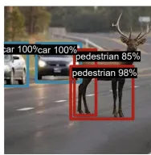
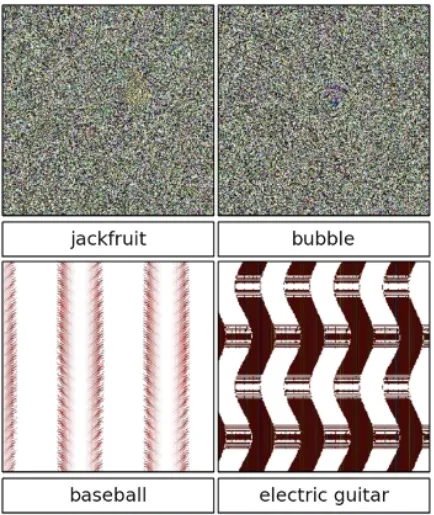
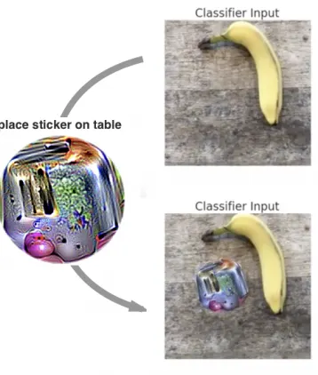
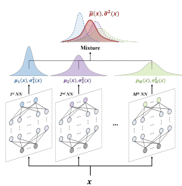
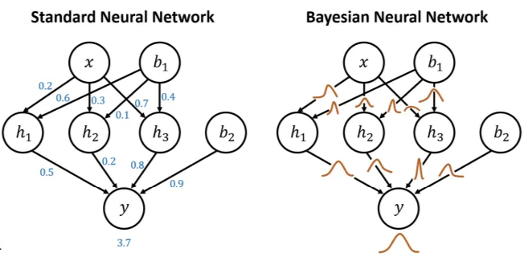

# Uncertainty

## Introduction

Deep Neural Networks (DNNs) have shown remarkable **success in various fields**, making them increasingly attractive in **high-risk domains** such as medical image analysis and autonomous driving. However, despite their high accuracy, the deployment of DNNs in safety-critical real-world systems remains limited. 

A primary reason is that **accuracy alone is insufficient** for reliable decision-making. Since DNNs often act as **black-box models**, their internal decision-making processes are opaque, making it difficult for users to trust their predictions. 

In real-world classification, it is crucial not only to produce correct predictions but also to **identify when a prediction is likely to be incorrect.**

<aside>
⚙

For instance, if the highest predicted class probability is **relatively low** (e.g., close to 0.5), the model may be **uncertain** about its decision. In such cases, blindly trusting the prediction can be risky.

This capability is especially important in safety-critical scenarios, where uncertain predictions can be **deferred to a human expert.**

</aside>

**PROBLEMS**

There are three problems:

1. **Overconfident Predictions**
    
    
    Ideally, the output distribution $p(y | x, \theta)$  predicted by a Neural Network should accurately represent the probability of belonging to a specific class. However, modern DNNs are often **overconfident**, assigning **high confidence scores** even to **incorrect predictions**. 
    
    Since confidence is typically measured as the **maximum softmax probability** this metric is often misleading. Models trained with softmax and cross-entropy loss tend to push their output distributions toward "hard" targets (e.g., $[0.99, 0.005, 0.005]$) rather than retaining a spread that reflects ambiguity (e.g., $[0.5, 0.25, 0.25]$).
    
    
    
2. **OOD Detection**
    
    
    A critical consequence of overconfidence is the inability of DNNs to robustly handle **Out-of-Distribution (OOD)** data.
    
    When presented with unrecognized data —or even random noise— a neural network tends to **"hallucinate"** a label, forcing the input into one of the known classes with high probability. This behavior poses a severe risk in safety-critical domains like medical diagnosis or autonomous driving.
    
    
    
3. **Adversarial Attacks**
    
    Deep Neural Networks are highly vulnerable to **adversarial attacks**: deliberate perturbations applied to the input data that cause the model to produce incorrect outputs. While these perturbations are often imperceptible to humans, they can drastically manipulate the model's behavior.
    
    <aside>
    ⚙
    
    For instance, applying a specially designed physical sticker (an **adversarial patch**) to an image of a banana can force the model to classify it as a toaster with high confidence.
    
    In autonomous driving, placing an adversarial sticker on a "Stop" sign could trick the vehicle's perception system into misinterpreting it as a "Speed Limit" sign, potentially causing an accident.
    
    </aside>
    
    
    

**UNCERTAINTY**

To **overcome these limitations** and ensure safe decision-making in high-risk fields – including domains such as medical diagnosis and autonomous systems – it is essential to provide **reliable uncertainty estimates**, such that some predictions can be ignored or passed to human experts.

**TYPES OF UNCERTAINTY**

Uncertainty in Deep Learning is generally categorized into two distinct types:

- **Aleatoric uncertainty (data uncertainty):**
    
    Aleatoric uncertainty arises from the inherent noise or ambiguity in the data-generating process. It captures the **variability in outcomes** caused by **uncontrollable or stochastic factors**, and therefore cannot be eliminated, even with access to more training data.
    
    <aside>
    ⚙
    
    **Examples:**
    
    - **Sensor Noise:** A voltage drop in a camera sensor might introduce random noise into an image. This is a physical limitation of the measurement device, not a lack of knowledge by the model.
    - **Stochastic Processes:** In financial markets, even if all historical trends are known, short-term stock price fluctuations remain random due to momentary imbalances (e.g., noise traders), making exact prediction impossible.
    </aside>
    
- **Epistemic uncertainty (model uncertainty or systematic uncertainty):**
    
    Epistemic uncertainty originates from a **lack of knowledge** about the optimal model parameters or the underlying data distribution. It reflects the model’s ignorance, typically caused by limited, biased, or incomplete training data.
    
    Unlike aleatoric uncertainty, epistemic uncertainty can be reduced by collecting more data or improving the model architecture. It is therefore particularly high when the model encounters **out-of-distribution (OOD)** inputs that were not represented during training. 
    
    <aside>
    ⚙
    
    **Examples:**
    
    - **Sparse Data:** If a model has never seen a specific type of traffic sign during training (e.g., a rare warning sign), it will have high epistemic uncertainty when it encounters one.
    </aside>
    

**METHODS FOR ESTIMATING UNCERTAINTY**

Two main problems:

- **How to estimate uncertainty with DNN?**
    - Deep Ensemble
    - Bayesian inference, e.g. Variational Bayes, MC Dropout
    - Test-time augmentation
- **How we make sure that these estimates are reliable?**
    - **Model Calibration** is key for meaningful uncertainty.

## Methods for Uncertainty Quantification

### Deep Ensembles

One of the simplest and most effective approaches to estimate epistemic uncertainty is the use of **Deep Ensembles**

Instead of training a single network, this method involves **training multiple independent neural networks** ($M$ models) on the same dataset, using different random initializations and random data shuffling.

Each model in the ensemble is likely to converge to a different **local minimum,** all consistent with the data. 

The **disagreement among these predictions** reflects epistemic uncertainty, as it captures variability stemming from model ambiguity and limited data.

Intuitively:

- If all models agree → **low epistemic uncertainty**
- If models disagree → **high epistemic uncertainty**

The idea is that when networks encounter regions with **abundant training data**, predictions from different models or training runs tend to be consistent (low uncertainty). In contrast, in **data-scarce regions**, predictions diverge, revealing **high epistemic uncertainty**.

Other tricks for improving uncertainty estimation.

- **Regression-specific approaches**: model both mean and variance to capture predictive uncertainty.
- **Adversarial training** (discussed in the next slides)

Disagreement between model outputs is typically measured using **variance or standard deviation** across ensemble predictions. High variance corresponds to high epistemic uncertainty, while low variance indicates high confidence.

**PREDICTIVE UNCERTAINTY IN REGRESSION**

In the **standard regression setting**, neural networks are typically trained to predict only the **conditional mean** $\mu(x)$ of the target variable. The model parameters are learned by minimizing the **Mean Squared Error (MSE)**:

 $\mathcal{L}_{MSE} = \frac{1}{N}\sum_{n=1}^{N} (y_n - \mu(x_n))^2$

This approach **does not model uncertainty**, as it provides point estimates only, no information about the **variability** or **confidence** associated with the predictions.

To explicitly model predictive uncertainty, we want to **predict both** the **mean** $\mu(x)$ and the **variance** $\sigma^2(x)$ of the target distribution. So, we assume that the observations are generated according to a Gaussian distribution:

$y \sim \mathcal{N}(\mu(x), \sigma^2(x))$

the model can be trained by minimizing the **negative log-likelihood (NLL).** This maximizes the probability that the ground truth $y$ was generated by the predicted distribution. The loss function for a single sample is:

$-\log p(y_n \mid x_n) = \log \sigma^2(x) + \frac{(y - \mu(x))^2}{\sigma^2(x)} + \text{const}$.

**MERGING PREDICTION IN ENSEMBLES (REGRESSION)**

The objective is to combine the outputs of the $M$ individual models to obtain a single, robust predictive distribution.

For regression, each model $m$ in the ensemble predicts a **mean** and a **variance**:

$\mu_m(x), \sigma^2_m(x) \quad \text{for } m = 1, \dots, M$

The combined ensemble prediction is mathematically a **Mixture of Gaussian distributions**. For practical decision-making, we approximate the ensemble prediction as a **single Gaussian distribution $\mathcal{N}(\mu_{ens}(x), \sigma^2_{ens}(x))$** whose mean and variance are respectively:

- **Predictive mean:** the ensemble mean is simply the arithmetic average of the individual means predicted by the models
    
    $\mu_{ens}(x) = \frac{1}{M} \sum_{m=1}^{M} \mu_m(x)$
    
- **Predictive variance**:
    
    The total uncertainty $\sigma^2_{ens}(x)$  is not just the average of the individual variances:
    
    $\sigma^2_{ens}(x) = \frac{1}{M} \sum_{m=1}^{M} (\sigma^2_m(x) + \mu^2_m(x)) - \mu^2_{ens}(x)$
    

**MERGING PREDICTION IN ENSEMBLES (CLASSIFICATION)**

**Goal:** Combine predictions from all individual models to obtain a single predictive distribution.

If we treat the ensemble as a **uniformly-weighted mixture model**, the combined prediction is defined as the average of the individual conditional probabilities:

 $p(y | x) = \frac{1}{M} \sum_{m=1}^{M} p_{\theta_m} (y | x, \theta_m)$.

In the specific context of classification, where each of the $M$ models outputs a **softmax distribution**, this corresponds to averaging the predicted softmax scores. The resulting ensemble distribution, $p_E$, is given by:

$p_E (y | x) = \frac{1}{M} \sum_{m=1}^{M} p_{\theta_m} (y | x)$

Once this aggregated distribution is established, we can quantify the **uncertainty** (or disagreement) within the ensemble. This is computed as the sum of the **Kullback–Leibler** (KL) **divergences** between each **individual model's distribution** and the **aggregated ensemble distribution**:

$\sum_{m=1}^{M} KL (p_{\theta_m} (y | x) \parallel p_E (y | x))$

Basically, it serves as a method to quantify how much the models disagree with one another regarding a specific prediction.

**LIMITATION OF DEEP ENSEMBLES**

Deep Ensembles are **simple**, effective, and empirically strong, but they also come with notable drawbacks, such as:

- **High computational cost:**
    
    The most significant limitation is the **heavy resource footprint**. Since Deep Ensembles require training and storing $M$ independent models, the **computational cost** in terms of training time and memory requirements (disk space for weights) **grow linearly** with the ensemble size.
    
    Additionally, inference latency increases significantly as it requires a separate forward pass for each model in the ensemble.
    
- **Limited diversity:**
    
    There is a risk that ensemble members may converge to similar solutions, particularly when trained on large datasets. If the models "collapse" to the same mode of the loss landscape, the ensemble fails to capture the true variance of the data. This lack of diversity can lead to an **underestimation of epistemic uncertainty**,
    

**THE SIZE OF THE ENSEMBLE**

The graph illustrates the entropy—or uncertainty—measured on unknown (out-of-distribution) classes. In this context, higher entropy is desirable as it indicates the system correctly identifies the input as unknown.

The **brighter plot** represents a single-model ensemble ($M=1$), while the **darker plot** represents an ensemble composed of five elements ($M=5$).

The single-model distribution is centered around an entropy value of 2. However, increasing the ensemble size to five causes the distribution to shift towards significantly higher values. This demonstrates that a larger number of models within the ensemble effectively increases the entropy for out-of-distribution elements, resulting in more reliable uncertainty estimates.

**BAYESIAN MODEL AVERAGE**

While a finite ensemble already provides benefits, we can theoretically improve uncertainty estimation by averaging over an *infinite* number of models. This concept forms the basis of **Bayesian inference**, where rather than relying on a single **"best" set of weights**, we aim to target the **posterior distribution** of the model parameters. This distribution is valuable because it provides not just a point estimate, but a full quantification of uncertainty. The final prediction is obtained by marginalizing (averaging) over this entire distribution.

The resulting **posterior predictive distribution** $p(y \mid x, D)$ can be interpreted as an **average over infinite models,** each corresponding to a different parameter configuration. Each model’s contribution is weighted by its posterior probability, so parameter settings that better explain the data have greater influence on the final prediction. 

Matematically this is defined as:

$p(y | x, D) = \int p(y | x, w) p(w | D) dw$

Where:

- $y$ is an output (e.g., a class label).
- $x$ is an input (e.g., an image).
- $w$ are parameters.
- $D$ is the dataset.
- $p(w | D)$ **posterior distribution** over the model parameters given the dataset.
- $p(y | x, w)$: estimated probability of $y$ given $x$ and a set of parameters $w$ (e.g., Softmax)
- $p(y | x, D)$: estimated marginalized probability of $y$ given $x$ and the dataset (a.k.a. posterior predictive distribution).

**THE CHALLENGE AND SOLUTIONS**

The main challenge is that **this integral is intractable** for modern neural networks, requiring approximate inference methods to estimate the **posterior predictive distribution**.

Both **sampling-based inference** and **variational inference** are different techniques, approximate the **posterior distribution** of the model parameters $p(w|D)$:

- **Sampling-based inference:** The approximation is obtained by training multiple models (e.g., Ensembles)
- **Variational inference:** Instead of sampling, we adopt a different strategy that converts **integration** into **optimization**.

This posterior distribution is valuable because it provides not only a **point estimate**, but also a quantification of **uncertainty**.   

Since we cannot calculate the integral directly, both approaches approximate the integral using **Monte Carlo methods**:

$p(y | x, D) = \int p(y | x, w)p(w | D)dw \approx \frac{1}{J} \sum_j p(y | x, w_j), \quad w_j \sim p(w | D)$

**VARIATIONAL INFERENCE**

Instead of sampling directly from the **true posterior** $p(w | D)$, which is often **intractable**, we approximate it with a simpler, tractable distribution $q_\theta(w)$ (e.g., a Gaussian).

**Procedure:**

1. Choose a family of approximate distributions $q_\theta(w)$ with parameters $\theta$.
2. Find the $q_\theta(w)$ that is closest to $p(w | D)$ by minimizing:
    
    $KL(q_\theta(w) \parallel p(w | D))$
    
3. Once $q_\theta(w)$ is learned, draw samples $w_j \sim q_\theta(w)$ to approximate the predictive distribution:
    
    $p(y | x, D) \approx \frac{1}{J} \sum_{j=1}^{J} p(y | x, w_j)$
    

**FROM STANDARD NEURAL NETWORK TO BAYESIAN NEURAL NETWORK (BNN)**

The realization of Variational Inference in deep learning represents a key conceptual shift: the transition from a standard neural network to a **Bayesian Neural Network (BNN)**.

- **Standard Neural Network:** Each weight is represented by a single deterministic value (point estimate).
- **Bayesian Neural Network:** parameters (weights) are represented by distributions $q_\theta(w) \approx p(w | D)$ defined by parameters $\theta$, such as **mean** and **variance**

| **Aspect** | **Standard Neural Network** | **Bayesian Neural Network (BNN)** |
| --- | --- | --- |
| **Weight Representation** | Weights are single, fixed values (**point estimates**). | Weights are modeled as **probability distributions**, typically approximating the posterior $q_\theta(w) \approx p(w \mid D)$. |
| **Learning Objective** | Optimizes a loss function to find one optimal set of weights ($w^*$). | Performs **Bayesian inference**, updating a prior $p(w)$ into a posterior $p(w \mid D)$ by maximizing the ELBO. |
| **Uncertainty Modeling** | Does not explicitly model uncertainty in the parameters. | Explicitly models **epistemic uncertainty** through distributions over weights. |
| **Regularization** | Requires explicit regularization techniques (e.g., weight decay, dropout). | Regularization emerges **naturally** from the prior over weights. |

<aside>

**Interpreting the weight distributions**

The variance of a weight’s distribution reflects how important that connection is to the model:

- A **small variance (peaky distribution)** means the model is confident about the weight’s value: even small changes can hurt performance, so the connection is **crucial**.
- A **large variance (flat distribution)** indicates uncertainty: many values work similarly well, so the connection is **less important** and the model is robust to changes in that weight.
</aside>

**BAYES BY BACKPROP**

**Bayes by Backprop** allows us to learn a probability distribution over weights using **variational inference** and **standard backpropagation.**

We define the following components to build our objective function:

- **Prior over weights:** $p(w) = \mathcal{N}(w | 0, \alpha^{-1}I)$ where $\alpha$ denotes the **precision** (inverse variance) parameter.
- **Variational posterior:** $q_\theta(w) = \mathcal{N}(w | \mu, \sigma^2)$, where both the **mean** $\mu$ and **variance** $\sigma^2$ are learnable.

The objective is to **minimize negative** **ELBO:**

$\mathcal{L}(\theta) = KL(q_\theta(w) \parallel p(w)) - E_{q_\theta(w)}[\log p(D | w)]$

- **KL Divergence Term:** Acts as a **regularizer**, encouraging the learned posterior to stay close to the prior.
- **Data Likelihood Term:** Focuses on **predictive accuracy**. For each samplet posterior distribution $q_\theta(w)$ using the reparameterization trick, compute the likelihood (e.g., cross-entropy) and average over all samples.

**The Reparameterization Trick**

To enable gradient-based optimization with stochastic weights, BBP uses the **reparameterization trick**. Instead of sampling $w$ directly, we sample noise $\epsilon$ and transform it using the learnable parameters:

$w = \mu + \sigma \odot \epsilon, \quad \epsilon \sim \mathcal{N}(0, I)$

This formulation allows gradients to flow through $\mu$ and $\sigma$ during backpropagation, introducing stochasticity in the forward pass while preserving differentiability.

**Mini-batch loss:**

$\mathcal{L}B = \sum{(x,y)\in B} - \log p(y | x, w) + \pi KL(q_\theta(w) \parallel p(w))$

**Inference**

At inference time, uncertainty is estimated by sampling multiple sets of weights from the learned posterior distribution and performing multiple forward passes through the same architecture. 

$p(y | x, D) \approx \frac{1}{J} \sum_{j=1}^{J} p(y | x, w_j), \quad w_j \sim q_\theta(w)$

The resulting predictions are compared:

- If predictions agree, the model is considered confident.
- If predictions vary significantly, the model exhibits high uncertainty.

**Weaknesses?**

- **Mean-field Gaussian assumption.** BBP can underestimate uncertainty by ignoring correlations between weights.
- **Additional training cost.** It needs multiple weight samples per update and higher gradient variance.

### Beyond BNNs

A limitation of Bayesian Neural Networks is that they require **modifying the training paradigm**: weights must be modeled as probability distributions, necessitating a full retraining of the model. When only a deterministic model is available, this approach may not be feasible.

However, Bayesian model averaging can be approximated without explicitly learning weight posteriors. Any mechanism that induces randomness during the forward pass—such as **Dropout**—can be interpreted as sampling from an implicit weight distribution, providing a practical alternative for uncertainty estimation.

**DROPOUT**

**Dropout** prevents the co-adaptation of neurons, which effectively reduces overfitting in neural networks. During training, the technique randomly suppresses neuron activations by setting them to zero.

This is achieved by multiplying the activations of each layer by a binary mask, $m$, sampled from a Bernoulli distribution for every mini-batch:

$h^{(l)}_{\text{dropped}} = m^{(l)} \odot h^{(l)}, \quad m^{(l)}_i \sim \text{Bernoulli}(1 - p)$

By masking these units, the network is forced to learn redundant, robust features that do not rely on the presence of specific neurons.

At inference time, dropout is typically disabled to produce deterministic predictions using the full network. To maintain consistency with the training phase, activations are scaled by a factor of $1 - p$, ensuring the expected output remains balanced.

**MONTE CARLO DROPOUT (MC DROPOUT)**

**Monte Carlo Dropout** extends standard dropout by keeping dropout enabled at test time to approximate Bayesian uncertainty without modifying the underlying architecture or training procedure.

**Methodology**

A standard network is trained with dropout as usual. At inference, instead of a single deterministic pass, the model performs $T$ stochastic forward passes using different dropout masks. The results are then aggregated to estimate the **predictive mean** and **predictive covariance** (the measure of uncertainty):

- $\mathbf{\mu}(x) = \frac{1}{T} \sum_{t=1}^{T} \mathbf{f}^{(t)}(x)$
- $\text{Cov}[y | x, D] = \frac{1}{T} \sum_{t=1}^{T} \mathbf{f}^{(t)}(x) \mathbf{f}^{(t)}(x)^\top - \hat{\mu}(x) \hat{\mu}(x)^\top + \tau^{-1}\mathbf{I}$

where:

- $\mathbf{f}^{(t)}(x) = \mathbf{f}(x; \theta, m^{(1)}_t, \dots, m^{(L)}_t) \in \mathbb{R}^K$ is the $K$-dimensional output for pass $t$ with sampled binary masks $m^{(1)}_t, \dots, m^{(L)}_t$
- $\tau^{-1}$ is the observation noise variance.

Because each stochastic pass yields slightly different predictions, their variability provides a direct measure of model **epistemic uncertainty**: consistent outputs indicate high confidence, while large dispersion suggests uncertainty. This uncertainty can be quantified using metrics such as **predictive entropy** or **variation ratios**.

**Key Advantages:**

- **No need to change the training procedure**
- **Low additional cost**, just multiple forward passes.
- **Bayesian Approximation:** Effectively captures **epistemic uncertainty** via variation in outputs across dropout masks.

<aside>
📚

**Similar approach: ”Variational Dropout and the Local Reparameterization Trick”.**

- The authors re-interpret dropout with continuous noise as a variational method, and propose a generalization that they call variational dropout.
- The Gaussian dropout noise can also be interpreted as arising from a Bayesian treatment of a neural network, where the posterior distribution of the weights is given by a factorized Gaussian.
</aside>

## Reliable Uncertainty Measures

**CONFIDENCE FROM THE PREDICTED PROBABILITY**

A common method for estimating model confidence is to use the **maximum predicted probability** (the highest value in the output vector). For instance, if a network outputs **`[0.05, 0.10, 0.80, 0.05]`**, the value 0.80 suggests the model is 80% confident in class 3. Under this logic:

- A probability close to 1 indicates the model is **very confident**.
- A lower value (e.g., 0.4) indicates **uncertainty**, as multiple classes compete.

**The Problem: Overconfidence and Calibration**

The primary issue is that Softmax outputs are **relative scores**, not calibrated likelihoods or true posterior probabilities. Because models are trained with one-hot encoded targets (e.g., **`[0,0,1,0]`**), they tend to assign very high probability to a single class even when the prediction is wrong.

This leads to **overconfidence**, making high predicted probabilities unreliable indicators of low uncertainty, which is especially problematic in safety-critical applications. Consequently, relying solely on the **maximum probability** can be misleading when the model is miscalibrated.

**MISSCALIBRATION**

Empirical studies reveal that while modern deep architectures achieve **higher accuracy**, they are often poorly calibrated and prone to **overconfidence**. Several factors influence calibration such as *Depth, width, Batch Normalization* and *Weight Decay.*

**Experiments on CIFAR-100** 

Experiments show that deeper networks, such as **ResNet**, achive higher accuracy than older architectures like **LeNet**. However, their confidence scores, calculated as the average maximum probability:

$\frac{1}{N} \sum_{i=1}^N \max_{k \in \{1,...,K\}} p_\theta(y=k|x_i)$

are often heavily concentrated near 1.0.

This indicates that high predictive performance does not imply well-calibrated uncertainty.

<aside>
⚙

**The Calibration Criterion**

A model is considered well-calibrated only when its **predicted confidence matches its empirical accuracy**.

- **Example 1:** If we isolate all predictions with a confidence score between 0.45 and 0.55, a calibrated model should be correct approximately 50% of the time.
- **Example 2:** For predictions with confidence between 0.85 and 0.95, the accuracy should be roughly 90%.

In miscalibrated models, this relationship breaks dow

</aside>

**RELIABILITY DIAGRAMS**

Calibration is commonly visualized using **reliability diagrams**. These diagrams plots **group predictions** into **confidence intervals**  (e.g., **`0.0–0.1, 0.1–0.2, . . . , 0.9–1.0`**) then for each bin compare two metrics:

1. **Average Predicted Confidence:** The mean of the highest predicted probabilities for samples in that bin.
2. **Empirical Accuracy:** The actual fraction of correct predictions in that bin.

**LeNet (left) vs ResNet (right)**

In a **perfectly calibrated model**, these two quantities coincide, and the diagram follows the identity function (a perfect $45^\circ$ diagonal). Any deviation from this diagonal represents miscalibration.

**Result:**

- **LeNet:** While less accurate overall, it exhibits better calibration. Its average confidence is closely aligned with its actual accuracy.
- **ResNet:** Despite its significantly higher accuracy, it is poorly calibrated. The diagram reveals that its real accuracy is lower than its predicted confidence, indicating systemic **overconfidence**.

**EXPECTED CALIBRATION ERROT (ECE)**

The **Expected Calibration Error (ECE)** is a metric used to quantify miscalibration. It measures the **average of the absolute difference** between a *model’s predicted confidence* and its *actual accuracy* across specific confidence intervals. Effectively, it provides a single numerical value representing the "gap" observed in a reliability diagram.

**Procedure:**

1. The model's predictions are partitioned into $M$ bins (e.g., 0.0–0.1, 0.1–0.2, . . . , 0.9–1.0).
2. For each bin $B_m$ the following are determined:
    - $acc(B_m)$ = fraction of correct predictions in the bin.
    - $conf(B_m)$ = average predicted confidence in the bin.
3. The ECE is then calculated as the weighted average of the absolute differences:
    
    $\text{ECE} = \sum_{m=1}^{M} \frac{|B_m|}{n} |acc(B_m) - conf(B_m)|$
    

**Interpretation:**

- $ECE = 0$ means perfect calibration, so predicted probabilities align well with actual outcomes
- **Higher values** indicate greater miscalibration, typically revealing systematic overconfidence or underconfidence.

Experimental results suggest that increased model capacity and certain training configurations are closely linked to miscalibration:

- **Depth and Width**: Increasing the depth or width of a model generally improves accuracy but simultaneously increases ECE.
- **Batch normalization** The use of normalization techniques can sometimes worsen calibration.
- **Weight decay** Applying weight decay often improves calibration by constraining parameter magnitudes.

**TEMPERATURE SCALING**

**Temperature Scaling** is a simple, effective post-training method designed to correct model miscalibration without altering the underlying architecture or weights. It modifies the standard Softmax function by introducing a single scalar parameter, $T>0$, known as the **temperature**, which is applied to the logits ($z_k$) before normalization:

$p(y=k|x) = \frac{\exp(z_k/T)}{\sum_{j=1}^K \exp(z_j/T)}$

**Notes:**

- $T = 1$: standard softmax.
- $T > 1$: the output distribution becomes smoother; the highest probability decreases while the others increase.

The parameter $T$ is tuned on a **held-out validation set** to minimize the negative log-likelihood (NLL) or calibration error.

The **advantage** is that this method does not require retraining the network or changing the model’s internal parameters.

Because $T$ scales all logits equally, the **model's accuracy remains the same**, while only the confidence values are rescaled, reducing the gap.

<aside>
🧠

**SUMMARY**

- Essential for decision-making in safety-critical and high-stakes domains.
- Two main types:
    - **Aleatoric:** inherent noise in the data.
    - **Epistemic:** uncertainty in the model parameters.
- Methods discussed:
    - **Deep Ensembles:** Multiple diverse models, averaged predictions, strong baseline.
    - **Bayesian Neural Networks (BNN):** Learn distributions over weights (e.g., Bayes by Backprop).
    - **MC Dropout:** Keep dropout active at test time to approximate Bayesian inference.

**Calibration:**

- **Well-calibrated models:** predicted probabilities match empirical accuracy.
- Softmax outputs are often overconfident.
- **Tools:** reliability diagrams, Expected Calibration Error (ECE), Temperature scaling, ODIN for OOD detection.

**Key message:** Good uncertainty estimation & calibration make models not just accurate, but reliable in their predictions.

We can determine when to trust a model’s prediction and when not to.

</aside>