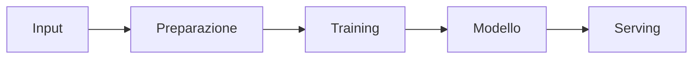
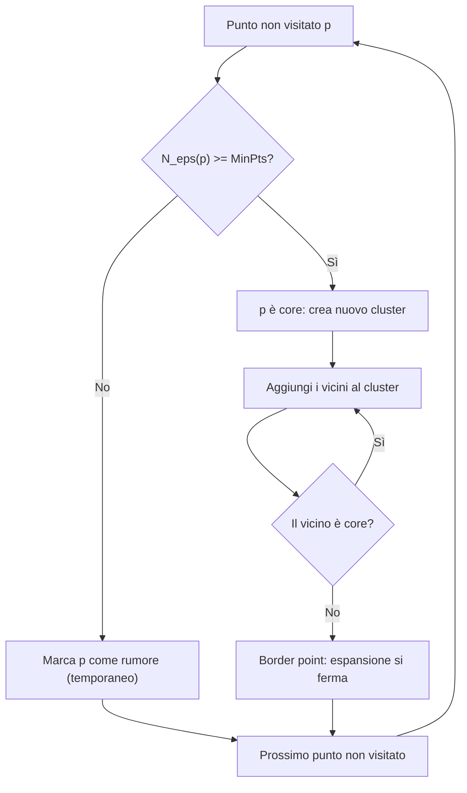

import Callout from '../../../components/Callout.astro';

## Machine Learning vs Data Mining

Sebbene spesso sovrapposti, hanno scopi diversi:

| | Machine Learning (ML) | Data Mining (DM / KDD) |
|---|---|---|
| **Focus** | Sul *come* imparare dai dati | Sull'*estrarre conoscenza* (pattern, insight) dai dati |
| **Obiettivo** | Sviluppare sistemi che migliorano le prestazioni automaticamente tramite l'esperienza, senza essere esplicitamente programmati | Risolvere problemi, prevedere tendenze o ridurre rischi |

## Il Principio di Bonferroni (Statistica nel DM)

Un avvertimento fondamentale quando si cercano **eventi rari** nei "Big Data". Questo principio aiuta a non trattare come reali eventi che in realtà sono casuali, evitando i **falsi positivi** in grandi quantità di dati.

- **Il problema**: cercando determinati eventi in enormi dataset, è probabile trovarne alcuni anche se i dati sono completamente casuali (falsi positivi).
- **La regola**: se il **numero atteso di eventi casuali** è significativamente maggiore del numero reale di istanze che ci si aspetta di trovare, i risultati sono probabilmente **"rumore"** e non **"segnale"**.

<Callout type="example">

Cercare "malintenzionati" che visitano hotel. Su miliardi di persone e dati casuali, si troveranno molte coppie di persone che hanno visitato lo stesso hotel due volte pur non conoscendosi, solo per effetto della casualità.

</Callout>

## La ML Pipeline e i Dati

Il processo standard prevede:

### Struttura dei dati

- **Istanze**: gli oggetti da classificare o raggruppare (esempi indipendenti).
- **Attributi (Features)**: le caratteristiche che descrivono le istanze.
- **Denormalizzazione (Data Flattening)**: in ML, trasformare dati complessi e strutturati (molte tabelle) in un'unica tabella utilizzabile da modelli di ML.

<Callout type="warning">

**Rischio della denormalizzazione**: può creare pattern spuri o falsi che riflettono la struttura del database invece che relazioni reali (es. "fornitore" predice "indirizzo fornitore").

</Callout>

### Tipologie di apprendimento

**Supervisionato (target noto)** — esiste una variabile obiettivo (*label*) da predire. Richiede l'etichettatura (*labeling*), che è costosa.

- **Classificazione**: predire una classe discreta (es. Sì/No, Benigno/Maligno).
- **Regressione**: predire un valore numerico continuo.

**Non supervisionato (nessun target)** — non ci sono etichette, l'obiettivo è trovare strutture intrinseche (es. "I clienti si raggruppano naturalmente?").

- **Clustering**: raggruppare istanze simili.
- **Associazioni**: trovare elementi che compaiono spesso insieme (es. carrello della spesa).

## Alberi Decisionali

### Funzionamento e criteri di split

Gli alberi decisionali sono modelli di **apprendimento supervisionato** che operano secondo una logica di ***divide et impera***. Strutturano una serie di decisioni in una gerarchia ad albero, dove:

- ogni **nodo interno** rappresenta un test su un attributo;
- ogni **ramo** corrisponde a un esito di tale test;
- le **foglie** assegnano una classe o una distribuzione di probabilità.

La classificazione (o regressione) di una nuova istanza avviene percorrendo l'albero **dalla radice fino a una foglia**, seguendo gli esiti dei test sugli attributi. Ogni percorso radice → foglia può essere interpretato come una **regola decisionale**.

La costruzione avviene tramite **suddivisione ricorsiva**: partendo dalla radice, si seleziona un attributo per suddividere l'insieme di istanze in sottoinsiemi più piccoli. Il processo si ripete ricorsivamente su ciascun sottoinsieme finché tutte le istanze di un sottoinsieme appartengono alla stessa classe o non è più possibile effettuare suddivisioni utili.

### Criteri di scelta degli attributi

L'obiettivo è ottenere un modello **il più piccolo possibile** che sia efficace nel separare le classi. Si usa un'euristica che privilegia l'attributo che genera i sottoinsiemi più **"puri"** (con la minor incertezza), il che equivale a **massimizzare l'information gain**.

### Entropia e Information Gain

L'**entropia** è una misura dell'incertezza o dell'impurità di un insieme di dati. Per una distribuzione di probabilità $p_1, p_2, \dots, p_n$:

$$
\text{Entropy}(p_1, p_2, \dots, p_n) = -\sum_{i} p_i \log_2 p_i
$$

L'**Information Gain** (IG) quantifica la riduzione dell'entropia ottenuta suddividendo un insieme di dati in base a un attributo $A$:

$$
\text{Gain}(A) = \text{Entropy}(\text{prima della suddivisione}) - \text{Entropy}(\text{dopo la suddivisione})
$$

L'attributo con il **maggiore Information Gain** viene scelto per la suddivisione, poiché massimizza la riduzione dell'incertezza. Il procedimento viene ripetuto fino a costruire l'albero decisionale intero.

<Callout type="warning">

È necessario **eliminare gli attributi univoci** (es. ID): un identificatore univoco produce partizioni perfettamente pure e quindi massimizza artificialmente il guadagno, senza alcuna capacità di generalizzazione.

</Callout>

### Gain Ratio

Un limite dell'Information Gain è la tendenza a **favorire attributi con molti valori distinti**. Per mitigare questo bias si introduce il **Gain Ratio**:

$$
\text{gain\_ratio}(A) = \frac{\text{Gain}(A)}{\text{intrinsic\_info}(\text{split}(A))}
$$

L'**informazione intrinseca** è l'entropia della distribuzione dei rami, e indica quanta informazione è necessaria per sapere a quale ramo appartiene un'istanza. Il Gain Ratio tende a selezionare attributi che producono suddivisioni più **bilanciate e significative**.

### Valori mancanti e overfitting

- **Valori mancanti**: possono essere gestiti trattandoli come un ramo separato oppure assegnando l'istanza al ramo più popolare.
- **Overfitting**: l'albero diventa troppo complesso e si adatta eccessivamente ai dati di addestramento. Per contrastarlo si usa la **potatura (pruning)**, che rimuove test o regole ridondanti per migliorare la generalizzazione.

## Modelli Lineari

I modelli lineari assumono una **relazione lineare** tra le caratteristiche di input e la variabile target. La forma generale per la regressione è:

$$
y = w_0 + w_1 a_1 + w_2 a_2 + \dots + w_k a_k
$$

dove $a_1, \dots, a_k$ sono gli attributi di input (features), $w_0$ è l'**intercetta** e $w_1, \dots, w_k$ sono i **pesi** associati a ciascun attributo. La previsione per un nuovo elemento è una combinazione lineare di questi pesi appresi dai dati di addestramento.

### Regressione Lineare — predizione numerica

La regressione lineare stima una **quantità numerica continua**. L'obiettivo è trovare i pesi $w_i$ che minimizzano la somma dei quadrati degli errori tra valori osservati ($y_i$) e predetti ($\hat{y}_i$):

$$
\min \sum_{i} (y_i - \hat{y}_i)^2
$$

Questa funzione di errore (**errore quadratico**) penalizza in modo significativo gli errori più grandi. La regressione lineare può essere **sensibile agli outlier**; tecniche robuste possono essere impiegate per mitigarne l'influenza. L'errore del modello si quantifica con metriche come **MSE** (Mean Squared Error) o **RMSE** (Root Mean Squared Error).

### Regressione Logistica — probabilità di appartenenza a una classe

La regressione logistica stima la **probabilità di appartenenza a una classe binaria** (es. positiva vs negativa). Invece di predire direttamente la classe, il modello stima $p(y = 1 \mid x)$.

Gli **odds** di un evento sono il rapporto tra la probabilità che l'evento si verifichi e la probabilità che non si verifichi:

$$
\text{odds} = \frac{p}{1 - p}
$$

Si modellano le **log-odds** dell'evento positivo come funzione lineare degli attributi:

$$
f(x) = w_0 + w_1 x_1 + \dots + w_k x_k
$$

La probabilità si ottiene applicando la **funzione sigmoide** a $f(x)$:

$$
p(y = 1 \mid x) = \text{sigmoid}(f(x)) = \frac{1}{1 + e^{-f(x)}}
$$

L'addestramento mira a **massimizzare la verosimiglianza logistica** o, equivalentemente, a **minimizzare la log-loss (cross-entropy)**. L'output è una probabilità stimata; la decisione finale sulla classe si prende applicando una **soglia** (tipicamente 0.5) o calibrando la probabilità in base alle conseguenze degli errori.

<Callout type="note">

**Considerazioni comuni**: sia gli alberi decisionali che i modelli lineari sono soggetti a overfitting e richiedono una corretta **validazione** per assicurare la capacità di generalizzazione su dati non visti.

</Callout>

## Apprendimento Basato sulle Istanze

L'apprendimento basato sulle istanze è una metodologia di ML **lazy**: il modello non viene costruito esplicitamente durante il training. L'intero dataset di training viene **memorizzato** e la predizione per una nuova istanza si basa sulla sua **somiglianza** con le istanze già note.

Le tecniche più rappresentative sono il **Nearest Neighbor (NN)** e il **k-Nearest Neighbors (k-NN)**. Il "modello" è, in sostanza, l'insieme delle istanze di training più una **funzione di similarità o distanza**.

Ogni istanza è caratterizzata da un insieme predefinito di attributi, **numerici o nominali**, fondamentali per definire la somiglianza tra istanze.

### La funzione di distanza

La scelta della funzione di distanza è cruciale per l'efficacia dei metodi basati sulle istanze.

| Tipo di attributo | Distanza |
|---|---|
| **Numerico** | Distanza **euclidea**; gli attributi vanno **normalizzati** per evitare che quelli con scale maggiori dominino il calcolo |
| **Nominale** | Distanza **binaria**: 1 se i valori sono diversi, 0 se sono uguali |

**Normalizzazione**: indispensabile quando gli attributi hanno scale diverse. Una formula comune è il **min-max scaling**:

$$
a_i = \frac{v_i - \min(v_i)}{\max(v_i) - \min(v_i)}
$$

dove $v_i$ è il valore dell'attributo $i$ per una data istanza.

### k-Nearest Neighbors (k-NN)

Il k-NN è un algoritmo versatile usato sia per **classificazione** che per **regressione**. Per una nuova istanza, identifica i $k$ vicini più prossimi nel dataset di training:

- **Classificazione**: la classe è determinata dal **voto di maggioranza** tra i $k$ vicini. Spesso si sceglie un $k$ **dispari** per evitare pareggi.
- **Regressione**: il valore predetto è la **media** dei valori target dei $k$ vicini.

**Peso dei vicini**: si può assegnare un peso ai vicini, spesso inversamente proporzionale alla distanza (es. $1/d^2$), per dare maggiore influenza ai vicini più prossimi.

**Scelta di $k$**:

- $k$ **piccolo** (es. $k = 1$) → modello molto sensibile al rumore (**overfitting**).
- $k$ **grande** → tende ad approssimare la media del dataset (**underfitting**).

<Callout type="tip">

**Normalizzazione e k-NN**: normalizzare gli attributi garantisce che tutte le dimensioni contribuiscano in modo equilibrato alla distanza, evitando che le features con scale maggiori dominino il calcolo.

</Callout>

## Clustering

Il clustering è una tecnica di apprendimento **non supervisionato** che raggruppa dati non etichettati in **cluster omogenei**: gli oggetti di un cluster sono simili tra loro e distinti da quelli di altri cluster. È utile per scoprire **strutture latenti** nei dati senza bisogno di etichette predefinite.

### Classificazione delle tecniche di clustering

| Famiglia | Idea | Esempi | Note |
|---|---|---|---|
| **Partizionamento** | Suddivide il dataset in un numero predefinito $k$ di cluster, ognuno rappresentato da un **centroide** | k-means | Richiede $k$ |
| **Gerarchici** | Decomposizione gerarchica rappresentata da un **dendrogramma**; **agglomerativi** (bottom-up, uniscono cluster) o **divisivi** (top-down, dividono cluster) | Single/complete/average-linkage | Non richiedono $k$; permettono di esplorare diverse granularità |
| **Basati sulla densità** | Cluster come **regioni dense** di punti separate da regioni a bassa densità | DBSCAN, HDBSCAN | Gestiscono il rumore; trovano cluster di forma arbitraria |

### k-means

L'obiettivo è **minimizzare la somma delle distanze al quadrato** tra i punti e i rispettivi centroidi.

**Processo**:

1. Inizializzare $k$ centroidi casualmente.
2. Assegnare ogni punto al cluster con il centroide più vicino.
3. Ricalcolare i centroidi come media dei punti assegnati a ciascun cluster.
4. Ripetere i passi 2 e 3 finché i centroidi non cambiano significativamente.

**Limiti**: richiede di specificare $k$ in anticipo, è **sensibile agli outlier** e tende a formare cluster di forma sub-ellittica (spesso **sferica**) in uno spazio euclideo.

### Clustering gerarchico

Non richiede un $k$ esplicito e offre una visione della struttura gerarchica dei cluster tramite un **dendrogramma**.

**Distanza tra cluster**:

- **Centroid distance**: distanza tra i centroidi dei cluster.
- **Single-linkage**: distanza **minima** tra elementi di due cluster.
- **Complete-linkage**: distanza **massima** tra elementi di due cluster.
- **Average-linkage**: distanza **media** tra elementi di due cluster.

**Vantaggio**: permette di comprendere come i cluster si formano e si uniscono a diversi livelli di granularità.

### DBSCAN

**DBSCAN** (*Density-Based Spatial Clustering of Applications with Noise*) identifica i cluster in base alla **densità** dei punti.

**Definizioni chiave**:

- $\varepsilon$ **(Epsilon)**: distanza massima per considerare due punti vicini.
- **MinPts**: numero minimo di punti richiesti per formare una regione densa.
- **Core point**: punto con almeno MinPts vicini nel suo intorno $\varepsilon$.
- **Border point**: vicino a un core point, ma con meno di MinPts punti nel suo intorno.
- **Noise point**: punto che non appartiene a nessun cluster.

**Def. 1 — Eps-neighborhood.** L'intorno $\varepsilon$ di un punto $p$, $N_\varepsilon(p)$, è l'insieme dei punti $q$ la cui distanza da $p$ è minore o uguale a $\varepsilon$.

**Def. 2 — Direct density-reachability.** Un punto $p$ è **direttamente raggiungibile per densità** da $q$ rispetto a $\varepsilon, MinPts$ se:

1. $p \in N_\varepsilon(q)$
2. $\lvert N_\varepsilon(q) \rvert \geq MinPts$ (quindi $q$ è un **core point**)

**Def. 3 — Density-reachability.** $p$ è **raggiungibile per densità** da $q$ se esiste una catena di punti $p_1, \dots, p_n$ con:

- $p_1 = q$
- $p_n = p$
- ogni $p_{i+1}$ è direttamente raggiungibile da $p_i$

**Def. 4 — Density-connectivity.** Due punti $p$ e $q$ sono **connessi per densità** se esiste un punto $o$ tale che entrambi sono raggiungibili per densità da $o$.

**Def. 5 — Cluster.** Un cluster $C$ è un sottoinsieme non vuoto di $D$ tale che:

- **(Massimalità)** se $p \in C$ e $q$ è raggiungibile per densità da $p$, allora $q \in C$;
- **(Connettività)** per ogni $p, q \in C$, $p$ è connesso per densità a $q$.

**Def. 6 — Noise.** I punti rumore sono quelli che non appartengono ad alcun cluster.

<Callout type="insight">

La raggiungibilità per densità **non è simmetrica**: un border point è raggiungibile da un core point, ma non viceversa. La connessione per densità, invece, è simmetrica.

</Callout>

#### Funzionamento di DBSCAN

1. **Scelta dei parametri**: $\varepsilon$ (distanza massima per considerare due punti vicini) e **MinPts** (numero minimo di punti per una regione densa).
2. **Selezione di un punto iniziale**: si parte da un punto non ancora visitato.
3. **Esame dell'intorno**:
   - se i vicini sono meno di MinPts → il punto è etichettato come **rumore** (temporaneamente);
   - se ci sono almeno MinPts vicini → il punto è marcato come **core** e viene creato un nuovo cluster.
4. **Espansione del cluster**:
   - i vicini del core vengono aggiunti al cluster;
   - se un vicino è un core, anche i suoi vicini vengono aggiunti ricorsivamente;
   - se un vicino non è un core → è un **border point**, e l'espansione si ferma lì.
5. **Ripetizione**: si passa al prossimo punto non visitato.
6. **Finalizzazione**:
   - tutti i cluster sono individuati;
   - i punti inizialmente marcati come rumore possono diventare border se risultano vicini a un core;
   - i punti che non appartengono a nessun cluster restano classificati come **rumore**.

### HDBSCAN

È una **versione gerarchica di DBSCAN** che costruisce un dendrogramma basato sulla densità e usa una **misura di stabilità** per identificare i cluster. A differenza di DBSCAN, **non richiede un singolo valore di $\varepsilon$**, ma considera una gamma di densità: un taglio orizzontale del dendrogramma produce il DBSCAN corrispondente.

In altre parole si costruisce il **Minimum Spanning Tree** (albero che connette tutti i punti con somma degli archi minima).

L'**Excess of Mass (EOM)** è il criterio algoritmico usato da HDBSCAN per trasformare l'albero gerarchico (dendrogramma) in una singola partizione **"piatta"** di cluster ottimali. EOM classifica i cluster in base ai livelli di densità: in parole semplici misura la **stabilità** di un cluster, ovvero quanto "resiste" e rimane compatto al variare della densità prima di spezzarsi in sottogruppi o dissolversi nel rumore.

**Vantaggi**: robustezza al rumore, capacità di scoprire cluster di forme arbitrarie e di gestire **densità variabili**.

### Valutazione del clustering

| Metrica | Tipo | Descrizione |
|---|---|---|
| **Adjusted Rand Index (ARI)** | Esterna | Misura la somiglianza tra la partizione ottenuta e una **ground truth** (se disponibile), correggendo per accordi casuali |
| **Silhouette Coefficient** | Interna | Valuta la **coesione** all'interno dei cluster e la **separazione** tra essi (quanto bene i campioni sono raggruppati con campioni simili). Valore alto = clustering ben definito. **Non richiede ground truth** |

### Istanze: k-NN e clustering a confronto

Le **istanze** sono il fondamento sia dell'apprendimento basato sulle istanze che del clustering: il k-NN usa istanze **etichettate** per la predizione, il clustering le raggruppa per somiglianza **senza etichette**.

Le tecniche si possono combinare: ad esempio il clustering può essere usato come **pre-processing per il feature engineering**, dove i cluster identificati diventano nuove features per un k-NN o altri algoritmi di classificazione/regressione.

**Implicazioni pratiche**:

- Il **k-NN** è semplice e robusto, ma la sua efficacia dipende criticamente dalla funzione di distanza e dalla normalizzazione; la scelta di $k$ influenza direttamente la complessità del modello e la tendenza a overfitting/underfitting.
- Il **clustering** permette di scoprire strutture nascoste nei dati non etichettati:
  - **k-means**: veloce, ma richiede di specificare $k$ e assume cluster di forma simile;
  - **clustering gerarchico**: visione gerarchica, non richiede $k$ iniziale, utile per l'esplorazione dei dati;
  - **DBSCAN/HDBSCAN**: robusti al rumore e capaci di identificare cluster di forme arbitrarie e densità variabili, utili in dataset complessi.

La valutazione del clustering si avvale di metriche **interne** (es. Silhouette) o **esterne** (es. ARI) quando è disponibile una ground truth. In pratica è spesso necessario combinare diverse tecniche: una normalizzazione accurata, una scelta attenta degli iperparametri e l'uso della validazione incrociata sono essenziali per risultati stabili e significativi.

## Ensemble Learning

L'**Ensemble Learning** combina più modelli di ML per ottenere prestazioni predittive migliori di quelle di un singolo modello. Le tecniche principali sono:

- **Bagging (Bootstrap Aggregating)**:
  - genera diversi dataset di training estraendo campioni **con reinserimento** dal dataset originale (della stessa dimensione $n$);
  - i modelli vengono addestrati **in parallelo** e le predizioni combinate tramite **voto di maggioranza** (classificazione) o **media** (regressione);
  - ideale per modelli **instabili** (che variano molto con piccoli cambiamenti nei dati), come gli alberi decisionali, perché **riduce la varianza** senza aumentare il bias. L'esempio più famoso è la **Random Forest**.
- **Boosting**:
  - i modelli vengono costruiti **in serie**: ogni nuovo modello si concentra sugli errori dei precedenti, assegnando un **peso maggiore agli esempi difficili**;
  - a differenza del bagging, **riduce il bias** e crea un insieme di "esperti" specializzati. Esempi: **AdaBoost**, **XGBoost**.
- **Randomizzazione**: oltre a randomizzare i dati (come nel bagging), si può randomizzare l'algoritmo stesso. Ad esempio, invece di scegliere sempre il miglior attributo per uno split, si sceglie casualmente tra i migliori $N$. Questo aumenta la **diversità** dell'ensemble.

| | Bagging | Boosting |
|---|---|---|
| Costruzione | Parallela | Sequenziale |
| Campionamento | Bootstrap con reinserimento | Pesi maggiori agli esempi difficili |
| Riduce | Varianza | Bias |
| Esempi | Random Forest | AdaBoost, XGBoost |

### Decomposizione Bias-Varianza

L'errore totale di un modello si scompone in tre componenti:

- **Bias (errore sistematico)**: dovuto ad assunzioni errate o troppo semplici del modello (es. usare una retta per dati curvi). Alto bias → **underfitting**.
- **Varianza**: dovuta all'eccessiva sensibilità del modello allo specifico training set. Cambiando il training set il modello cambierebbe drasticamente. Alta varianza → **overfitting**.
- **Rumore (errore irriducibile)**: l'imprevedibilità intrinseca dei dati che nessun modello può eliminare.

<Callout type="insight">

**Relazione con l'ensemble**: il Bagging funziona **riducendo la varianza** (mediando modelli diversi), mentre il Boosting tende a **ridurre il bias** (correggendo gli errori sistematici).

</Callout>

## Overfitting

### Che cos'è e le sue cause

L'**overfitting** è la condizione in cui un modello apprende i dettagli e il rumore del training set in modo eccessivo, invece di cogliere la rappresentazione generale del fenomeno. Un modello overfittato ha **prestazioni elevate sul training** ma **scarse su dati non visti**.

Cause comuni:

- **Modelli troppo complessi**: modelli con capacità eccessiva (alberi molto profondi, polinomi di alto grado) possono interpretare il rumore come segnale.
- **Eccessiva flessibilità del modello**: complessità sproporzionata rispetto a quantità e qualità dei dati disponibili.
- **Rumore e dati imperfetti**: outlier, eterogeneità o dati incompleti possono indurre il modello a identificare regolarità spurie.
- **Scala del dataset**: con dataset piccoli è più facile che il modello si adatti alle peculiarità specifiche di quel set.

La conseguenza principale è una **ridotta capacità di generalizzazione**, con predizioni inaffidabili sui dati futuri e potenziale perdita di valore operativo.

### Strategie per mitigare l'overfitting

- **Controllo della complessità del modello**:
  - preferire modelli meno complessi in presenza di dati limitati;
  - applicare **pruning** negli alberi decisionali o **regolarizzazione** in modelli lineari e non lineari.
- **Regolarizzazione**: tecniche come **L1** o **L2** penalizzano la complessità del modello, riducendo la varianza.
- **Aumento dei dati**: raccogliere più dati o usare **data augmentation** per espandere il training set.
- **Suddivisione corretta dei dati**:
  - evitare di usare lo stesso set per training e valutazione: separare i dati in **training, validazione e test**;
  - le **learning curves** aiutano a capire se più dati portano a miglioramenti consistenti.
- **Cross-validation**: per stimare in modo più robusto le prestazioni su dati non visti.
- **Valutazione continua durante lo sviluppo**: monitorare il modello per assicurarsi che l'overfitting non si instauri e che la generalizzazione migliori con l'adeguata complessità.

## Holdout, Curve di Fitting e Valutazione della Generalizzazione

La valutazione della generalizzazione è cruciale per assicurarsi che il modello sia efficace su dati nuovi.

### Holdout e curve di fitting

Si costruisce una **curva di errore in funzione della complessità del modello** (asse x: complessità; asse y: loss o accuracy):

- l'errore sul **training set** tende a diminuire all'aumentare della complessità;
- l'errore sul **test/tuning set** (ottenuto tramite holdout) diminuisce solo fino a un certo punto, per poi **risalire** a causa dell'overfitting.

L'obiettivo è identificare il **punto ottimale (sweet spot)** tra complessità del modello e capacità di generalizzazione.

### Dataset di holdout

La creazione di un dataset di holdout simula un **test di laboratorio** per misurare la generalizzazione. Un test set più grande fornisce una stima più affidabile. La valutazione non deve basarsi solo sull'accuratezza sul training, ma richiede una valutazione su **dati non visti**.

### Tecniche di valutazione basate su laboratorio

**Suddivisione dei dati** in tre insiemi:

| Insieme | Quota | Scopo |
|---|---|---|
| **Training set** | 60–70% | Addestrare i parametri del modello |
| **Validation set** | 15–20% | Ottimizzare gli iperparametri e prevenire l'overfitting sul test set |
| **Test set** | 15–20% | Verificare le prestazioni finali su dati completamente nuovi |

### Cross-Validation (k-fold)

La **k-fold cross-validation** suddivide i dati in $k$ sottoinsiemi (*fold*) di uguale dimensione. Ciascun fold viene usato **una volta come test set**, mentre i restanti $k-1$ fold sono usati come training set. La **stratified ten-fold cross-validation** è una scelta comune per bilanciare la distribuzione delle classi tra i fold.

### Leave-One-Out Cross-Validation (LOOCV)

Caso estremo di cross-validation in cui **ogni singola istanza** viene usata come test set e il modello viene addestrato su tutte le altre. È molto accurata ma **computazionalmente onerosa**.

L'obiettivo della cross-validation è **stimare l'errore su dati non visti** e ridurre l'overfitting durante la scelta di parametri e configurazioni del modello.

## Matrice di Confusione e Metriche

Per la valutazione dei modelli di classificazione la **matrice di confusione** è lo strumento fondamentale. Organizza i risultati in quattro categorie:

- **Vero Positivo (TP)**: il modello ha predetto correttamente la classe positiva.
- **Falso Negativo (FN)**: il modello ha predetto la classe negativa, ma quella reale era positiva.
- **Falso Positivo (FP)**: il modello ha predetto la classe positiva, ma quella reale era negativa.
- **Vero Negativo (TN)**: il modello ha predetto correttamente la classe negativa.

| | **Predetta: Yes** | **Predetta: No** |
|---|---|---|
| **Reale: Yes** | True positive (TP) | False negative (FN) |
| **Reale: No** | False positive (FP) | True negative (TN) |

### Accuratezza (Overall accuracy)

$$
\text{Accuracy} = \frac{TP + TN}{TP + TN + FP + FN}
$$

### Precisione (Precision)

Tra tutte le istanze predette come positive, quante lo sono effettivamente:

$$
\text{Precision} = \frac{TP}{TP + FP}
$$

Un'alta precisione indica **pochi falsi positivi** tra le predizioni positive.

### Recall (Sensibilità, TPR)

Tra tutti i positivi reali, quanti sono stati identificati correttamente:

$$
\text{Recall} = \frac{TP}{TP + FN}
$$

Un'alta recall significa che il modello cattura la maggior parte dei **positivi reali**.

### F-measure (F1)

La **F1-score** è la **media armonica** di precisione e recall, e fornisce un bilanciamento tra le due:

$$
F_1 = \frac{2 \cdot (\text{Precision} \cdot \text{Recall})}{\text{Precision} + \text{Recall}}
$$

<Callout type="warning">

**Classi sbilanciate**: in presenza di classi molto sbilanciate, l'accuratezza può essere **fuorviante** (es. predire sempre la classe maggioritaria dà un'accuratezza alta ma un modello inutile).

</Callout>

## Metriche di Valutazione per Classificazione e Regressione

### Classificazione

Oltre a quelle già viste, altre metriche includono la **ROC-AUC** (area sotto la curva *Receiver Operating Characteristic*, che descrive il compromesso tra tasso di veri positivi e tasso di falsi positivi al variare della soglia) e le **macro/micro-averages**. La matrice di confusione rimane la base per derivare molte di queste metriche.

### Regressione (predizione numerica)

- **Mean Squared Error (MSE)**: errore medio al quadrato tra valori predetti e reali.
- **Root Mean Squared Error (RMSE)**: radice quadrata del MSE.
- **Mean Absolute Error (MAE)**: media degli errori assoluti.
- **Relative Squared Error (RSE)** e **Relative Absolute Error (RAE)**: versioni normalizzate rispetto a una baseline.
- **Coefficiente di correlazione**: misura l'allineamento tra predizioni e valori reali.

### Cross-validation e metriche

Durante la valutazione, la cross-validation è essenziale per stimare le metriche di generalizzazione in modo robusto. Con dati etichettati abbondanti si possono usare split training/validation/test o **k-fold cross-validation stratificata** per garantire una distribuzione stabile delle classi tra i fold.

La scelta delle metriche dipende dal **dominio** e dai **costi associati a falsi positivi e falsi negativi**. Dove è cruciale bilanciare i due tipi di errore, **F-measure** e **ROC-AUC** sono particolarmente utili, oltre all'accuratezza.

## Data Preparation Avanzata

Oltre alla normalizzazione, esistono tecniche cruciali per migliorare la qualità dell'input:

- **Selezione degli attributi (Feature Selection)**: rimuovere attributi irrilevanti è vitale perché degradano le performance e aumentano esponenzialmente il bisogno di dati (**maledizione della dimensionalità**).
  - **Filter approach (scheme-independent)**: valuta gli attributi in base a caratteristiche generali dei dati (es. correlazione) *prima* di applicare qualsiasi algoritmo di ML. È veloce ma ignora come il modello userà i dati.
  - **Wrapper approach (scheme-specific)**: usa l'algoritmo di ML stesso per valutare i sottoinsiemi di attributi. Poiché provare tutte le combinazioni ($2^k$ sottoinsiemi per $k$ attributi) è impossibile, si usano metodi **greedy**:
    - *Forward Selection*: si parte da zero e si aggiunge l'attributo che migliora di più il risultato;
    - *Backward Elimination*: si parte con tutti gli attributi e si rimuove quello peggiore.
- **Discretizzazione**: trasformare valori continui in intervalli nominali (*binning*).
  - **Non supervisionata**: *equal-interval* (intervalli di ampiezza fissa) o *equal-frequency* (istogrammi con lo stesso numero di dati per intervallo).
  - **Supervisionata**: usa l'**entropia** per creare intervalli che massimizzano la purezza della classe (minimizzano il mix di classi nello stesso intervallo).

## Curve di Apprendimento (Learning Curves)

Da non confondere con le curve di fitting (errore rispetto alla **complessità del modello**), le **learning curves** mostrano come varia l'accuratezza (o l'errore) in funzione della **quantità di dati di training**. Asse x: dimensione del training set; asse y: errore o accuratezza.

- **Funzionamento**: all'aumentare dei dati, l'errore sul training **sale** (è più difficile memorizzare tutto) e l'errore sul test **scende** (migliora la generalizzazione).
- **Saturazione**: le curve tendono a stabilizzarsi.
  - Se la curva è **piatta** (saturazione), aggiungere dati non migliora le prestazioni ed è uno spreco di risorse: conviene **cambiare modello** (aumentarne la complessità).
  - Se la curva mostra ancora **miglioramento**, investire nella raccolta di nuovi dati è una buona strategia.

<Callout type="example">

Nel grafico la **regressione logistica** satura dopo circa 1500 istanze: più dati non servono, serve un modello più espressivo. L'**albero decisionale**, più flessibile, continua invece a beneficiare di dati aggiuntivi.

</Callout>

---

## Riepilogo

| Concetto | Descrizione |
|---|---|
| ML vs DM | ML: *come* imparare dai dati; DM: *estrarre conoscenza* (pattern, insight) |
| Principio di Bonferroni | Se gli eventi casuali attesi superano quelli reali attesi, i risultati sono rumore |
| Supervisionato / Non supervisionato | Con label (classificazione, regressione) / senza label (clustering, associazioni) |
| Entropia | $-\sum_i p_i \log_2 p_i$, misura di impurità |
| Information Gain | $\text{Entropy}_{\text{prima}} - \text{Entropy}_{\text{dopo}}$; si sceglie l'attributo con IG massimo |
| Gain Ratio | $\text{Gain}(A) / \text{intrinsic\_info}(\text{split}(A))$, corregge il bias verso attributi con molti valori |
| Pruning | Potatura dell'albero per ridurre l'overfitting |
| Regressione lineare | $y = w_0 + \sum_j w_j a_j$, minimizza $\sum_i (y_i - \hat{y}_i)^2$ |
| Regressione logistica | $p(y=1 \mid x) = 1/(1 + e^{-f(x)})$, log-odds lineari, si minimizza la log-loss |
| Min-max scaling | $a_i = (v_i - \min v_i)/(\max v_i - \min v_i)$ |
| k-NN | Lazy learner: voto di maggioranza (classif.) o media (regr.) dei $k$ vicini; $k$ piccolo → overfitting, grande → underfitting |
| k-means | Partizionamento con $k$ centroidi; minimizza la somma delle distanze al quadrato |
| Clustering gerarchico | Dendrogramma; linkage single/complete/average/centroid |
| DBSCAN | Cluster per densità con $\varepsilon$ e MinPts; core, border, noise point |
| HDBSCAN | DBSCAN gerarchico su più densità (MST) con selezione via Excess of Mass |
| ARI / Silhouette | Metrica esterna (con ground truth) / interna (coesione e separazione) |
| Bagging | Bootstrap + modelli in parallelo; riduce la varianza (Random Forest) |
| Boosting | Modelli in serie sugli errori; riduce il bias (AdaBoost, XGBoost) |
| Bias / Varianza / Rumore | Errore sistematico (underfitting) / sensibilità al training set (overfitting) / irriducibile |
| Holdout | Split training 60–70%, validation 15–20%, test 15–20% |
| k-fold CV / LOOCV | $k$ fold, ognuno test una volta / ogni istanza è test una volta |
| Accuracy | $(TP+TN)/(TP+TN+FP+FN)$, fuorviante con classi sbilanciate |
| Precision / Recall | $TP/(TP+FP)$ / $TP/(TP+FN)$ |
| F1 | $2 \cdot P \cdot R / (P + R)$, media armonica |
| Metriche di regressione | MSE, RMSE, MAE, RSE, RAE, coefficiente di correlazione |
| Feature selection | Filter (indipendente dal modello) vs Wrapper (forward selection, backward elimination) |
| Discretizzazione | Equal-interval / equal-frequency (non sup.), basata su entropia (sup.) |
| Learning curve | Prestazioni vs dimensione del training set; se satura conviene cambiare modello |
