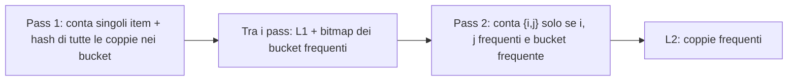
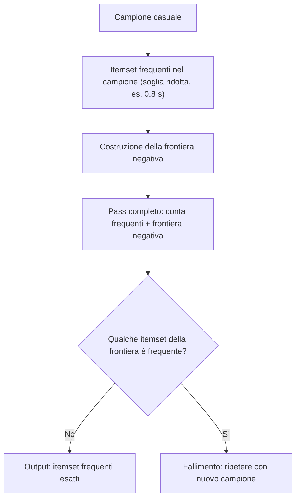

import Callout from '../../../components/Callout.astro';

## Il Modello del Carrello della Spesa (Market-Basket Model)

Il modello del carrello della spesa è un approccio fondamentale nell'analisi dei dati per identificare pattern di acquisto. Esso descrive una relazione **molti-a-molti** tra **item** (prodotti) e **basket** (transazioni o carrelli).

L'obiettivo è scoprire **insiemi di articoli che vengono acquistati frequentemente insieme**. Ogni carrello è considerato un insieme di articoli, **senza tenere conto delle quantità**. Questo modello è particolarmente rilevante in contesti con un numero elevato di transazioni e un numero relativamente piccolo di articoli per transazione.

<Callout type="example">

Un esempio classico è l'analisi delle vendite di un supermercato, dove l'identificazione di prodotti spesso acquistati insieme (es. pannolini e birra) può guidare strategie di marketing e la disposizione dei prodotti.

</Callout>

### Insiemi di Item Frequenti (Frequent Itemsets)

Un insieme di item (**itemset**) è un sottoinsieme di articoli. Un itemset è definito **frequente** se compare in un numero di transazioni pari o superiore a una **soglia di supporto minima** $s$. Il **supporto** di un itemset $I$ è il numero di carrelli che contengono $I$.

<Callout type="example">

Consideriamo il seguente esempio con soglia di supporto $s = 3$:

| Carrello ID | Contenuto |
| --- | --- |
| B1 | `{latte, coca, birra}` |
| B2 | `{latte, pepsi, succo}` |
| B3 | `{latte, birra}` |
| B4 | `{coca, succo}` |
| B5 | `{latte, pepsi, birra}` |
| B6 | `{latte, coca, birra, succo}` |
| B7 | `{coca, birra, succo}` |
| B8 | `{birra, coca}` |

**Calcolo del supporto:**

- Il supporto di `{latte}` è 5.
- Il supporto di `{birra}` è 6.
- Il supporto di `{latte, birra}` è 3.
- Il supporto di `{coca, succo}` è 3.
- Il supporto di `{latte, coca, birra}` è 2.

**Risultato:** con $s = 3$ gli itemset frequenti includono `{latte}`, `{coca}`, `{birra}`, `{succo}`, `{latte, birra}`, `{coca, succo}`.

</Callout>

**Applicazioni** degli insiemi di item frequenti:

- **Market basket:** ottimizzazione del layout dei negozi e delle promozioni.
- **Concetti correlati:** analisi di documenti per scoprire concetti congiunti.
- **Plagio:** identificazione di documenti con frasi comuni.

## Regole di Associazione (Association Rules)

L'identificazione degli itemset frequenti è il prerequisito per la scoperta delle **regole di associazione**, che esprimono dipendenze del tipo "if-then".

Una regola ha la forma $I \to j$, dove:

- $I$ è l'**antecedente** (un itemset);
- $j$ è il **conseguente** (un singolo item).

Questa regola indica che se tutti gli item in $I$ sono presenti in un carrello, è probabile che anche $j$ lo sia.

### Metriche di valutazione

Per valutare la significatività di una regola si utilizzano due metriche principali.

**1. Supporto:** la frazione di transazioni che contengono sia l'antecedente $I$ sia il conseguente $j$. Corrisponde al supporto dell'itemset $I \cup \{j\}$.

$$
\text{Support}(I \to j) = \text{Support}(I \cup \{j\})
$$

**2. Confidenza:** misura la probabilità che $j$ sia presente in un carrello, dato che $I$ è già presente.

$$
\text{Confidence}(I \to j) = \frac{\text{Support}(I \cup \{j\})}{\text{Support}(I)}
$$

La confidenza è un valore tra 0 e 1. Una confidenza elevata indica una forte dipendenza. Tuttavia, **non tutte le regole con alta confidenza sono interessanti**.

<Callout type="warning">

La regola $X \to \text{latte}$ può avere una confidenza elevata per molti insiemi $X$, poiché il latte è acquistato molto spesso (indipendentemente da $X$): la confidenza risulta alta ma **poco informativa**.

</Callout>

**3. Interesse (Lift):** per ovviare ai limiti della confidenza si può considerare l'**interesse**, che confronta la confidenza della regola con la probabilità attesa di $j$ se gli item fossero indipendenti:

$$
\text{Interest}(I \to j) = \text{Confidence}(I \to j) - P(j)
$$

Un interesse **positivo** suggerisce che $I$ e $j$ appaiono insieme più frequentemente di quanto ci si aspetterebbe per caso.

### Processo di scoperta delle regole

Si articola in due fasi:

1. **Individuazione degli insiemi frequenti:** trovare tutti gli itemset che soddisfano una soglia di supporto minima $s$.
2. **Generazione delle regole di associazione:** da ogni itemset frequente $I$ si generano regole del tipo $I - \{j\} \to j$ e se ne calcola la confidenza, scartando quelle al di sotto di una soglia minima $c$.

## Gestione della Memoria nel Conteggio di Coppie

Nella Market Basket Analysis il collo di bottiglia è spesso la **memoria RAM** necessaria a contare le coppie di item. Esistono due strategie principali per ottimizzare questo spazio.

### 1. Metodo della Matrice Triangolare (Triangular Matrix Method)

Questo metodo è ideale quando i dati sono **densi** (molte coppie diverse appaiono nei carrelli).

- **Rappresentazione degli item:** per massimizzare l'efficienza, gli item vengono mappati come interi consecutivi da $1$ a $n$ utilizzando una tabella hash.
- **Logica di memorizzazione:** si conta ogni coppia $\{i, j\}$ una sola volta assicurando che $i < j$. Invece di usare una matrice quadrata $n \times n$ (dove metà spazio sarebbe sprecato e la diagonale inutile), si utilizza un **array monodimensionale** che simula una matrice triangolare.
- **Formula di indicizzazione:** il conteggio della coppia $\{i, j\}$ si trova nell'array alla posizione $k$:

$$
k = (i-1)\left(n - \frac{i}{2}\right) + j - i
$$

- **Ordine lessicografico:** le coppie vengono salvate seguendo l'ordine $\{1,2\}, \{1,3\}, \dots, \{1,n\}, \{2,3\}, \{2,4\}, \dots$

### 2. Metodo delle Triple (Triples Method)

Questo metodo è preferibile quando i dati sono **sparsi** (poche coppie uniche rispetto a quelle possibili).

- **Struttura:** i conteggi sono memorizzati come triple $[i, j, c]$, dove:
  - $i, j$: indici degli item (con $i < j$);
  - $c$: conteggio della frequenza della coppia.
- **Supporto:** si utilizza una tabella hash con chiave $(i, j)$ per individuare rapidamente la tripla corrispondente.
- **Efficienza di spazio:** non viene occupato spazio per le coppie con conteggio pari a zero. Tuttavia, ogni coppia esistente richiede lo spazio di **3 interi** più l'overhead della tabella hash.

### Confronto e scelta del metodo

La scelta dipende dalla densità delle coppie nel dataset:

| Metodo | Quando conviene | Costo per coppia |
| --- | --- | --- |
| **Matrice triangolare** | Se **almeno 1/3** delle coppie possibili compare in almeno un carrello | 1 intero per ogni coppia possibile |
| **Triple** | Se compare **molto meno di 1/3** delle coppie possibili | 3 interi (+ overhead hash) solo per le coppie presenti |

## Proprietà di Monotonicità degli Itemset

La ricerca degli itemset frequenti si basa su un principio logico chiamato **Proprietà di Monotonicità** (o Principio di A-Priori):

<Callout type="insight">

**Se un insieme $I$ di item è frequente, allora ogni suo sottoinsieme è anch'esso frequente.**

</Callout>

*Esempio:* se $\{\text{pane}, \text{latte}, \text{uova}\}$ appare in 100 carrelli, allora anche $\{\text{pane}, \text{latte}\}$ apparirà in *almeno* 100 carrelli.

### Itemset Massimali

Dato un supporto minimo $s$, un itemset è detto **massimale** se è frequente, ma nessuno dei suoi sovrainsiemi lo è.

Conoscere gli itemset massimali è estremamente potente perché:

1. **Sottoinsiemi:** sappiamo automaticamente che tutti i loro sottoinsiemi sono frequenti.
2. **Esclusione:** sappiamo che nessun insieme che non sia sottoinsieme di un itemset massimale può essere frequente.

<Callout type="note">

Questa proprietà è fondamentale perché permette all'algoritmo di **potare (pruning)** lo spazio di ricerca, evitando di contare combinazioni di item che non hanno alcuna possibilità di essere frequenti.

</Callout>

Vediamo ora gli algoritmi per l'individuazione degli insiemi frequenti.

## L'Algoritmo A-Priori

L'Algoritmo A-Priori è progettato per **ridurre il numero di coppie (e di $k$-ple) da contare**, ottimizzando l'uso della memoria RAM al costo di effettuare **più passaggi sui dati**.

### 1. Primo passaggio (First Pass)

In questa fase l'obiettivo è identificare quali singoli item sono promettenti.

- **Tabella di traduzione:** converte i nomi degli item in interi $[1, \dots, n]$.
- **Tabella dei conteggi:** un array monodimensionale dove l'elemento $i$ registra quante volte l'item $i$ appare in tutti i carrelli.

### 2. Tra il primo e il secondo passaggio

Si effettua il "filtro" basato sulla soglia di supporto $s$ (es. 1% dei carrelli).

- **Singleton frequenti ($L_1$):** si isolano gli item il cui conteggio è $\geq s$.
- **Frequent-Items Table:** si crea un nuovo array di dimensione $n$.
  - Se l'item $i$ non è frequente $\to$ valore **0**.
  - Se l'item $i$ è frequente $\to$ gli viene assegnato un **nuovo indice univoco** da $1$ a $m$ (dove $m < n$).

### 3. Secondo passaggio (Second Pass)

Qui si contano solo le coppie "potenzialmente" frequenti.

- **Generazione coppie:** per ogni carrello si considerano solo gli item che nella tabella precedente hanno un indice $> 0$, e si generano tutte le possibili coppie tra questi item frequenti.
- **Incremento:** si aggiorna la struttura dati (matrice triangolare o triple) usando i nuovi indici $[1, \dots, m]$.
- **Risultato:** si ottiene $L_2$, l'insieme delle coppie frequenti.

<Callout type="tip">

**Osservazioni sulla memoria:**

- Usando la matrice triangolare, lo spazio scende da $2n^2$ a $2m^2$ byte.
- Se solo il 50% degli item è frequente ($m = n/2$), lo spazio richiesto si riduce a **1/4** dell'originale.

</Callout>

### A-Priori per insiemi di dimensione $k$

L'algoritmo sfrutta la **proprietà di monotonicità**: un insieme di dimensione $k+1$ può essere frequente solo se tutti i suoi sottoinsiemi di dimensione $k$ lo sono.

L'algoritmo alterna fasi di generazione dei candidati e fasi di conteggio:

1. **$C_k$ (Candidati):** insieme degli itemset di dimensione $k$ che *potrebbero* essere frequenti (costruiti a partire da $L_{k-1}$).
2. **$L_k$ (Frequenti):** insieme degli itemset di dimensione $k$ che, dopo il conteggio sul dataset, superano effettivamente la soglia $s$.

<Callout type="example">

Passaggi ipotetici dell'algoritmo A-Priori:

- $C_1 = \{\{b\}\{c\}\{j\}\{m\}\{n\}\{p\}\}$
- Calcolare il supporto degli insiemi di elementi in $C_1$.
- Eliminare quelli non frequenti: $L_1 = \{b, c, j, m\}$.
- Generare $C_2 = \{\{b,c\}\{b,j\}\{b,m\}\{c,j\}\{c,m\}\{j,m\}\}$.
- Calcolare il supporto degli insiemi di elementi in $C_2$.
- Eliminare quelli non frequenti: $L_2 = \{\{b,m\}\{b,c\}\{c,m\}\{c,j\}\}$.
- Generare $C_3 = \{\{b,c,m\}\{b,c,j\}\{b,m,j\}\{c,m,j\}\}$.
- Calcolare il supporto degli insiemi di elementi in $C_3$.
- Eliminare quelli non frequenti: $L_3 = \{\{b,c,m\}\}$.

</Callout>

### Gestione di grandi dataset e limiti

L'efficacia di A-Priori dipende dalla **RAM disponibile**:

- **Capacità:** il passaggio con il maggior numero di candidati (solitamente $C_2$) deve risiedere interamente in memoria.
- **Thrashing:** se la RAM non è sufficiente, il sistema inizia a spostare dati continuamente tra RAM e disco rigido. Questo fenomeno, detto *thrashing*, rallenta drasticamente l'esecuzione, rendendo l'algoritmo inefficiente.

Seguono alcune possibili ottimizzazioni.

## L'Algoritmo di Park, Chen e Yu (PCY)

L'algoritmo PCY è un'estensione dell'A-Priori che sfrutta la **memoria principale inutilizzata durante il primo passaggio** per ridurre drasticamente il numero di coppie candidate da analizzare nel secondo passaggio.

### 1. Primo passaggio (First Pass)

Mentre l'A-Priori conta solo i singoli item, il PCY utilizza lo spazio rimanente in RAM per creare una **hash table di "bucket"** (secchielli).

**Operazioni per ogni carrello:**

1. **Conteggio item singoli:** per ogni item nel carrello si incrementa il relativo contatore nell'array dei singleton.
2. **Generazione di TUTTE le coppie:** tramite un doppio ciclo si generano tutte le possibili coppie $\{i, j\}$ contenute nel carrello (indipendentemente dal fatto che gli item siano frequenti o meno).
3. **Hashing delle coppie:** ogni coppia viene passata a una funzione di hash $f(i, j)$ e si incrementa di 1 il contatore del bucket corrispondente.
   - *Esempio di funzione di hash:* $f(i_1, i_2) = (i_1 + i_2) \pmod d$
   - L'output sarà un indice nell'intervallo $[0, d-1]$.

<Callout type="note">

**Nota tecnica:**

- La coppia in sé **non viene memorizzata** nel bucket; si salva solo il contatore incrementato.
- **Collisioni:** coppie diverse possono finire nello stesso bucket.

</Callout>

### 2. Tra il primo e il secondo passaggio

Alla fine del primo passaggio ogni bucket ha un conteggio totale.

- **Bucket frequente:** un bucket il cui conteggio è $\geq s$ (soglia di supporto).
- **Filtro fondamentale:** se un bucket è **infrequente**, allora **nessuna** coppia al suo interno può essere frequente.
- **Bitmap:** la tabella di hash viene riassunta in una **bitmap** (vettore di bit):
  - **Bit = 1:** bucket frequente.
  - **Bit = 0:** bucket infrequente.
  - *Vantaggio:* riduce l'occupazione di memoria a $1/32$ rispetto all'uso di interi a 32 bit.

### 3. Secondo passaggio (Second Pass)

Il set di coppie candidate $C_2$ è molto più ristretto rispetto all'A-Priori. Una coppia $\{i, j\}$ viene contata solo se soddisfa **due condizioni**:

1. Entrambi gli item $i$ e $j$ sono frequenti (come in A-Priori).
2. La coppia $\{i, j\}$ viene mappata in un bucket che la bitmap indica come **frequente** (condizione distintiva di PCY).

### Limiti strutturali e scelta del metodo

A differenza di A-Priori, nel PCY **non è possibile usare il metodo della matrice triangolare** per il conteggio nel secondo passaggio.

- **Motivo:** le coppie rimosse dal PCY sono distribuite casualmente. Non esiste un modo per "compattare" la matrice eliminando i buchi lasciati dalle coppie scartate.
- **Conseguenza:** nel PCY si è costretti a utilizzare il **metodo delle triple**.

## Evitare gli Errori nei Metodi di Campionamento

### Tipi di errori possibili

- **Falso negativo:** un itemset che è frequente nel dataset completo ma **non risulta frequente nel campione**.
- **Falso positivo:** un itemset che risulta frequente nel campione ma **non lo è nel dataset completo**.

Gli itemset con un supporto **molto vicino alla soglia** hanno probabilità simili di risultare frequenti o meno nel campione.

### Correzione dei falsi positivi

Per eliminare i falsi positivi si può eseguire **un passaggio completo sull'intero dataset**, contando solo gli itemset che erano stati trovati frequenti nel campione. Questo processo **rimuove tutti i falsi positivi**, ma **i falsi negativi rimangono**, poiché non vengono contati.

### Riduzione dei falsi negativi

Se la memoria lo consente, è possibile ridurre i falsi negativi **abbassando la soglia di supporto nel campione**.

Se $s$ è la soglia di supporto del dataset e il campione rappresenta una frazione $p$ del dataset intero, si può usare $p \cdot s$ come soglia per il campione, oppure un valore leggermente inferiore, ad esempio $0.9\,ps$.

Abbassare la soglia comporta l'aumento del numero di itemset da conteggiare, e quindi maggiori esigenze di memoria.

## Algoritmo SON (Savasere-Omiecinski-Navathe)

**Obiettivo:** gestire dataset troppo grandi per la memoria RAM sfruttando il **partizionamento**. È l'algoritmo ideale per ambienti distribuiti (es. MapReduce).

**Principio fondamentale:** se un itemset è frequente nell'intero dataset, allora **deve** essere frequente in almeno una delle partizioni (chunk).

**Funzionamento (two-pass):**

- **Passaggio 1 (locale):** il dataset viene diviso in $k$ partizioni. Si esegue A-Priori (o un altro algoritmo) su ogni partizione singolarmente, usando una soglia di supporto scalata ($s/k$). L'unione di tutti gli itemset trovati frequenti localmente diventa l'elenco dei **Candidati Globali**.
- **Passaggio 2 (globale):** si scansiona l'intero dataset un'ultima volta per contare il supporto reale *solo* dei Candidati Globali identificati nel passo 1.
- **Risultato:** vengono restituiti solo gli itemset che superano la soglia di supporto globale $s$.

**Vantaggio:** non genera falsi negativi (garantito dalla matematica) e richiede solo **due passaggi completi** sui dati.

## Algoritmo di Toivonen

**Obiettivo:** ridurre drasticamente il numero di passaggi sul dataset completo (spesso ne basta **1**) utilizzando un campionamento casuale.

**Funzionamento:**

1. **Campionamento:** si estrae un piccolo campione casuale dal dataset.
2. **Soglia abbassata:** si cercano gli itemset frequenti nel campione, ma usando una soglia di supporto leggermente più bassa (es. $0.8 \cdot s$) per aumentare la probabilità di catturare i "veri" frequenti.
3. **Frontiera negativa (negative border):** si costruisce la *frontiera negativa*, ovvero l'insieme degli itemset che **non** sono frequenti nel campione, ma i cui sottoinsiemi immediati **lo sono tutti**.
4. **Validazione:** si scansiona il dataset completo contando sia i frequenti trovati nel campione sia quelli della frontiera negativa.

**Gestione degli errori:**

- **Nessun falso positivo:** poiché si fa un conteggio finale sul dataset completo, i falsi positivi vengono scartati.
- **Rischio falsi negativi:** se un itemset è frequente nel dataset completo ma non è stato trovato nel campione *e* non è nemmeno nella frontiera negativa, l'algoritmo fallisce. In questo caso (raro se il campione è buono) l'algoritmo deve essere rieseguito con un nuovo campione.

### Confronto tra gli algoritmi

| Algoritmo | Idea chiave | Passaggi sul dataset | Falsi positivi / negativi |
| --- | --- | --- | --- |
| **A-Priori** | Monotonicità, $C_k \to L_k$ | $k$ (uno per dimensione) | Esatto |
| **PCY** | Hash delle coppie + bitmap nel pass 1 | Come A-Priori, ma $C_2$ più piccolo | Esatto |
| **SON** | Partizionamento in $k$ chunk, soglia $s/k$ | 2 | Nessun FN, FP rimossi nel pass 2 |
| **Toivonen** | Campione + frontiera negativa | Spesso 1 | Nessun FP; FN rilevati → si ripete |

## Il Problema della Ricerca di Documenti Simili

Nel contesto dei Big Data, l'identificazione di documenti simili all'interno di collezioni di vaste dimensioni rappresenta una sfida significativa. Confrontare ogni documento con ogni altro per determinarne la similarità è un'operazione **computazionalmente proibitiva**.

Ad esempio, per $N = 1$ milione di documenti, il numero di confronti necessari sarebbe di circa $5 \times 10^{11}$, richiedendo tempi di calcolo eccessivi.

Questo problema emerge in diverse applicazioni cruciali:

- **Identificazione di contenuti duplicati:** rilevamento di siti mirror o quasi-duplicati per ottimizzare i risultati dei motori di ricerca.
- **Raggruppamento di informazioni:** aggregazione di articoli di notizie che trattano lo stesso evento da fonti diverse.
- **Rilevamento di plagio:** individuazione di testi copiati o riutilizzati in ambito accademico o professionale.
- **Sistemi di raccomandazione:** suggerimento di contenuti affini agli interessi dell'utente.

Per superare l'inefficienza del confronto diretto sono state sviluppate tecniche che riducono la dimensionalità dei dati e permettono di focalizzarsi solo sulle coppie di documenti più promettenti.

## Shingling: Rappresentare i Documenti come Insiemi

Lo **shingling** è una tecnica fondamentale per trasformare un documento testuale in un formato che ne catturi il contenuto in modo efficace e confrontabile. Converte un documento in un insieme di brevi stringhe, denominate **shingles** o **n-grammi**.

### Cosa sono gli shingles?

Un **k-shingle** è definito come ogni sottostringa di lunghezza $k$ presente in un documento. Associando a ciascun documento l'insieme dei $k$-shingles che vi appaiono, il documento viene rappresentato come un insieme di queste unità. È comune normalizzare il testo trattando sequenze di spazi bianchi come un singolo spazio.

<Callout type="example">

Per il documento $D = \text{"abcab"}$ e $k = 2$, l'insieme dei 2-shingles è $S(D) = \{\text{"ab"}, \text{"bc"}, \text{"ca"}\}$. Le ripetizioni sono generalmente ignorate per la maggior parte delle applicazioni di similarità.

</Callout>

### Scelta della dimensione dello shingle ($k$)

La scelta del valore di $k$ è critica:

- Se $k$ è **troppo piccolo**, molti shingles appariranno in quasi tutti i documenti, rendendo la similarità poco discriminante.
- Se $k$ è **troppo grande**, ogni shingle potrebbe essere unico per un solo documento, annullando la similarità.

Un criterio generale suggerisce di scegliere $k$ sufficientemente grande da rendere bassa la probabilità che uno shingle appaia casualmente in documenti diversi:

- per documenti di medie dimensioni (es. email), $k = 5$ è spesso adeguato;
- per documenti più lunghi (es. articoli scientifici), $k = 9$ è considerato più sicuro.

### 1. Trasformazione del documento in shingles

1. **Estrazione:** si divide il documento in shingles (es. $S_1, S_2, S_3, \dots$).
2. **Mapping:** si applica una funzione di hash $h$ a ogni shingle:
   - $h(\text{"abcde"}) = 129481$
   - $h(\text{"bcdef"}) = 928374$
3. **Rappresentazione:** il documento ora non è più un insieme di stringhe, ma un **insieme di numeri interi**.

<Callout type="note">

**Nota sulle collisioni:** è possibile che due shingle diversi finiscano nello stesso numero (collisione), ma con una funzione di hash a 64 bit la probabilità è così bassa da essere trascurabile per scopi pratici.

</Callout>

### 2. La matrice caratteristica

Una volta ottenuti gli shingles hashati, possiamo immaginare i dati come una gigantesca matrice:

- **Righe:** rappresentano tutti i possibili valori di hash (l'unione di tutti gli shingles di tutti i documenti).
- **Colonne:** rappresentano i documenti.
- **Valore:** **1** se il documento $j$ contiene lo shingle $i$, altrimenti **0**.

Poiché il numero di possibili shingles è enorme, questa matrice è **estremamente sparsa** (piena di zeri). Non la memorizziamo mai interamente, ma è il concetto matematico su cui si basa il calcolo della somiglianza.

### Rappresentazione e similarità di Jaccard

Una volta generati gli shingles, i documenti possono essere rappresentati come **vettori binari** (0/1) in uno spazio multidimensionale, dove ogni dimensione corrisponde a uno shingle unico nella collezione.

La similarità tra due documenti $D_1$ e $D_2$ può essere misurata tramite la **similarità di Jaccard** tra i loro insiemi di shingles $S(D_1)$ e $S(D_2)$:

$$
\text{sim}(D_1, D_2) = \frac{|S(D_1) \cap S(D_2)|}{|S(D_1) \cup S(D_2)|}
$$

Questa rappresentazione, sebbene porti a matrici molto grandi e sparse, è il punto di partenza per tecniche più avanzate.

## Minhashing: Creare Signature Compatte

Il calcolo diretto della similarità di Jaccard per tutte le coppie di documenti basato sulla matrice di shingles rimane computazionalmente oneroso. Il **Minhashing** risolve questo problema creando **signature compatte** per ciascun documento, che **preservano la similarità di Jaccard** degli insiemi di shingles originali.

### L'idea chiave: permutazioni e valori minimi

Il Minhashing si basa sul principio che **la probabilità che due insiemi abbiano lo stesso valore minimo sotto una permutazione casuale delle righe della matrice di shingles è uguale alla loro similarità di Jaccard**.

In pratica si utilizzano diverse funzioni di hash per simulare permutazioni casuali delle righe. Per ogni documento si calcola un vettore di valori minimi, chiamato **signature**. Se si usano $h$ funzioni di hash, la signature di un documento sarà un vettore di $h$ numeri interi. La similarità tra due documenti è quindi stimata dalla **frazione di funzioni di hash per cui i valori minimi corrispondenti nelle loro signature sono uguali**.

<Callout type="insight">

Nella matrice caratteristica le righe sono gli ID degli shingles hashati. L'algoritmo si chiede: "E se mescolassimo l'ordine delle righe in modo casuale?". Questa è la **permutazione**.

</Callout>

Per ogni colonna (documento) e per ogni permutazione effettuata:

1. Scorri le righe della matrice partendo dall'alto (nel nuovo ordine dato dalla permutazione).
2. Fermati appena incontri il **primo "1"**.
3. Segnati il **numero della riga** (o l'indice) in cui hai trovato quell'1.

Questo numero è il **MinHash** del documento per quella specifica permutazione.

Un solo MinHash non basta a descrivere un documento. Per creare una **signature** robusta:

- si scelgono $n$ permutazioni diverse (solitamente tra 100 e 500);
- per ogni permutazione si annota l'indice del primo 1;
- alla fine, ogni documento sarà rappresentato da un **vettore di $n$ numeri** (la signature).

**Risultato:** abbiamo trasformato una colonna di milioni di bit in un piccolo vettore di (ad esempio) 200 numeri interi.

<Callout type="example">

Date le signature $D_1 = [2, 4, 3, 1]$ e $D_2 = [2, 1, 3, 4]$ (ottenute con 4 funzioni di hash), le posizioni coincidenti sono la prima e la terza. La similarità stimata è $2/4 = 0.5$.

</Callout>

La ragione per cui facciamo tutto questo è un teorema matematico:

<Callout type="insight">

La probabilità che due documenti abbiano lo stesso valore di MinHash per una permutazione casuale è **esattamente uguale** alla loro similarità di Jaccard:

$$
P\left[h(C_1) = h(C_2)\right] = \text{sim}(C_1, C_2)
$$

</Callout>

Quindi:

- se due documenti sono identici (Jaccard = 1), avranno sempre il "primo 1" nella stessa riga, quindi signature identiche;
- se sono simili al 50%, avranno lo stesso numero nella signature circa il 50% delle volte.

### Implementazione con funzioni di hash

Permutare fisicamente una matrice con milioni di righe è impossibile per un computer. In pratica, invece di "mescolare le righe", si usano delle **funzioni di hash**:

1. per ogni riga $r$ che contiene un "1" per il documento $D$;
2. si calcolano $h_1(r), h_2(r), \dots, h_n(r)$ (dove ogni $h$ simula una permutazione);
3. per ogni funzione di hash si tiene solo il **valore minimo** trovato tra tutte le righe con "1" — ecco perché si chiama ***Min**Hashing*!

### Vantaggi del Minhashing

- **Riduzione della dimensionalità:** le signature sono significativamente più piccole degli insiemi di shingles originali.
- **Preservazione della similarità:** la similarità tra le signature è una buona stima della similarità di Jaccard.
- **Efficienza:** il confronto delle signature è molto più rapido rispetto al confronto degli insiemi di shingles.

### Accelerazione e precisione

Per velocizzare si possono analizzare solo le prime $m$ righe su $k$. Se una colonna ha solo zeri nelle prime $m$ righe, il suo valore è $\infty$.

- **Confronto con $\infty$:** se entrambe hanno $\infty$, la riga non conta; se una sola ha $\infty$, conta come differenza.
- Questo riduce il lavoro di un fattore $k/m$, permettendo di usare più funzioni di hash per compensare la leggera perdita di precisione.

## Locality-Sensitive Hashing (LSH) per la Ricerca di Coppie Simili

Anche con le signature MinHash, confrontare tutte le coppie di documenti può essere troppo lento per collezioni estremamente grandi. Il **Locality-Sensitive Hashing (LSH)** aggira questo problema raggruppando documenti potenzialmente simili in "bucket", riducendo drasticamente il numero di confronti necessari.

### L'idea generale di LSH

LSH impiega funzioni di hash con la proprietà di **"località sensibile"**: elementi simili hanno un'alta probabilità di finire nello stesso bucket, mentre elementi dissimili hanno un'alta probabilità di finire in bucket diversi.

Nel contesto del Minhashing, LSH divide la matrice delle signature in diverse **"bande"** (gruppi di righe). Ogni banda viene poi hashata in un numero di bucket. Due documenti sono considerati una **"coppia candidata"** se le loro signature corrispondenti finiscono nello stesso bucket per **almeno una banda**.

### Partizionare la matrice delle signature in bande

Data una matrice di signature $M$ con $r_{tot}$ righe (corrispondenti al numero di funzioni di hash) e $N$ colonne (documenti):

1. **Divisione in bande:** la matrice $M$ viene suddivisa in $b$ bande, ciascuna contenente $r$ righe, tale che $b \times r = r_{tot}$.
2. **Hashing delle bande:** per ogni banda si applica una funzione di hash alle righe che la compongono per ciascuna colonna. Le colonne che producono lo stesso valore hash per una data banda sono considerate coppie candidate.
3. **Identificazione delle coppie candidate:** due documenti diventano una coppia candidata se le loro signature corrispondenti sono identiche in almeno una banda.

La scelta dei parametri $b$ (numero di bande) e $r$ (righe per banda) è cruciale per bilanciare i **falsi positivi** (coppie dissimili erroneamente considerate simili) e i **falsi negativi** (coppie simili non identificate).

### Analisi della tecnica delle bande

La probabilità che due documenti con similarità di Jaccard $s$ diventino una coppia candidata è data da:

$$
P(\text{candidata}) = 1 - (1 - s^r)^b
$$

- $s^r$: probabilità che tutte le righe di una banda siano uguali;
- $1 - s^r$: probabilità che almeno una riga di una banda sia diversa;
- $(1 - s^r)^b$: probabilità che nessuna banda sia identica.

**Soglia (threshold):** il punto critico è circa

$$
t \approx \left(\frac{1}{b}\right)^{1/r}
$$

Questa funzione ha una **forma a "S"**: la probabilità di candidarsi è bassa per $s$ basse e alta per $s$ alte. I parametri $b$ e $r$ determinano la "ripidità" di questa curva e la soglia di similarità attorno alla quale la probabilità di candidarsi cresce rapidamente.

**Tuning:**

- **Più bande ($b$):** meno falsi negativi (trovi tutto), ma più falsi positivi.
- **Più righe ($r$):** filtro più stretto (solo documenti molto simili).

### Vantaggi di LSH

- **Scalabilità:** riduce drasticamente il numero di confronti necessari, rendendo possibile l'analisi di collezioni di documenti molto grandi.
- **Efficienza:** focalizza l'attenzione solo sulle coppie di documenti che hanno una probabilità significativa di essere simili.

<Callout type="insight">

In sintesi, lo **Shingling** trasforma i documenti in insiemi gestibili, il **Minhashing** crea rappresentazioni compatte (signature) che preservano la similarità di Jaccard, e **LSH** utilizza queste signature per identificare efficientemente coppie di documenti potenzialmente simili, evitando confronti esaustivi. Queste tecniche sono essenziali per la gestione e l'analisi di grandi volumi di dati testuali.

</Callout>

### Schema riassuntivo del processo combinato

1. **Shingling:** estrai i $k$-shingles da ogni documento.
2. **MinHash:** calcola le signature di lunghezza $n$ usando funzioni di hash minimizzate.
3. **LSH:** definisci la soglia $t$ e scegli $b, r$ tali che $t \approx (1/b)^{1/r}$.
4. **Filtro candidati:** applica LSH per trovare solo le coppie sospette.
5. **Verifica:** confronta le signature delle coppie candidate.
6. **(Opzionale):** se le signature confermano la similarità, verifica i documenti originali.

## Bag of Words (BoW)

Un altro metodo di tokenizzazione, oltre agli shingles, è il **Bag of Words**.

Immagina di prendere un documento, ritagliare ogni singola parola e buttarla dentro un sacchetto (un "bag", appunto). In questo sacchetto perdi l'ordine delle parole e la struttura grammaticale, ma mantieni la **frequenza** di ogni parola. Dunque la BoW è una rappresentazione testuale che **ignora l'ordine delle parole** e considera solo la loro frequenza nel testo.

**Il processo:**

1. **Vocabolario:** si crea un elenco di tutte le parole uniche presenti nel set di documenti (es. "il", "gatto", "corre", "topo").
2. **Vettorizzazione:** ogni documento viene trasformato in un vettore dove ogni posizione corrisponde a una parola del vocabolario. Il valore in quella posizione indica quante volte la parola appare nel documento.

<Callout type="example">

- Doc 1: "Il gatto mangia il topo"
- Doc 2: "Il topo mangia il formaggio"
- *Vocabolario:* `{il, gatto, mangia, topo, formaggio}`
- **Vettore Doc 1:** $[2, 1, 1, 1, 0]$ (la parola "il" appare 2 volte, "formaggio" 0).

</Callout>

Il Bag of Words è un metodo usato nei modelli di **recupero dell'informazione** (information retrieval).

---

## Riepilogo

| Concetto | Descrizione |
| --- | --- |
| **Market-basket model** | Relazione molti-a-molti tra item e basket; si cercano item acquistati insieme, ignorando le quantità |
| **Supporto** | Numero (o frazione) di carrelli che contengono l'itemset $I$; frequente se $\geq s$ |
| **Regola di associazione** | $I \to j$; supporto $= \text{Support}(I \cup \{j\})$ |
| **Confidenza** | $\text{Support}(I \cup \{j\}) / \text{Support}(I)$, tra 0 e 1 |
| **Interesse (Lift)** | $\text{Confidence}(I \to j) - P(j)$; positivo = più frequente del caso |
| **Matrice triangolare** | Array 1D, $k = (i-1)(n - i/2) + j - i$; conviene se almeno 1/3 delle coppie compare |
| **Metodo delle triple** | $[i, j, c]$ solo per coppie presenti (3 interi + hash); conviene con dati sparsi |
| **Monotonicità** | Se $I$ è frequente, ogni suo sottoinsieme lo è; consente il pruning |
| **Itemset massimale** | Frequente, ma nessun sovrainsieme lo è |
| **A-Priori** | Alterna $C_k$ (candidati) e $L_k$ (frequenti); un passaggio per dimensione; memoria da $2n^2$ a $2m^2$ byte |
| **PCY** | Pass 1: hash di tutte le coppie in bucket → bitmap; pass 2 conta solo coppie con item frequenti e bucket frequente; richiede le triple |
| **Campionamento** | Falsi positivi rimossi con un pass completo; falsi negativi ridotti con soglia $p \cdot s$ (o $0.9\,ps$) |
| **SON** | $k$ partizioni con soglia $s/k$ → candidati globali → conteggio reale; 2 passaggi, nessun falso negativo |
| **Toivonen** | Campione con soglia ridotta + frontiera negativa; spesso 1 pass; se un elemento della frontiera è frequente si ripete |
| **k-shingle** | Sottostringa di lunghezza $k$; $k = 5$ per email, $k = 9$ per documenti lunghi |
| **Similarità di Jaccard** | $\lvert S(D_1) \cap S(D_2) \rvert / \lvert S(D_1) \cup S(D_2) \rvert$ |
| **MinHash** | Indice del primo 1 sotto una permutazione; $P[h(C_1) = h(C_2)] = \text{sim}(C_1, C_2)$ |
| **Signature** | Vettore di $n$ MinHash (100–500); similarità stimata = frazione di posizioni uguali |
| **LSH (bande)** | $b$ bande da $r$ righe ($b \cdot r = r_{tot}$); candidata se identica in almeno una banda |
| **Probabilità candidata** | $1 - (1 - s^r)^b$, curva a S con soglia $t \approx (1/b)^{1/r}$ |
| **Bag of Words** | Vettore di frequenze delle parole del vocabolario, ignora l'ordine |
