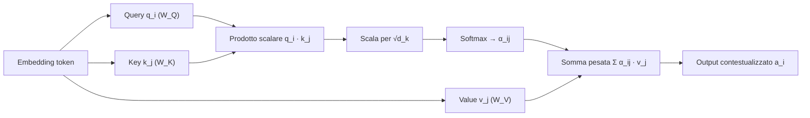

import Callout from '../../../components/Callout.astro';

## Accesso all'informazione e Text Retrieval

L'obiettivo dell'accesso ai dati testuali è **connettere l'utente con l'informazione giusta al momento giusto**. Esistono due modalità principali di interazione:

- **Pull Mode (Search)**: l'utente prende l'iniziativa (ad-hoc). Ha un bisogno informativo specifico e interroga il sistema.
  - *Querying*: l'utente sa cosa cerca e formula una richiesta specifica.
  - *Browsing*: l'utente naviga in una struttura per esplorare contenuti.
- **Push Mode (Recommendation)**: il sistema prende l'iniziativa. Basandosi su **interessi stabili** dell'utente (profilo), il sistema "spinge" informazioni rilevanti (es. feed di notizie, raccomandazioni).

| Modalità | Chi prende l'iniziativa | Bisogno informativo | Esempi |
|---|---|---|---|
| Pull (Search) | Utente | Specifico, ad-hoc | Querying, browsing |
| Push (Recommendation) | Sistema | Interessi stabili (profilo) | Feed di notizie, raccomandazioni |

### Il motore di ricerca (Text Retrieval System)

Il compito di un motore di ricerca è trasformare una **query** (spesso breve, incompleta e ambigua) in una **lista ordinata di documenti rilevanti** da una collezione fissa.

## Preprocessing del testo

Prima di qualsiasi analisi, il testo grezzo deve essere trasformato in una rappresentazione strutturata tramite una pipeline di elaborazione:

1. **Tokenization**: segmentazione del flusso di caratteri in unità minime (**token**/parole). Gestisce spazi, punteggiatura e casi speciali (es. "l'albero", "U.S.A.").
2. **Stopword removal**: rimozione di parole molto frequenti ma con scarso contenuto informativo (articoli, preposizioni, congiunzioni come "il", "di", "e"). Riduce la dimensione dell'indice del **30–40%** senza perdere significato.
3. **Normalizzazione**: riduzione delle parole alla loro forma canonica per gestire le varianti morfologiche.
   - **Stemming**: approccio algoritmico "grezzo" che **tronca i suffissi** delle parole (es. "fishing", "fished", "fisher" → "fish"). È veloce ma può generare radici non esistenti.
   - **Lemmatization**: **analisi morfologica** che riconduce la parola alla sua forma base da dizionario (es. "better" → "good"). È più precisa ma computazionalmente costosa.

| | Stemming | Lemmatization |
|---|---|---|
| Approccio | Troncamento algoritmico dei suffissi | Analisi morfologica con dizionario |
| Esempio | fishing, fished, fisher → fish | better → good |
| Velocità | Alta | Bassa (costosa) |
| Precisione | Può produrre radici inesistenti | Forma base corretta |

### Normalizzazione della lunghezza del documento

Nei motori di ricerca esiste una distorsione intrinseca: i **documenti lunghi tendono ad avere un vantaggio ingiusto** rispetto a quelli brevi (contengono più parole, quindi più probabilmente i termini della query).

- **Document Length Normalization**: si **penalizzano i documenti lunghi** per bilanciare questo vantaggio, facendo però attenzione a **non penalizzarli eccessivamente**.
- **Pivoted Length Normalization**: tecnica specifica e molto efficace per implementare tale normalizzazione, usando la lunghezza media come "perno":
  - se un documento è **più lungo** della media, il suo punteggio viene **penalizzato** (ridotto);
  - se un documento è **più corto** della media, il suo punteggio riceve un **bonus** (o viene penalizzato meno).

## Retrieval Model

Un **Retrieval Model** è un framework formale che fornisce una **definizione computazionale di rilevanza**. Il suo scopo è definire la **funzione di ranking** $f(q, d)$ che il motore di ricerca utilizzerà per ordinare i documenti: in pratica stabilisce le regole matematiche per decidere quale documento ($d$) è più pertinente rispetto alla query dell'utente ($q$).

Le due famiglie principali di modelli sono:

- i **modelli a spazio vettoriale** (Vector Space Model);
- i **modelli probabilistici**.

## Rappresentazione classica: Vector Space Model

Per calcolare la rilevanza, documenti e query vengono rappresentati come **vettori in uno spazio multidimensionale** (**Bag-of-Words**), dove ogni dimensione corrisponde a una parola del vocabolario. Utilizza la semantica vettoriale (vedi [Semantica vettoriale](#semantica-vettoriale)).

Ogni documento è rappresentato con un **unico vettore** (media dei vettori delle singole parole).

### Pesi: TF-IDF

Non tutte le parole hanno la stessa importanza. Il peso di un termine $t$ in un documento $d$ è dato da:

$$
\text{Weight}(t, d) = TF(t, d) \times IDF(t)
$$

1. **Term Frequency (TF)**: quanto spesso il termine appare nel documento. Se una parola appare molte volte, è probabilmente importante per quel documento.
   - *Variante*: spesso si usa il logaritmo $1 + \log(TF)$ per evitare che parole ripetute troppe volte dominino il punteggio (**legge di saturazione**).
2. **Inverse Document Frequency (IDF)**: misura quanto il termine è "raro" nell'intera collezione.

$$
IDF(t) = \frac{N + 1}{DF(t)}
$$

dove $N$ è il numero totale di documenti e $DF(t)$ è il numero di documenti che contengono $t$.

- *Logica*: parole comuni ovunque (es. "fare") hanno IDF basso (vicino a 0); parole rare e specifiche hanno IDF alto.

<Callout type="note">

Nella formulazione standard l'IDF include un logaritmo, ad esempio $IDF(t) = \log \frac{N + 1}{DF(t)}$: è proprio il logaritmo a far sì che un termine presente in quasi tutti i documenti abbia IDF **vicino a 0**.

</Callout>

La **TF transformation** (trasformazione della frequenza dei termini) è una procedura usata per migliorare il modello a spazio vettoriale di base, passando dal semplice **conteggio grezzo** delle parole a una **frequenza ponderata**.

### Similarità (Ranking)

Per ordinare i documenti in base alla rilevanza rispetto alla query, si calcola la **similarità coseno** tra il vettore della query ($q$) e il vettore del documento ($d$):

$$
Sim(q, d) = \cos(\theta) = \frac{q \cdot d}{\lvert q \rvert \, \lvert d \rvert}
$$

A differenza della **distanza euclidea** (che dipende dalla lunghezza del testo), il coseno misura l'**angolo** tra i vettori: due documenti sono simili se i loro vettori puntano nella stessa direzione, indipendentemente dalla loro lunghezza.

Altre funzioni di similarità sono la **distanza euclidea** e il **prodotto scalare** (quest'ultimo tiene conto anche del modulo dei vettori).

## Modelli di linguaggio

Nel campo dell'elaborazione del linguaggio naturale (**NLP**), un **modello di linguaggio** è uno strumento essenziale per comprendere e generare il linguaggio umano. La sua funzione primaria è **assegnare una probabilità a una sequenza di parole**, permettendo di valutare la correttezza grammaticale e la sensatezza semantica di una frase. Questa capacità è fondamentale per applicazioni come la traduzione automatica, la correzione ortografica e la generazione di testo.

### Modelli probabilistici

I modelli probabilistici misurano quanto un documento sia utile stimando la **probabilità di rilevanza**. Utilizzano una funzione di ranking probabilistica basata sulla probabilità che un dato documento $d$ sia rilevante rispetto a una query $q$:

$$
P(R = 1 \mid d, q)
$$

dove $R$ è una **variabile binaria** che indica la rilevanza. Esempi sono **BM25**, **Query Likelihood** e **PL2**.

### Modello Query Likelihood (QL)

L'obiettivo di questo modello è quantificare la **probabilità che un utente formuli una determinata query** $q$ per identificare un particolare documento $d$. Un documento è quindi rappresentato come una **distribuzione di probabilità sulle parole** del vocabolario.

- **Assunzione di base**: la query viene generata campionando parole direttamente dal documento ideale ("immaginario") che l'utente ha in mente.
- Si basa sul **prodotto delle probabilità** delle singole parole della query, assumendo che ogni parola sia **indipendente**.

**Formalizzazione**:

$$
P(q \mid d) = \prod_{w \in q} P(w \mid d)
$$

dove $P(w \mid d)$ è la frequenza relativa del termine nel documento.

### Legge di Zipf

Descrive la **distribuzione sbilanciata** delle frequenze delle parole: **poche parole** hanno frequenze elevatissime, mentre **moltissime parole** hanno frequenze basse.

$$
r \cdot f = k
$$

dove $r$ è il **rango** (posizione nella classifica per frequenza) e $f$ è la **frequenza assoluta**. La frequenza è quindi inversamente proporzionale al rango:

$$
f(r) = \frac{k}{r}
$$

**Definizione empirica di probabilità**: la probabilità (o frequenza relativa) di una parola è data dal rapporto tra la sua frequenza e il numero totale di parole (token) nel testo:

$$
P(r) = \frac{\text{frequenza}}{\text{numero totale di parole}}
$$

### Regola della catena e approssimazione N-gram

La probabilità di una frase $W = (w_1, w_2, \dots, w_n)$ può essere formalmente calcolata con la **regola della catena** delle probabilità:

$$
P(W) = P(w_1, w_2, \dots, w_n) = P(w_1)\,P(w_2 \mid w_1)\,P(w_3 \mid w_1, w_2) \cdots P(w_n \mid w_1, w_2, \dots, w_{n-1})
$$

Questa formula è però **impraticabile** a causa dell'enorme numero di possibili sequenze di parole e della **scarsità di dati**, che rende difficile stimare le probabilità in modo affidabile. Per ovviare a questi limiti si ricorre all'**ipotesi di Markov**, che porta ai modelli N-gram: la probabilità condizionata di una parola viene calcolata considerando solo un contesto limitato di $N-1$ parole precedenti.

$$
P(w_i \mid w_1, w_2, \dots, w_{i-1}) \approx P(w_i \mid w_{i-N+1}, \dots, w_{i-1})
$$

### Modelli N-gram

Un **N-gramma** è una sequenza contigua di $N$ parole. A seconda del valore di $N$ si distinguono:

| Modello | $N$ | Dipendenza |
|---|---|---|
| **Unigramma** | 1 | Ogni parola è indipendente; la probabilità è data dalla sua frequenza nel corpus |
| **Bigramma** | 2 | La parola dipende solo da quella immediatamente precedente |
| **Trigramma** | 3 | La parola dipende dalle due parole precedenti |

#### Stima delle probabilità (Maximum Likelihood Estimation)

Le probabilità nei modelli N-gram sono stimate tramite **Maximum Likelihood Estimation (MLE)**, basata sulla frequenza relativa delle sequenze nel corpus di addestramento. Per un modello bigramma, la probabilità di una parola $w_i$ dato il contesto $w_{i-1}$ è:

$$
P(w_i \mid w_{i-1}) = \frac{\text{count}(w_{i-1}, w_i)}{\text{count}(w_{i-1})}
$$

dove $\text{count}(w_{i-1}, w_i)$ è il numero di occorrenze della sequenza $w_{i-1}, w_i$ e $\text{count}(w_{i-1})$ è il numero di occorrenze della parola $w_{i-1}$. Per un N-gramma generico la formula si estende considerando le $N-1$ parole precedenti.

#### Sensibilità al corpus e overfitting

I modelli N-gram sono **fortemente dipendenti dal corpus di addestramento**: un corpus di test significativamente diverso può degradare le prestazioni. Inoltre, un valore di $N$ **troppo elevato** può causare **overfitting**: il modello impara troppo i dettagli specifici del training set, compromettendo la generalizzazione su nuovi dati.

#### Problema degli zeri e smoothing

Un limite della MLE è il **problema degli zeri**: se una sequenza di N-grammi non appare nel corpus di addestramento, la sua probabilità stimata sarà **zero**, il che è irrealistico. Per mitigare il problema si usano tecniche di **smoothing** (lisciatura/smussamento), che **ridistribuiscono una piccola quantità di probabilità** dalle sequenze osservate a quelle non osservate.

Un esempio è il **Laplace Smoothing (Add-One Smoothing)**, che aggiunge 1 a tutti i conteggi:

$$
P_{\text{Laplace}}(w_i \mid w_{i-1}) = \frac{\text{count}(w_{i-1}, w_i) + 1}{\text{count}(w_{i-1}) + \lvert V \rvert}
$$

dove $\lvert V \rvert$ è la dimensione del vocabolario. Sebbene semplice, il Laplace smoothing può **alterare eccessivamente** le probabilità.

Altre tecniche di smoothing per gestire i conteggi zero:

- **Jelinek-Mercer Smoothing**: effettua un'**interpolazione lineare** tra la stima del documento e il modello della collezione, usando un parametro **costante** $\lambda \in [0, 1]$.
- **Dirichlet Prior Smoothing**: aggiunge degli **"pseudoconteggi"** proporzionali alla probabilità della parola nell'intera collezione. Qui il coefficiente di interpolazione **dipende dalla lunghezza del documento**.

## Semantica vettoriale

Oltre alla probabilità delle sequenze, l'NLP si occupa della **rappresentazione del significato** delle parole. L'approccio tradizionale di trattare le parole come **simboli discreti** non cattura le relazioni semantiche tra di esse.

La **semantica lessicale computazionale** riguarda qualsiasi processo computazionale che coinvolga il significato delle parole.

- **WordNet** (database di relazioni lessicali): banca dati lessicale **gerarchica** che organizza i sensi delle parole (lemmi) in base alle loro relazioni semantiche (es. sinonimia, iperonimia).
- **Word Sense Disambiguation (WSD)**: consiste nel decidere quale senso di una parola (es. "bank" come banca o come riva) sia attivo in un contesto specifico. Può usare algoritmi **supervisionati** (dati etichettati) o **debolmente supervisionati** (basati su dizionari), come l'**algoritmo di Lesk**, che misura la sovrapposizione tra la definizione del senso e il contesto della parola.
- **Sfida del vocabolario**: lo stesso concetto può essere espresso con parole diverse (**sinonimia**) e la stessa parola può avere più significati (**polisemia**). Il sistema deve colmare il divario tra il linguaggio dell'utente e quello dei documenti.

### Ipotesi distribuzionale

La semantica vettoriale si basa sull'**ipotesi distribuzionale**:

> "Parole che compaiono in contesti simili tendono ad avere significati simili."

Il significato di una parola può quindi essere inferito dalla sua **distribuzione nel testo**, ovvero dalle parole che la circondano.

### Embeddings

La semantica vettoriale modella il significato delle parole proiettandole in uno **spazio vettoriale multidimensionale**. Ogni parola è rappresentata da un **vettore denso**, chiamato **embedding**, che cattura relazioni semantiche e sintattiche.

- Gli embeddings sono **vettori densi**, tipicamente con centinaia di dimensioni, a differenza delle rappresentazioni **sparse** (es. Bag-of-Words).
- Vengono **appresi automaticamente** da dati testuali, senza necessità di etichettatura manuale.
- Nello spazio vettoriale, parole con significati simili hanno **vettori vicini** (misurati con la similarità coseno) e si possono catturare **analogie**:

$$
\text{vettore}(\text{"re"}) - \text{vettore}(\text{"uomo"}) + \text{vettore}(\text{"donna"}) \approx \text{vettore}(\text{"regina"})
$$

### Modelli di word embeddings

Esistono diverse architetture per apprendere gli embeddings.

#### 1. Modelli basati su matrici di co-occorrenza e fattorizzazione

- **Matrici di co-occorrenza**: registrano la frequenza con cui le parole appaiono insieme in un contesto.
- **Latent Semantic Analysis (LSA)**: applica la **Decomposizione ai Valori Singolari (SVD)** a matrici termine-documento o termine-contesto per ridurre la dimensionalità e ottenere vettori densi (vedi [Riduzione della dimensionalità](#riduzione-della-dimensionalità)).

#### 2. Modelli basati su reti neurali

Apprendono gli embeddings in modo più diretto ed efficace.

- **Word2Vec** (Mikolov et al., 2013): modello per l'apprendimento di **embeddings statici** (vettori densi) tramite **auto-supervisione**. Modalità di addestramento:
  - **Continuous Bag-of-Words (CBOW)**: predice la **parola target** dato il suo **contesto**.
  - **Skip-gram**: predice le **parole di contesto** data la **parola target**. Spesso più performante per vocabolari ampi.
  - **Negative Sampling**: tecnica di ottimizzazione che trasforma il problema di predizione in una **classificazione binaria**, distinguendo coppie di parole reali da coppie "rumorose". L'obiettivo è apprendere i pesi (embeddings) della rete neurale.

  Word2Vec produce embeddings **statici**: ogni parola ha un **unico vettore**, indipendentemente dal contesto. Utilizza il **prodotto scalare** tra vettori e la funzione **sigmoide** per calcolare le probabilità. Una sua proprietà nota è la capacità di **risolvere analogie** tramite operazioni vettoriali.
- **FastText**: estende Word2Vec considerando anche le **sottoparole** (n-grammi di caratteri), migliorando la gestione delle parole **fuori vocabolario (OOV)** e le relazioni morfologiche.

#### 3. Embeddings contestualizzati

Modelli più recenti (es. **ELMo**, **BERT**, **GPT**) generano rappresentazioni vettoriali di una parola che **dipendono dal suo contesto** specifico nella frase. La stessa parola può quindi avere embeddings diversi a seconda dell'utilizzo (es. "banca" come istituto finanziario o come sponda di un fiume).

| Tipo | Esempi | Un vettore per parola? | Gestione OOV |
|---|---|---|---|
| Co-occorrenza + fattorizzazione | LSA (SVD) | Sì (statico) | No |
| Reti neurali statiche | Word2Vec, FastText | Sì (statico) | Solo FastText (n-grammi di caratteri) |
| Contestualizzati | ELMo, BERT, GPT | No, dipende dal contesto | Tramite tokenizzazione in sottoparole |

### Misure di associazione: PMI e PPMI

Metriche di associazione usate per **pesare gli elementi di una matrice di co-occorrenza**.

- **PMI (Pointwise Mutual Information)**: misura quanto spesso due parole co-occorrono rispetto a quanto previsto se fossero indipendenti; in altre parole, quanto spesso due eventi $x$ e $y$ si verificano insieme rispetto a quanto ci aspetteremmo se fossero indipendenti.

$$
PMI(x, y) = \log_2 \frac{P(x, y)}{P(x)\,P(y)}
$$

- **PPMI (Positive PMI)**: poiché la PMI è **inaffidabile per valori negativi** (co-occorrenze rare), la PPMI sostituisce tutti i valori negativi con 0:

$$
PPMI(w, c) = \max(PMI(w, c), 0)
$$

## Riduzione della dimensionalità

Obiettivo: **scoprire gli assi principali dei dati**.

**SVD (Singular Value Decomposition)**: decompone una matrice $A$, che rappresenta il dataset grezzo da analizzare, in

$$
A = U \Sigma V^T
$$

per individuare le dimensioni principali lungo cui i dati variano maggiormente.

- $U$: matrice **documento × concetto**;
- $V$: matrice **termine × concetto**;
- $\Sigma$: matrice che contiene i **valori singolari**, che indicano l'importanza di ciascun concetto.

**Truncated SVD (SVD troncata)**: mantiene solo i primi $k$ **valori singolari più grandi**, eliminando le dimensioni meno importanti (spesso rumore) per ottenere una rappresentazione **densa e compatta**.

**LSA (Latent Semantic Analysis)**: applicazione della SVD troncata a una matrice termine-documento o termine-contesto per catturare **somiglianze semantiche** (es. sinonimia) che i conteggi grezzi non colgono. La matrice dei dati viene ricostruita a una dimensionalità minore:

$$
A_k = U' \Sigma' V'^T
$$

dove $U'$, $\Sigma'$ e $V'$ sono le rispettive matrici troncate.

---

## Architettura Transformer

L'architettura **Transformer** ha segnato una svolta nell'NLP, diventando il fondamento della maggior parte dei moderni **modelli linguistici di grandi dimensioni (LLM)**. La sua innovazione principale è il meccanismo di **auto-attenzione (self-attention)**, che permette al modello di valutare l'importanza di diverse parole all'interno di una sequenza di input, **indipendentemente dalla loro posizione**.

## Fondamenti delle reti neurali per NLP

Le reti neurali costituiscono il blocco computazionale fondamentale per l'elaborazione del linguaggio moderno.

### Il neurone artificiale (unità)

Un'unità neurale riceve un input vettoriale $x$, lo elabora tramite pesi $w$ e bias $b$, e produce un **output scalare**.

1. **Somma pesata**: combinazione lineare degli input:

$$
z = w \cdot x + b = \sum_i (w_i x_i) + b
$$

2. **Funzione di attivazione** ($\sigma$): il valore $z$ viene passato attraverso una funzione **non lineare** che decide se e quanto il neurone deve "attivarsi". Senza questa non-linearità, la rete sarebbe equivalente a una semplice **regressione lineare**.

### Funzioni di attivazione comuni

| Funzione | Range | Note |
|---|---|---|
| **Sigmoide** | $(0, 1)$ | Utile per probabilità, ma soffre della **scomparsa del gradiente** (vanishing gradient) |
| **Tanh** (tangente iperbolica) | $(-1, 1)$ | Centrata sullo zero, spesso preferibile alla sigmoide |
| **ReLU** (Rectified Linear Unit) | $[0, +\infty)$ | $f(z) = \max(0, z)$; standard attuale per reti profonde: efficiente e mitiga la scomparsa del gradiente |

### Addestramento e regolarizzazione

- **Loss function (Cross-Entropy)**: per compiti di classificazione (es. predire la prossima parola) si usa la **Cross-Entropy Loss** ($L_{CE}$), che misura la distanza tra la distribuzione di probabilità predetta dal modello e la classe reale.
- **Dropout**: tecnica di regolarizzazione cruciale per evitare l'**overfitting**. Durante l'addestramento si "spengono" (azzerano) **casualmente** alcuni neuroni (es. il 50%). Questo impedisce alla rete di memorizzare pattern specifici e la costringe a imparare caratteristiche più robuste e distribuite.

## Il meccanismo di Self-Attention

Il self-attention è il **fulcro dell'architettura Transformer**. A differenza delle **reti neurali ricorrenti (RNN)**, che elaborano le sequenze in modo sequenziale, il self-attention consente al modello di considerare **simultaneamente tutte le parole** di una sequenza. Questo migliora significativamente la capacità di catturare **relazioni contestuali** e **dipendenze a lunga distanza**.

Per ogni parola della sequenza di input, il self-attention calcola un **punteggio di "attenzione"** rispetto a tutte le altre parole, **inclusa se stessa**. Questi punteggi quantificano la rilevanza di ogni altra parola per la comprensione del significato della parola corrente nel suo contesto.

### Query, Key, Value (Q, K, V)

Il self-attention si basa su tre rappresentazioni vettoriali derivate da ciascun token di input, generate proiettando l'embedding del token attraverso tre distinte **matrici di pesi apprese** ($W_Q$, $W_K$, $W_V$):

- **Query (Q)**: rappresenta il token corrente che **"interroga"** gli altri token per ottenere informazioni.
- **Key (K)**: agisce come **etichetta/identificatore** degli altri token nella sequenza, usata per determinarne la rilevanza rispetto alla Query.
- **Value (V)**: contiene il **contenuto informativo** degli altri token. Una volta stabilita la rilevanza tramite il confronto Query–Key, i vettori Value vengono aggregati per produrre l'output.

### Calcolo dell'attenzione

Per un token $i$:

1. Si calcola un **punteggio di similarità**, tipicamente un **prodotto scalare**, tra la Query del token $i$ ($q_i$) e le Key di tutti i token $j$ ($k_j$).
2. I punteggi vengono **scalati** dividendo per la radice quadrata della dimensione dei vettori Key ($\sqrt{d_k}$), per stabilizzare l'addestramento.
3. I punteggi scalati vengono normalizzati con una **softmax**, ottenendo i **pesi di attenzione** $\alpha_{ij}$, che indicano quanto il token $i$ debba "prestare attenzione" al token $j$:

$$
\alpha_{ij} = \text{softmax}_j\left(\frac{q_i \cdot k_j}{\sqrt{d_k}}\right)
$$

4. L'output per il token $i$ ($a_i$) è una **somma pesata dei vettori Value** ($v_j$) di tutti i token, con pesi pari ai coefficienti di attenzione:

$$
a_i = \sum_j \alpha_{ij} \cdot v_j
$$

Questo processo permette a ciascun token di integrare informazioni dai token più rilevanti della sequenza, generando una **rappresentazione contestualizzata**.

## Componenti dell'architettura Transformer

Oltre al meccanismo di attention di base, il Transformer si appoggia a componenti ingegneristici specifici che ne permettono il funzionamento in profondità.

### Positional Encodings

A differenza delle RNN, il Transformer elabora tutti i token **in parallelo** e **non ha un senso intrinseco dell'ordine** (non sa che la parola A viene prima della parola B).

Per risolvere il problema si sommano agli embedding di input dei **vettori posizionali fissi**, basati su funzioni **seno e coseno** di diverse frequenze. Questo permette al modello di distinguere la posizione relativa dei token (es. la differenza tra "Mario mangia la mela" e "La mela mangia Mario").

### Multi-Head Attention

Invece di calcolare una singola funzione di attenzione, il Transformer proietta query, key e value $h$ volte diverse (es. $h = 8$ o $h = 12$), creando diverse **"teste" di attenzione in parallelo**.

- **Obiettivo**: ogni testa può **specializzarsi** su aspetti diversi del linguaggio (es. una testa cattura le dipendenze sintattiche soggetto-verbo, un'altra le relazioni semantiche o anaforiche).
- Gli output delle diverse teste vengono **concatenati** e **proiettati linearmente** per ottenere il risultato finale.

### Connessioni residue e Layer Normalization (Add & Norm)

Ogni sotto-livello (Self-Attention e Feed-Forward) è avvolto da una **connessione residua** seguita da **normalizzazione**:

$$
\text{Output} = \text{LayerNorm}(x + \text{Sublayer}(x))
$$

- **Residual connection** ($+x$): l'input originale viene sommato all'output del livello. Crea un'**"autostrada" per il gradiente**, permettendo di addestrare reti molto profonde senza perdere l'informazione originale.
- **Layer Normalization**: normalizza le attivazioni per avere **media 0 e varianza 1**, stabilizzando l'addestramento.

### Feed-Forward Neural Network

Livello composto da **due layer lineari con una ReLU** tra i due; effettua trasformazioni su **ciascun token in modo indipendente**.

### Tokenizer

Nel caso di input testuali è necessaria una fase di pre-processing: il **tokenizer** è lo strumento che si occupa della **tokenizzazione**, ovvero della suddivisione di un testo in unità più piccole, i token (**parole o sottoparole**).

## Modelli Encoder-Only (BERT)

I modelli encoder-only, come **BERT** (*Bidirectional Encoder Representations from Transformers*), utilizzano la componente **encoder** del Transformer. Il loro obiettivo primario è generare **rappresentazioni vettoriali (embedding) contestualizzate** per ogni token di input. Questi embedding catturano il significato di una parola in relazione a tutte le altre parole della frase, considerando sia il contesto precedente sia quello successivo (**bidirezionalità**: la frase viene letta sia da destra che da sinistra).

BERT produce, per ogni parola, **vettori di embedding differenti in base al contesto**.

<Callout type="warning">

**Anisotropia**: fenomeno che si verifica quando gli embeddings tendono a essere **troppo simili tra loro** e a puntare quasi tutti nella **stessa direzione** dello spazio vettoriale.

</Callout>

### Pre-training

BERT viene pre-addestrato su vasti corpus di testo (es. Wikipedia) attraverso due compiti principali.

#### 1. Masked Language Modeling (MLM)

- Una percentuale casuale (generalmente il **15%**) dei token della sequenza di input viene **mascherata**.
- Il modello deve **prevedere il token originale** per ciascun token mascherato.
- Strategia di mascheramento:
  - **80%** dei casi: sostituzione con il token speciale `[MASK]`;
  - **10%** dei casi: sostituzione con un **token casuale** del vocabolario;
  - **10%** dei casi: **mantenimento** del token originale.
- Questo compito forza il modello a sfruttare il **contesto bidirezionale** per inferire il token mancante, portando all'apprendimento di rappresentazioni linguistiche profonde e contestuali.

#### 2. Next Sentence Prediction (NSP)

- Il modello riceve **coppie di frasi** e deve determinare se la seconda frase segue logicamente la prima nel corpus originale. Compito cruciale per la comprensione delle **relazioni inter-frase**.

Dopo il pre-addestramento, i modelli BERT possono essere **fine-tuned** su compiti specifici (es. classificazione del testo, riconoscimento di entità nominate), sfruttando le rappresentazioni contestuali apprese.

### Strategie di fine-tuning

BERT non viene usato solo per generare embedding, ma viene **adattato (fine-tuned)** a task specifici utilizzando **token speciali**.

**Classificazione di sequenze (Sequence Classification)** — per classificare una frase (es. Sentiment Analysis) non si usa l'output di tutte le parole:

- **Token `[CLS]`**: viene aggiunto come **primo token** di ogni sequenza. Durante il pre-training BERT impara a **comprimere l'informazione dell'intera frase** nel vettore corrispondente a questo token.
- Per la classificazione si prende solo l'**embedding finale di `[CLS]`** e lo si passa a un classificatore (es. Softmax).

**Classificazione di coppie (Pairwise Classification)** — per task che richiedono il confronto tra due frasi (es. *Entailment*: la frase A implica la frase B? oppure *Question Answering*):

- **Token `[SEP]`**: le due frasi vengono concatenate in un unico input, separate dal token speciale `[SEP]`.
- BERT distingue le due frasi grazie al separatore e a specifici **Segment Embeddings** (un vettore aggiunto per indicare "questa è la frase A" o "questa è la frase B").

## Modelli Decoder-Only (GPT)

I modelli decoder-only, come la serie **GPT** (*Generative Pre-trained Transformer*), impiegano la componente **decoder** del Transformer. Sono orientati principalmente alla **generazione di testo** e operano in modo **autoregressivo**: prevedono **un token alla volta** basandosi sul testo già generato e sull'input iniziale (**prompt**).

| | BERT (Encoder-only) | GPT (Decoder-only) |
|---|---|---|
| Componente | Encoder | Decoder |
| Contesto | Bidirezionale | Autoregressivo (solo token precedenti) |
| Obiettivo principale | Embedding contestualizzati, comprensione | Generazione di testo |
| Pre-training | MLM + NSP | Predizione del token successivo |
| Uso tipico | Classificazione, NER, entailment, QA | Generazione a partire da un prompt |

### Strategie di generazione del testo (decoding)

La generazione avviene **token per token**. Dopo aver elaborato il prompt e i token già generati, il modello produce una **distribuzione di probabilità sull'intero vocabolario** per il token successivo. La scelta del token è guidata da diverse strategie di decoding.

#### 1. Greedy Decoding

- A ogni passo il modello seleziona il token con la **probabilità più alta**.
- *Caratteristiche*: è **deterministico** e produce risultati prevedibili.
- *Problema*: tende a generare testo **ripetitivo, generico** o che può cadere in **loop**, poiché non esplora alternative potenzialmente migliori nel lungo termine.

#### 2. Sampling

Invece di scegliere sempre il token più probabile, il sampling seleziona il token in modo **casuale ma ponderato** dalla distribuzione del modello. Introduce **diversità** e rende il testo più naturale.

- **Random Sampling**: seleziona un token casualmente dalla distribuzione **completa**.
- **Top-k Sampling**: limita la selezione ai $k$ token **più probabili**; le loro probabilità vengono rinormalizzate e si campiona da questo sottoinsieme. Con $k = 1$ equivale al greedy decoding.
- **Top-p Sampling (Nucleus Sampling)**: seleziona il **più piccolo insieme di token** la cui **probabilità cumulativa supera una soglia** $p$. Il pool di candidati si adatta dinamicamente al contesto.
- **Temperature Sampling**: modifica la distribuzione tramite un parametro di **temperatura** ($t$). Una temperatura **alta** appiattisce la distribuzione, aumentando la casualità; una temperatura **bassa** la rende più "appuntita", favorendo i token più probabili e avvicinandosi al greedy decoding.

<Callout type="insight">

Queste strategie di decoding consentono di bilanciare la **fedeltà al prompt** con la **creatività e la varietà** del testo generato.

</Callout>

---

## Riepilogo

| Concetto | Descrizione |
|---|---|
| Pull vs Push | Search (iniziativa dell'utente) vs Recommendation (iniziativa del sistema, basata sul profilo) |
| Preprocessing | Tokenization → stopword removal (−30–40% indice) → stemming / lemmatization |
| Pivoted Length Normalization | Penalizza i documenti più lunghi della media, premia quelli più corti |
| Retrieval Model | Definizione computazionale di rilevanza: funzione di ranking $f(q, d)$ |
| TF-IDF | $\text{Weight}(t,d) = TF(t,d) \times IDF(t)$, con $IDF(t) = \frac{N+1}{DF(t)}$ e TF sublineare $1 + \log(TF)$ |
| Similarità coseno | $\frac{q \cdot d}{\lvert q \rvert \lvert d \rvert}$: misura l'angolo, indipendente dalla lunghezza |
| Modelli probabilistici | Stimano $P(R=1 \mid d,q)$; es. BM25, Query Likelihood, PL2 |
| Query Likelihood | $P(q \mid d) = \prod_{w \in q} P(w \mid d)$, parole indipendenti |
| Legge di Zipf | $r \cdot f = k$: poche parole frequentissime, moltissime rare |
| N-gram | Ipotesi di Markov: contesto di $N-1$ parole; stima MLE $\frac{\text{count}(w_{i-1},w_i)}{\text{count}(w_{i-1})}$ |
| Smoothing | Laplace (add-one, $+\lvert V \rvert$ al denominatore), Jelinek-Mercer ($\lambda$ costante), Dirichlet (dipende dalla lunghezza) |
| Ipotesi distribuzionale | Parole in contesti simili hanno significati simili |
| Word2Vec / FastText | Embeddings statici (CBOW, Skip-gram, negative sampling); FastText usa n-grammi di caratteri per gli OOV |
| Embeddings contestualizzati | ELMo, BERT, GPT: vettore diverso a seconda del contesto |
| PMI / PPMI | $\log_2 \frac{P(x,y)}{P(x)P(y)}$; PPMI $= \max(PMI, 0)$ |
| SVD / LSA | $A = U \Sigma V^T$; LSA = SVD troncata, $A_k = U' \Sigma' V'^T$ |
| Neurone artificiale | $z = w \cdot x + b$, poi attivazione non lineare (sigmoide, tanh, ReLU) |
| Self-attention | $\alpha_{ij} = \text{softmax}(q_i \cdot k_j / \sqrt{d_k})$, $a_i = \sum_j \alpha_{ij} v_j$ |
| Componenti Transformer | Positional encodings (seno/coseno), multi-head attention, Add & Norm, FFN, tokenizer |
| BERT | Encoder bidirezionale; pre-training MLM (15%: 80/10/10) + NSP; fine-tuning con `[CLS]` e `[SEP]` |
| Anisotropia | Embeddings troppo simili, orientati nella stessa direzione |
| GPT | Decoder autoregressivo per la generazione di testo |
| Decoding | Greedy (deterministico, ripetitivo) vs sampling (random, top-k, top-p, temperatura) |
