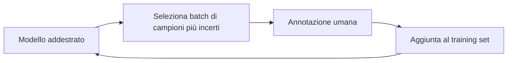

import Callout from '../../../components/Callout.astro';

## Introduzione

Per migliorare i risultati di un sistema di AI ci sono due strade:

- **migliorare i dati**;
- **migliorare il modello**.

Tradizionalmente l'intelligenza artificiale si è concentrata sull'approccio **Model-Centric**. Negli scenari reali, però, i miglioramenti più significativi spesso non derivano dal cambiare l'architettura del modello, ma dal **migliorare i dati** con cui viene addestrato. Questo è il cuore del **Data-Centric AI**.

## Definizioni e cambio di paradigma

### Che cos'è il Data-Centric AI?

È la disciplina che si occupa dell'**ingegnerizzazione sistematica dei dati** utilizzati per costruire sistemi di AI.

- **Obiettivo:** sviluppare, iterare e mantenere i **dati** (piuttosto che il codice) per migliorare le prestazioni del sistema.
- **Filosofia:** il modello (codice) è considerato una **componente fissa** (spesso si usano architetture open-source standard), mentre i dati sono la **componente variabile** su cui agire.

### Confronto: Model-Centric vs Data-Centric

| Caratteristica | Model-Centric AI (tradizionale) | Data-Centric AI (emergente) |
| --- | --- | --- |
| **Focus** | Migliorare il codice/algoritmo (architettura, iperparametri) | Migliorare i dati (qualità, etichette, pulizia) |
| **Assunzione** | I dati sono fissi ("Ground Truth" statica) | I dati sono modificabili e spesso imperfetti |
| **Obiettivo** | Battere i benchmark su dataset statici | Risolvere problemi reali con dati rumorosi |
| **Strategia** | "Come posso cambiare il modello per gestire questo rumore?" | "Come posso pulire i dati per eliminare il rumore?" |

## La centralità della qualità dei dati

In molti settori industriali la **quantità** di dati non è il problema principale: lo è la **qualità**.

### Il problema delle etichette (Label Consistency)

Il nemico principale dell'apprendimento supervisionato non è la mancanza di dati, ma l'**inconsistenza delle etichette**.

- **Rumore nelle etichette:** se più annotatori umani etichettano lo stesso esempio in modo diverso (es. un radiologo dice "malato", l'altro "sano"), il modello non può imparare efficacemente.
- **Soluzione Data-Centric:** invece di cercare un modello più "robusto al rumore", si investe nel migliorare le **linee guida di annotazione** per rendere gli etichettatori concordi (aumentare la **consistenza**).

<Callout type="example">

Definire chiaramente cosa costituisce un "difetto" in un'immagine industriale, in modo da eliminare l'ambiguità tra annotatori.

</Callout>

- **Active Learning:** approccio **iterativo** che prevede l'intervento umano. A ogni iterazione l'algoritmo seleziona un gruppo (*batch*) di campioni, solitamente quelli su cui è **più incerto**, da sottoporre all'annotazione umana. I nuovi dati etichettati guidano poi la selezione dei campioni successivi.
- **Data Programming:** consiste nella creazione, da parte dell'uomo, di **funzioni di etichettatura** basate su regole euristiche (es. parole chiave per classificare testi) per inferire le etichette in modo automatico. L'uomo interviene poi iterativamente per affinare queste funzioni.

## Le tre aree del Data-Centric AI

Il Data-Centric AI si articola in tre macro-aree: **Training Data Development**, **Inference Data Development** e **Data Maintenance**, quest'ultima a supporto delle prime due.

## Training Data Development

Oltre a raccolta ed etichettatura (viste sopra), lo sviluppo dei dati di training comprende la preparazione, la riduzione e l'aumento dei dati.

### Data Cleaning

Mira a identificare e correggere **errori, incoerenze e valori nulli**.

- I metodi **tradizionali** usano euristiche (es. imputazione con media/mediana).
- I metodi **moderni** usano il ML per predire i valori mancanti o correggere errori di etichettatura.

### Data Reduction (riduzione dei dati)

L'obiettivo è ridurre la complessità del dataset per **aumentare l'efficienza** e **ridurre l'overfitting**.

- **Sample Reduction (o Instance Selection):** seleziona un sottoinsieme rappresentativo di campioni (**righe**), utile per gestire grandi volumi di dati o squilibri di classe (*undersampling*).
- **Feature Reduction:** riduce il numero di variabili (**colonne**). Si divide in due approcci principali:
  - **Feature Selection:** seleziona un sottoinsieme delle feature originali più rilevanti (tramite metodi *filter*, *wrapper* o *embedded*).
  - **Dimensionality Reduction:** trasforma le feature originali in un **nuovo spazio** a dimensionalità ridotta mantenendo l'informazione (es. tramite PCA, LDA o Autoencoder).

### Data Augmentation

È l'opposto della riduzione: **aumenta la dimensione e la diversità** del dataset creando variazioni artificiali dei dati esistenti. È fondamentale quando i dati sono **limitati** o le classi sono **sbilanciate** (es. tramite **SMOTE**, che interpola campioni della classe minoritaria).

## Inference Data Development

Si concentra sulla progettazione di **set di valutazione** innovativi per testare il modello dopo l'addestramento.

- **In-distribution Evaluation:** valuta la qualità del modello su dati simili a quelli di training, ma con analisi a grana fine (es. **Data Slicing**, per vedere come il modello performa su specifiche sotto-popolazioni come età o genere).
- **Out-of-distribution (OOD) Evaluation:** testa la capacità del modello di **generalizzare** su dati con distribuzioni diverse da quelle di training (es. **Adversarial Samples**, ovvero input perturbati per causare errori, o dati con **Distribution Shift** naturale o sintetico).

## Data Maintenance (manutenzione dei dati)

In produzione i dati non sono statici: richiedono una **gestione continua** per garantirne affidabilità e tempestività.

- **Data Understanding:** i dati complessi devono essere sintetizzati e presentati in modo conciso per poter essere analizzati dall'uomo.
  - **Data Visualization:** condensa i dati grezzi in diagrammi grafici per ottenere insight rapidi. Spesso si usa il **clustering** unito alla **riduzione della dimensionalità** per visualizzare dati complessi in 2D o 3D.
- **Data Quality Assurance:** monitoraggio continuo della qualità dei dati tramite metriche quantitative.
  - **Quality Assessment:** valutazione **oggettiva** (accuratezza, completezza) e **soggettiva** (affidabilità, comprensibilità, tramite esperti).
  - **Quality Improvement:** applicazione di vincoli di integrità o annotazioni umane per migliorare i dati nelle varie fasi della pipeline.

## Small Data

L'approccio Data-Centric è particolarmente efficace in contesti di **Small Data** (pochi dati disponibili).

<Callout type="insight">

Quando i dati sono pochi, il **rumore** ha un impatto devastante. Pulire anche solo pochi campioni (correggendo le etichette sbagliate) può portare a miglioramenti di performance superiori rispetto al raccogliere migliaia di nuovi dati rumorosi.

</Callout>

## Gestione e infrastruttura dei dati (Data Storage & Retrieval)

Il Data-Centric AI richiede un'**infrastruttura solida** per gestire il ciclo di vita del dato: non si tratta solo di file CSV, ma di sistemi complessi di gestione.

### Sfide infrastrutturali

1. **Scalabilità:** i volumi di dati crescono esponenzialmente; i sistemi devono scalare **orizzontalmente**.
2. **Integrazione:** unire dati provenienti da fonti eterogenee (DB, sensori, log) gestendo formati diversi.
3. **Accesso efficiente:** i dati devono essere recuperabili velocemente sia per il training (**batch**) sia per l'inferenza (**real-time**).

### Resource Allocation (allocazione delle risorse)

I sistemi di gestione dati (DBMS) devono bilanciare le risorse (CPU, I/O, memoria) per ottimizzare due metriche chiave, spesso in conflitto:

| Metrica | Definizione | Cruciale per |
| --- | --- | --- |
| **Throughput** | Quantità di dati processati per unità di tempo | Ingestione massiva dei dati |
| **Latency (latenza)** | Tempo di risposta per una singola richiesta | Inferenza real-time |

**Strategie di ottimizzazione:**

- **Tuning dei parametri:** configurazione del database (es. dimensione del *buffer pool*, parallelismo della CPU).
- **ML per il DB:** utilizzare il Machine Learning stesso per ottimizzare automaticamente la configurazione del database in base al carico di lavoro (*workload*).

### Query Acceleration (accelerazione delle query)

Per rendere l'AI efficiente, il recupero dei dati deve essere istantaneo.

- **Indicizzazione (Indexing):** creare strutture dati ausiliarie (**indici**) per minimizzare gli accessi al disco durante la ricerca.
- **Query Rewriting:** riscrivere automaticamente le query complesse in forme equivalenti ma più efficienti da eseguire per il motore del database (es. identificando sotto-query ripetute).

---

## Riepilogo

| Concetto | Descrizione |
| --- | --- |
| **Data-Centric AI** | Ingegnerizzazione sistematica dei dati: il modello è fisso, i dati sono la componente su cui agire |
| **Model-Centric AI** | Approccio tradizionale: dati fissi, si migliora architettura/iperparametri per battere benchmark |
| **Label Consistency** | Etichette incoerenti tra annotatori sono il principale nemico; si risolve con linee guida di annotazione chiare |
| **Active Learning** | Ciclo iterativo: il modello sceglie i campioni più incerti da far annotare all'uomo |
| **Data Programming** | Funzioni di etichettatura euristiche scritte dall'uomo per etichettare automaticamente, affinate iterativamente |
| **Data Cleaning** | Correzione di errori, incoerenze e valori nulli (euristiche o ML) |
| **Sample Reduction** | Selezione di un sottoinsieme rappresentativo di righe (es. undersampling) |
| **Feature Selection** | Sottoinsieme delle feature originali (filter, wrapper, embedded) |
| **Dimensionality Reduction** | Proiezione in un nuovo spazio ridotto (PCA, LDA, Autoencoder) |
| **Data Augmentation** | Variazioni artificiali per aumentare dimensione e diversità (es. SMOTE) |
| **In-distribution Evaluation** | Valutazione a grana fine su dati simili al training (Data Slicing) |
| **OOD Evaluation** | Generalizzazione su distribuzioni diverse (adversarial samples, distribution shift) |
| **Data Maintenance** | Data understanding, quality assurance (assessment + improvement), storage & retrieval |
| **Small Data** | Con pochi dati il rumore pesa molto: pulire pochi campioni vale più di molti dati nuovi rumorosi |
| **Throughput vs Latency** | Dati processati per unità di tempo vs tempo di risposta della singola richiesta |
| **Query Acceleration** | Indicizzazione e query rewriting per un recupero dati rapido |
