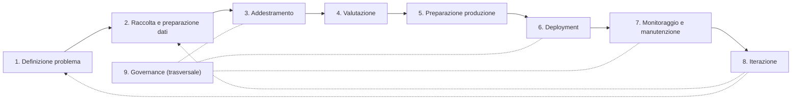
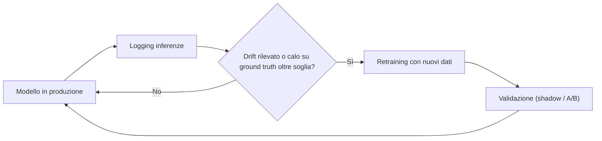

import Callout from '../../../components/Callout.astro';

## Introduzione a MLOps

Il **Machine Learning (ML)** si basa su algoritmi che apprendono e migliorano dall'esperienza, costruendo modelli predittivi da dati campione. Tuttavia, la sua applicazione non è sempre la soluzione ideale, specialmente per problemi con regole semplici o che cambiano rapidamente.

Molti progetti ML falliscono a causa di:

- carenza di esperti;
- supporto insufficiente;
- infrastrutture dati inadeguate;
- problemi di etichettatura.

La differenza tra lo sviluppo di un modello in un **ambiente di laboratorio** e la sua implementazione in **produzione** è notevole: il valore del ML si concretizza solo quando i modelli sono **integrati nei sistemi aziendali** per fornire predizioni.

### MLOps

L'**MLOps** estende i principi del **DevOps** (che unifica lo sviluppo del software con la gestione operativa) al Machine Learning, standardizzando e razionalizzando la gestione dell'**intero ciclo di vita del modello**. L'MLOps mira a integrare il modello addestrato nel core codebase e a distribuirlo come parte integrante dei processi aziendali, garantendo un **ciclo di vita continuo**.

**Machine Learning Engineering (MLE)**: utilizzo di principi scientifici, strumenti e tecniche del machine learning e dell'ingegneria del software tradizionale per progettare e costruire sistemi di calcolo complessi. Comprende tutte le fasi, dalla raccolta dei dati alla costruzione del modello, fino alla sua messa a disposizione del prodotto o degli utenti.

Le applicazioni ML evolvono in modo diverso dal software tradizionale: i cambiamenti possono riguardare **i dati, il modello o il codice**, secondo il principio **"Changing Anything Changes Everything" (CACE)**. Per affrontare queste complessità e garantire affidabilità, trasparenza e agilità è emersa la disciplina **MLOps (Machine Learning Operations)**. Analogamente a DevOps, MLOps mira a standardizzare e razionalizzare la gestione del ciclo di vita del ML, riconoscendo che la **separazione tra sviluppo e operazioni riduce la qualità** complessiva.

<Callout type="warning">

**Rischi di implementare modelli ML senza un approccio MLOps:**

- la valutazione delle prestazioni del modello spesso avviene solo in produzione;
- il mismatch tra dati di training e di produzione può degradare rapidamente le prestazioni;
- i modelli sono sensibili a specifiche versioni di software, sistemi operativi e librerie;
- il deployment non è la fine, ma l'**inizio di un ciclo continuo** di monitoraggio e verifica.

</Callout>

Le caratteristiche chiave di MLOps si articolano in cinque componenti principali: **Sviluppo, Deployment, Monitoraggio, Iterazione e Governance**.

### Quando usare (e non usare) il Machine Learning

**Quando usarlo:**

- **Problemi troppo complessi per regole tradizionali**: quando scrivere un elenco di regole `if-then` è impossibile o ingestibile (es. riconoscimento spam, dove le regole cambiano sempre).
- **Problemi in continuo cambiamento**: ambienti dinamici dove la logica deve adattarsi ai nuovi dati senza riscrivere il codice manualmente.
- **Problemi percettivi**: task che gli umani svolgono naturalmente ma che sono difficili da codificare (es. riconoscimento di immagini, parlato).
- **Fenomeni non studiati**: quando manca una teoria fisica solida per descrivere il fenomeno, ma ci sono molti dati osservati.

**Quando NON usarlo:**

- se il problema è risolvibile con regole semplici e deterministiche;
- se è richiesta una precisione assoluta (il ML è **probabilistico**);
- se non ci sono dati sufficienti o di qualità.

### I ruoli chiave nel ciclo di vita MLOps

| Ruolo | Responsabilità |
| --- | --- |
| **Business Analyst / Product Owner** | Definisce il problema di business e gli obiettivi (KPI). Non tocca il codice ma guida la direzione del progetto. |
| **Data Analyst** | Esplorazione iniziale dei dati, visualizzazione e reportistica per capire se i dati supportano l'obiettivo. |
| **Data Engineer** | Costruisce le pipeline di ingestione, gestisce i database e l'infrastruttura per rendere i dati accessibili e puliti. |
| **Machine Learning Engineer (MLE)** | Figura ibrida centrale in MLOps: addestra i modelli, ma soprattutto li porta in produzione (deployment), li ottimizza e li monitora. |
| **DevOps / Infrastructure Engineer** | Gestisce l'hardware, i container (Docker/Kubernetes) e la pipeline CI/CD che supporta il lavoro del MLE. |

## Il ciclo di vita di un progetto ML

La qualità dei dati è fondamentale per la performance di un modello ML, secondo il principio **"Garbage In, Garbage Out" (GIGO)**. Un progetto di Machine Learning segue un **ciclo di vita iterativo**, che comprende diverse fasi fondamentali.

<Callout type="note">

**Cinque componenti principali:**

1. Sviluppo
2. Deployment
3. Monitoraggio
4. Iterazione
5. Governance

</Callout>

## Fase di Sviluppo

Lo sviluppo di un modello ML segue un percorso strutturato, che inizia con la chiara definizione del problema e degli obiettivi di business.

### 1. Definizione del problema e obiettivi di business

È fondamentale chiarire il problema da risolvere, definire gli obiettivi specifici e identificare le **metriche di successo**. In questa fase si valuta anche se l'ML sia la soluzione più appropriata: in alcuni casi, come per regole semplici o problemi non stazionari, una soluzione **non-ML** potrebbe essere preferibile.

### 2. Raccolta e preparazione dei dati

Si identificano e raccolgono i dati da varie fonti, per poi pulirli, trasformarli e organizzarli. Questa fase è spesso **la più dispendiosa in termini di tempo** e cruciale per la qualità del modello.

#### Data Ingestion

Processo di raccolta, acquisizione e trasferimento dei dati da diverse fonti (database, file, API, stream) verso un sistema di destinazione (data lake, data warehouse).

Le buone pratiche includono:

- identificazione e documentazione delle sorgenti dati;
- stima dei requisiti di archiviazione;
- conversione dei dati in formati manipolabili **preservando gli originali**;
- implementazione di backup;
- garanzia di conformità alla privacy (**anonimizzazione, pseudonimizzazione**);
- mantenimento di un **catalogo di metadati**.

La **generazione sintetica** e l'**arricchimento** possono integrare o creare dati artificiali per migliorare il dataset.

#### Dati di test

È cruciale campionare un **set di hold-out** per i dati di test, che non deve essere utilizzato durante lo sviluppo per prevenire il **data snooping**.

#### Data Profiling

Il *Data Profiling* permette di ottenere informazioni sul contenuto e sulla struttura del dataset (metadati come min, max, media, mediana, distribuzione, valori mancanti).

#### Data Validation

La *Data Validation* valuta la qualità dei dati tramite funzioni personalizzate per rilevare errori e valutare la coerenza dei dati.

#### Data Wrangling

Fase che si concentra sulla trasformazione dei dati per renderli idonei al training:

- **Pulizia e riformattazione**: gestire i valori mancanti, prestando attenzione al **data leakage** se si calcolano statistiche sull'intero dataset.
- **Gestione dei dati sbilanciati**: tecniche come **SMOTE** e **ADASYN** per l'oversampling, o **undersampling** e **Tomek Links** per bilanciare le classi.
- **Creazione/selezione delle feature**: bilanciare l'accuratezza con i costi computazionali. Il feature engineering può migliorare le prestazioni ma aumentare la complessità.

#### Feature Engineering

Consiste nella creazione di nuove feature o nella trasformazione di quelle esistenti per migliorare le prestazioni del modello. Le tecniche includono la **ristrutturazione dei dati** (creazione di nuovi campi, combinazione, filtraggio, aggregazioni) e l'**estrazione di valori** da campi esistenti.

#### Data Labeling (etichettatura dei dati)

Assegna categorie o valori target ai dati, essenziale per l'**apprendimento supervisionato**. Può essere costoso e richiedere tempo, e la **qualità delle etichette** è cruciale.

#### Data Splitting (suddivisione dei dati)

Il dataset viene diviso in:

- **training set**: per addestrare il modello;
- **validation set**: per ottimizzare gli iperparametri e valutare il modello durante lo sviluppo;
- **test set**: per una valutazione finale imparziale.

### Problemi comuni dei dati e tecniche di gestione

La qualità e la rappresentatività dei dati sono cruciali per il successo di un progetto ML. Diversi problemi possono compromettere l'efficacia del modello.

#### Adeguatezza e utilizzabilità dei dati

I dati devono avere una **dimensione adeguata** rispetto al numero di feature e parametri del modello. La loro utilizzabilità può essere compromessa da valori mancanti, duplicati, dati obsoleti o incompletezza/non rappresentatività. È fondamentale la **comprensibilità** dell'origine e del significato di ogni attributo, così come l'**affidabilità delle etichette**.

#### Data Leakage

Il **Data Leakage** si verifica quando informazioni sul target, che **non sarebbero disponibili al momento della previsione**, vengono involontariamente introdotte nel dataset di training.

<Callout type="example">

Esempi di leakage:

- feature che sono **funzioni dirette del target**;
- feature **strettamente correlate** al target;
- dati provenienti **dal futuro**;
- **imputazione di valori mancanti** calcolata sull'intero dataset (inclusi i dati di validazione/test).

</Callout>

#### Altri problemi comuni

- **Alto costo**: l'ottenimento e l'etichettatura dei dati, specialmente manuale, possono essere estremamente costosi.
- **Scarsa qualità**: dati grezzi o etichette inaccurate o incomplete.
- **Rumore (noise)**: processo casuale che corrompe gli esempi. È un problema maggiore con dataset piccoli e può portare a **overfitting**, in cui il modello impara il rumore anziché il segnale sottostante.
- **Bias (pregiudizio)**: incoerenza tra i dati e il fenomeno che dovrebbero rappresentare, che porta a risultati sistematicamente distorti.

#### Gestione dei dati sbilanciati (Imbalanced Data)

La **Class Imbalance** si verifica quando le etichette sono distribuite in modo molto disomogeneo: gli algoritmi ML tendono a ottimizzare per la **classe maggioritaria**. Le tecniche di gestione includono:

**Oversampling** — aumentare il peso o il numero di esempi della classe minoritaria.

- **SMOTE (Synthetic Minority Oversampling Technique)**: crea nuovi esempi sintetici **interpolando** tra esempi esistenti della classe minoritaria e i loro vicini più prossimi:
  1. per ogni esempio $x_i$ della classe minoritaria, selezionare i $k$ vicini più prossimi della stessa classe;
  2. scegliere casualmente uno dei vicini $x_{zi}$;
  3. generare un nuovo esempio sintetico:

     $$
     x_{new} = x_i + L \cdot (x_{zi} - x_i)
     $$

     dove $L$ è un numero casuale in $[0, 1]$.

- **ADASYN (Adaptive Synthetic Sampling Method)**: simile a SMOTE, ma genera **più campioni sintetici** per gli esempi della classe minoritaria **più difficili da imparare**.

**Undersampling** — ridurre il numero di esempi della classe maggioritaria, casualmente o basandosi su proprietà specifiche (es. Tomek Links).

- **Tomek Links**: coppie di istanze $x_i$ e $x_j$ di classi diverse, dove $x_i$ è il vicino più prossimo di $x_j$ e viceversa. La rimozione di una di queste istanze può migliorare la **separabilità delle classi**.

<Callout type="insight">

Geometricamente, SMOTE genera il nuovo punto su un punto casuale del **segmento** che congiunge $x_i$ al suo vicino $x_{zi}$: con $L = 0$ si ottiene $x_i$, con $L = 1$ si ottiene $x_{zi}$.

</Callout>

#### Gestione degli attributi mancanti

Le strategie includono:

- rimozione degli esempi con attributi mancanti;
- uso di algoritmi che li gestiscono nativamente;
- applicazione di tecniche di **imputazione** dei dati.

È fondamentale prestare attenzione al **leakage** quando si calcolano statistiche per l'imputazione.

### 3. Addestramento del modello

Si seleziona un algoritmo ML e si addestra il modello sui dati preparati, ottimizzando i **parametri** e gli **iperparametri**.

### 4. Valutazione del modello

Le prestazioni del modello addestrato vengono valutate utilizzando metriche appropriate su un set di dati di validazione o test, confrontando diverse configurazioni per selezionare la migliore.

#### Modeling

Le prestazioni umane (**Human Level Performance**) rappresentano una **baseline** per gli algoritmi, in particolare per i dati strutturati.

### 5. Preparazione per la produzione

Prima del deployment è necessario:

- **Preparare runtime environments adeguati.**
  - **Model Packaging**: esportare il modello in formati standardizzati come **PMML** o **ONNX** per l'uso in produzione.
- **Valutare i rischi** associati al modello.
- **Garantire qualità** (riproducibilità e auditabilità), sicurezza e mitigazione del rischio.
  - **Riproducibilità**: salvare versioni significative, ambienti, asset (dati, parametri, ambiente software) e documentare assunzioni, casualità, dati e configurazioni.
  - **Auditabilità** (*auditability*): capacità di un sistema di essere controllato e verificato in ogni sua parte.
- **Stabilire ambienti di produzione** che replichino fedelmente quelli di sviluppo, per minimizzare i problemi di transizione.

## Preparazione alla produzione e messa in servizio

### 6. Deployment del modello

L'obiettivo è distribuire i modelli ML come parte integrante delle applicazioni aziendali ed esporli tramite **servizi di inferenza**.

#### Deployment e Model Serving

I modelli vengono esposti tramite servizi di inferenza, integrandosi in applicazioni mobili, desktop o web.

**Training vs Serving Environments.** In produzione, l'ambiente di **Scoring (Inference)** è spesso fisicamente separato dall'ambiente di **Retraining**.

- **Rischio**: se il nuovo modello viene validato solo sui dati storici nell'ambiente di training, potrebbe fallire nel mondo reale.
- **Feedback loop**: le predizioni del modello in produzione influenzano i dati futuri. Questo richiede strategie di validazione "live" come **Shadow Deployment** o **A/B Testing** per essere gestito correttamente.

<Callout type="example">

Un sistema anti-frode **blocca** alcune transazioni: di conseguenza, il modello futuro non vedrà mai le frodi bloccate, perché non arriveranno mai a compimento. Le predizioni hanno modificato i dati su cui il modello sarà riaddestrato.

</Callout>

#### Aspetti prestazionali di MLOps

È fondamentale considerare:

- **Latenza**: il tempo di risposta del modello.
- **Risorse**: l'utilizzo di CPU/RAM/GPU.
- **Ottimizzazioni**: tecniche come **quantizzazione, pruning e distillazione** per migliorare le prestazioni, specialmente su dispositivi edge o con risorse limitate.

### 7. Monitoraggio e manutenzione

Si monitorano continuamente le prestazioni del modello in produzione per rilevare degrado (**model decay**), drift dei dati o dei concetti. Si raccolgono feedback e dati per future iterazioni e si pianifica il riaddestramento quando necessario.

Il monitoraggio è continuo e prevede:

- registrazione dell'output di ogni inferenza (**performance logging**) per audit e debugging;
- tracciamento di **input drift**, **output drift** e **ground truth** per valutare il degrado e la necessità di retraining.

#### Valutazione del rischio dei modelli

Si valutano rischi **legali, etici, di sicurezza e reputazionali**, considerando scenari peggiori e le implicazioni di un'eventuale fuoriuscita dei dati di training.

#### Generazione di Explainability e Fairness

Durante la pipeline di deployment si valutano la **fairness** (parità di trattamento tra gruppi) e la **spiegabilità** (interpretabilità) per garantire affidabilità e fiducia.

#### Monitoraggio a due livelli

Il monitoraggio è un processo a due livelli, essenziale per mantenere l'efficacia del modello nel tempo:

| Livello | Cosa si monitora |
| --- | --- |
| **Sistema** | Stato, utilizzo di CPU/RAM/disco/rete, throughput e affidabilità dell'infrastruttura |
| **ML** | Accuratezza, prestazioni su nuovi dati, drift delle feature e degli output |

#### Drift e degradazione

Il degrado del modello può manifestarsi in diverse forme:

| Tipo | Cosa cambia | Descrizione |
| --- | --- | --- |
| **Data Drift** (o drift di input) | Le **distribuzioni delle feature** | I dati di input cambiano tra la fase di training e quella di produzione: la natura dei dati che il modello riceve nel mondo reale non è più la stessa di quella su cui è stato istruito. |
| **Concept Drift** (o model drift) | Le **relazioni tra input e output** | Anche se le distribuzioni degli input rimangono simili, il "concetto" che il modello deve prevedere si è evoluto (es. cambiamenti nelle abitudini degli utenti o negli obiettivi di business). |
| **Training-Serving Skew** | **Differenze tecniche o strutturali** tra dati di training e di produzione | Non necessariamente dovuto al passare del tempo: deriva ad esempio da un mismatch tra dati storici e dati live o da differenze nell'ambiente software (OS, librerie). Causa un divario tra prestazioni attese (in laboratorio) e reali. |

**Tempistiche del degrado del modello:**

- **Graduale**: il modello può degradare nel tempo, richiedendo un monitoraggio continuo e un eventuale riaddestramento periodico.
- **Improvviso (rapido)**: le prestazioni possono degradare **rapidamente** a causa del mismatch tra i dati di training e quelli di produzione. Accade spesso in ambienti dinamici dove le regole cambiano costantemente (come nei sistemi anti-spam).
- **Ricorrente (ciclico)**: il ciclo di vita di MLOps è **intrinsecamente iterativo** e il monitoraggio costante è l'inizio di un ciclo continuo di verifica e aggiornamento, necessario in ambienti in continuo cambiamento. Si fa riferimento alla **stagionalità** del cambiamento dei dati (es. andamento delle vendite durante il Black Friday).

Questi fenomeni riducono l'accuratezza e possono rendere il modello **obsoleto**.

#### Rilevamento e mitigazione del drift

**Tecniche di rilevamento del data drift (senza ground truth):**

- **Test statistici univariati** (**Kolmogorov-Smirnov** per variabili continue, **chi-quadrato** per variabili categoriche): confrontano la distribuzione di ciascuna feature nel dataset di produzione con quella del dataset di addestramento.
- **Domain classifier**: si addestra un modello di classificazione a distinguere i dati di training da quelli di produzione; se il modello ha un'**alta accuracy**, il drift è elevato.
- **Analisi delle feature importances** per identificare le variabili che guidano il drift.

<Callout type="insight">

L'idea del domain classifier: se training e produzione provenissero dalla stessa distribuzione, un classificatore non riuscirebbe a distinguerli (accuracy vicina al caso, circa 50%). Più è facile separarli, più le distribuzioni sono diverse.

</Callout>

**Strategie di mitigazione:** ripesare le feature, rimuovere le feature instabili, riaddestrare periodicamente o in base alla disponibilità di ground truth.

#### Ground Truth e Retraining

Il **ground truth** sono i dati di etichetta per i nuovi eventi. La valutazione delle prestazioni sui nuovi ground truth determina la **necessità di retraining** se la differenza rispetto alle performance originali supera una **soglia** (sintomo del concept drift). La frequenza di retraining dipende dal dominio (es. cyber security o trading richiedono retraining frequente) e dai costi associati.

### 8. Iterazione

Il ciclo di vita è **intrinsecamente iterativo**: i risultati del monitoraggio e i feedback guidano nuove iterazioni di sviluppo, preparazione dati, addestramento e deployment.

#### Scenari post-deployment

Dopo il deployment, i modelli possono degradare per diverse ragioni, che richiedono un'iterazione:

- **Model Decay**: il modello si degrada nel tempo e necessita di retraining con nuovi dati.
- **Limitazioni dei dati**: i dati disponibili non sono più rappresentativi.
- **Assunzioni iniziali sbagliate**: necessità di correggere il modello.
- **Obiettivi di business in evoluzione**: adeguamento dell'approccio o dell'algoritmo.

#### Versioning e riproducibilità

Il **controllo di versione** è cruciale per tracciare esperimenti, annullare modifiche e documentare assunzioni, casualità, dati e ambienti.

#### Environments e runtime

Gli ambienti di runtime possono variare da servizi personalizzati a piattaforme di data science, strumenti di messa in servizio (es. **TensorFlow Serving**) e infrastrutture di basso livello (**Kubernetes**). La validazione deve **replicare l'ambiente di produzione**.

#### Containerization

La containerizzazione, tipicamente con **Docker**, è lo standard per il deployment. Garantisce **riproducibilità e isolamento**, evitando conflitti tra dipendenze di modelli diversi o incompatibilità ambientali.

#### Deployment strategies

Diverse strategie riducono i rischi e i tempi di inattività:

| Strategia | Funzionamento |
| --- | --- |
| **Blue-Green Deployment** | Il nuovo sistema viene rilasciato in parallelo e sostituisce gradualmente il vecchio dopo la verifica. |
| **Canary Releases** | Il rilascio avviene in modo incrementale a una piccola porzione di traffico per monitorare prestazioni e rischi. |
| **Shadow Deployment** | Il nuovo modello opera in parallelo con le operazioni umane, ma le sue predizioni non sono utilizzate in produzione finché non si stabilisce fiducia. |

#### Continuous Integration / Continuous Deployment per ML

Una pipeline **CI/CD** centralizza codice, metadati e documentazione, automatizzando test, validazione e deployment. Una pipeline tipica include:

#### Artefatti ML

Gli artefatti includono:

- codice del modello e di preprocessing;
- iperparametri e configurazioni;
- dati di addestramento/validazione;
- modello addestrato;
- ambiente e dipendenze;
- documentazione e dati per scenari di test.

### 9. Governance

La **governance** è il quadro generale di gestione che assicura che l'intero ciclo di vita del Machine Learning sia **affidabile, conforme e trasparente**:

- **Auditabilità**: tracciare fonti dei dati, versioni dei modelli e processi decisionali.
- **Gestione del rischio**: affrontare bias, equità e sicurezza, con responsabilità per sviluppo, deployment e manutenzione.
- **Documentazione e reporting**: mantenere documentazione trasparente per stakeholder e requisiti regolatori.
- **Conformità e regolamentazione**: aderire a standard legali, etici e organizzativi.
- **Accountability**: definire chiaramente le responsabilità per sviluppo, deploy e manutenzione del modello.

#### Fairness (equità)

La **fairness** è una proprietà specifica (spesso etica e tecnica) del modello e dei dati, volta a garantire che il sistema **non produca o amplifichi discriminazioni**.

### Rischi e considerazioni etiche

I sistemi ML possono introdurre o amplificare disparità attraverso **bias preesistenti, tecnici o emergenti**. È fondamentale progettare per mitigare i **feedback loop dannosi** e comprendere la differenza tra **causalità e correlazione**.

### Note pratiche per l'uso quotidiano

<Callout type="tip">

- Partire sempre dalla **definizione chiara del problema** e dalle metriche di successo, includendo considerazioni di fairness fin dall'inizio.
- Strutturare la **Data Engineering Pipeline** in modo automatizzato e tracciabile per garantire qualità dei dati e riproducibilità degli esperimenti.
- Selezionare una **strategia di deployment** adeguata al contesto (Blue-Green, Canary, Shadow), bilanciando rischi, costi e requisiti di disponibilità.
- Contenere l'ambiente di produzione tramite **containerizzazione** per ridurre i rischi di dipendenze e garantire riproducibilità.
- Integrare **monitoraggio a livello di sistema e a livello ML**, implementando alert e piani di rollback in caso di degrado.
- Integrare tecniche di **explainability e fairness** per fornire spiegazioni utili agli stakeholder e monitorare la non discriminazione.
- Pianificare il **retraining** basandosi su drift detection, disponibilità di ground truth e costi associati per mantenere le prestazioni nel tempo.

</Callout>

<Callout type="insight">

La **Pipeline Big Data** è focalizzata sul **flusso e l'analisi dei dati**; il **Ciclo di Vita ML** è focalizzato sull'**addestramento e il mantenimento di un'intelligenza automatizzata** che usa quei dati.

</Callout>

---

## Riepilogo

| Concetto | Descrizione |
| --- | --- |
| **MLOps** | Estensione dei principi DevOps al ML: standardizza la gestione dell'intero ciclo di vita del modello |
| **MLE** | Machine Learning Engineering: unione di ML e ingegneria del software per costruire sistemi in produzione |
| **CACE** | "Changing Anything Changes Everything": cambiare dati, modello o codice influenza tutto il sistema |
| **GIGO** | "Garbage In, Garbage Out": la qualità dei dati determina la qualità del modello |
| **Cinque componenti** | Sviluppo, Deployment, Monitoraggio, Iterazione, Governance |
| **Data Leakage** | Informazioni sul target non disponibili in predizione che finiscono nel training |
| **SMOTE** | Oversampling sintetico: $x_{new} = x_i + L \cdot (x_{zi} - x_i)$, con $L \in [0,1]$ |
| **ADASYN** | Come SMOTE, ma genera più campioni per gli esempi minoritari difficili |
| **Tomek Links** | Coppie di vicini reciproci di classi diverse; rimuoverne uno migliora la separabilità |
| **Model Packaging** | Esportazione in formati standard (PMML, ONNX) |
| **Training vs Serving** | Ambienti separati; rischio di feedback loop gestito con Shadow Deployment o A/B Testing |
| **Ottimizzazioni** | Quantizzazione, pruning, distillazione per ridurre latenza e risorse |
| **Monitoraggio a due livelli** | Sistema (infrastruttura) e ML (accuratezza, drift) |
| **Data Drift** | Cambia la distribuzione delle feature di input |
| **Concept Drift** | Cambia la relazione input-output |
| **Training-Serving Skew** | Differenze tecniche/strutturali tra dati o ambienti di training e produzione |
| **Degrado** | Graduale, improvviso o ricorrente (stagionale) |
| **Rilevamento drift** | Test KS / chi-quadrato, domain classifier, feature importances |
| **Deployment strategies** | Blue-Green, Canary, Shadow |
| **CI/CD per ML** | Pipeline automatizzata: artefatti, sanity checks, fairness, test, validazione, canary, rilascio |
| **Governance** | Auditabilità, gestione del rischio, documentazione, conformità, accountability |
| **Fairness** | Il sistema non deve produrre o amplificare discriminazioni |
