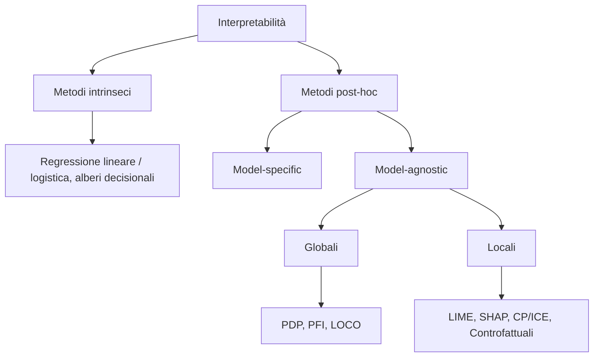
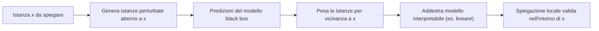

import Callout from '../../../components/Callout.astro';

## Introduzione alla Fairness

Il tema della **fairness** è strettamente collegato all'**Explainable AI (XAI)**. Diverse tecniche permettono di comprendere e giustificare le decisioni dei modelli.

L'analisi di fairness può includere indici basati su tassi di **veri positivi**, **falsi positivi**, **PPV** (Positive Predictive Value), ecc., per confrontare gruppi diversi e capire dove esistono disparità. Le spiegazioni per l'equità possono mostrare **quali feature guidano l'effetto su gruppi diversi**, consentendo di capire quali cambiamenti potrebbero mitigare il bias.

## Introduzione all'Interpretabilità

L'**interpretabilità** nel machine learning è la capacità di un essere umano di comprendere il *perché* una decisione è stata presa da un modello o di prevederne in modo coerente l'output. In contesti critici come la medicina o la finanza, comprendere le motivazioni dietro le previsioni dei modelli è essenziale per garantire **equità, privacy, robustezza, affidabilità** e per costruire **fiducia** nei sistemi algoritmici.

Esistono due approcci principali per ottenere interpretabilità:

1. **Metodi intrinseci**: utilizzano modelli intrinsecamente semplici e trasparenti, come alberi decisionali brevi, modelli lineari sparsi o regressione logistica (che si basano direttamente su pesi, coefficienti e soglie).
2. **Metodi post-hoc**: analizzano un modello complesso (spesso una *black box*) dopo che è stato addestrato, senza modificarne la struttura interna.

All'interno dei metodi post-hoc si distinguono ulteriormente:

| Tipo | Descrizione |
|---|---|
| **Model-specific** | Funzionano solo con specifiche classi di modelli. |
| **Model-agnostic** | Possono essere applicati a qualsiasi modello di ML, indipendentemente dall'architettura. Questa flessibilità li rende particolarmente preziosi. |

I metodi model-agnostic possono essere classificati in base al loro **scopo**:

| Scopo | Obiettivo | Esempi |
|---|---|---|
| **Globali** | Spiegare il comportamento complessivo del modello sull'intero dataset | PDP, Permutation Feature Importance |
| **Locali** | Spiegare una singola previsione individuale | LIME, SHAP, CP/ICE |

## Interpretazione Globale del Modello

L'interpretazione globale mira a comprendere come il modello addestrato genera previsioni in modo **olistico**, considerando tutte le feature e i componenti appresi. Le domande chiave a cui risponde sono: *"Quali feature sono più importanti?"* e *"Come interagiscono le feature per influenzare le previsioni?"*.

### Partial Dependence Plot (PDP)

Il **Partial Dependence Plot (PDP)** è una tecnica grafica che illustra l'**effetto marginale medio** di una o due feature sulla previsione di un modello di machine learning. Mostra come la previsione del modello cambia al variare di una specifica feature, mantenendo costanti le altre.

**Funzionamento:**

1. Si seleziona una feature di interesse (o una coppia).
2. Per ogni valore possibile della feature selezionata, si calcola la **previsione media** del modello sull'intero dataset. Questo si ottiene sostituendo il valore della feature di interesse in ogni istanza del dataset con il valore considerato, mantenendo le altre feature invariate, e calcolando la media delle previsioni risultanti.
3. Il grafico mostra la relazione tra la feature (asse x) e la previsione media del modello (asse y).

**Interpretazione:**

- Un PDP può rivelare se la relazione tra una feature e il target è **lineare, monotona o più complessa**.
- Per problemi di **classificazione**, il PDP mostra come la variazione di una o più feature influenzi la probabilità prevista di ciascuna classe.
- Per **feature categoriche**, si fissano tutti i campioni su una stessa categoria e si calcola la media delle predizioni per stimare l'influenza media di ciascuna categoria.

**Limitazioni:**

- Il PDP assume implicitamente che le feature **non siano correlate** tra loro. Se le feature sono correlate, la variazione di una feature isolatamente potrebbe generare combinazioni di feature non realistiche, portando a interpretazioni fuorvianti.
- Non mostra le predizioni singole, ma **solo l'effetto medio**.

### Permutation Feature Importance (PFI)

La **Permutation Feature Importance (PFI)** misura l'importanza di una feature valutando **quanto peggiora la performance** del modello quando i valori di quella feature vengono mescolati casualmente.

**Funzionamento:**

1. Si addestra un modello e si calcola una metrica di errore originale (es. MAE, Log Loss) sul dataset di test.
2. Per ogni feature:
   - si **mescolano casualmente** i valori di quella feature nel dataset di test, mantenendo tutte le altre feature invariate;
   - si calcola nuovamente la metrica di errore del modello utilizzando questo dataset con la feature permutata;
   - l'importanza della feature è data dall'**aumento dell'errore** (o dalla diminuzione di una metrica di performance positiva come l'accuratezza). Un aumento significativo dell'errore indica che la feature era importante per la previsione del modello.
3. Le feature vengono ordinate in base alla loro importanza decrescente.

**Interpretazione:**

- Una feature è considerata **importante** se la sua permutazione porta a un peggioramento significativo delle prestazioni del modello.
- Una feature è considerata **poco importante** se la sua permutazione non altera significativamente le prestazioni del modello.

**Considerazioni:**

- È fondamentale calcolare la PFI **sui dati di test** per evitare di essere fuorviati dall'overfitting.
- La PFI è **sensibile alle correlazioni** tra feature: se due feature sono altamente correlate, la permutazione di una potrebbe non avere un grande impatto perché l'altra feature può compensare.

### Approfondimenti metodologici e concettuali

#### 1. Perché l'interpretabilità è necessaria? (Il lato umano)

Non ci limitiamo a volere modelli accurati: l'interpretabilità risponde a bisogni umani fondamentali che una semplice metrica (come l'Accuracy o l'F1-Score) non può soddisfare:

- **Trust (Fiducia)**: è più facile fidarsi di un sistema se si capisce *perché* prende decisioni, specialmente in ambiti critici (medicina, finanza).
- **Causalità**: vogliamo assicurarci che il modello abbia imparato relazioni causali vere e non **correlazioni spurie** (es. associare "neve" al "lupo" solo perché tutte le foto di lupi nel dataset hanno sfondo bianco).
- **Safety & Robustness (Sicurezza)**: capire il funzionamento interno aiuta a fare debug e a garantire che piccoli cambiamenti nell'input non causino errori catastrofici.

#### 2. Le insidie della Feature Importance: Training vs Test data

Un errore comune nell'uso della **PFI** è calcolarla sul dataset sbagliato.

| Dataset | Esito | Spiegazione |
|---|---|---|
| **Training data** | ERRORE | La PFI misura quanto il modello ha *memorizzato* i dati. Se il modello è in **overfitting**, assegnerà un'importanza alta anche a feature inutili o rumorose, solo perché le usa per "ricordare" gli esempi specifici. |
| **Test data** | CORRETTO | La PFI deve essere calcolata sempre su dati non visti (test o validation set). Solo qui possiamo misurare quanto una feature contribuisce alla **generalizzazione** del modello. |

<Callout type="insight">

**Regola d'oro**: se l'importanza di una feature è alta nel training ma scende a zero nel test, il modello sta facendo overfitting su quella feature.

</Callout>

#### 3. Un'alternativa alla PFI: Leave-One-Covariate-Out (LOCO)

Mentre la PFI "rompe" il legame tra feature e target *mescolando* (permutando) i valori, il metodo **LOCO** adotta un approccio più radicale.

**Funzionamento:**

1. Si calcola l'errore del modello originale con tutte le feature.
2. Per ogni feature $j$:
   - si **rimuove** fisicamente la feature dal dataset (o la si azzera);
   - si **riaddestra** il modello da zero senza quella feature;
   - si calcola il nuovo errore.
3. L'importanza è la **differenza tra il nuovo errore e l'errore originale**.

**PFI vs LOCO:**

| | PFI | LOCO |
|---|---|---|
| Come rompe il legame feature–target | Permuta i valori | Rimuove la feature e riaddestra |
| Feature correlate | Sensibile: l'altra feature può compensare | **Vantaggio**: gestisce meglio le correlazioni. Se il modello può ricostruire l'informazione da un'altra feature correlata, LOCO mostrerà (correttamente) che quella singola feature non era indispensabile |
| Costo computazionale | Un solo addestramento | **Svantaggio**: molto costoso. Con 100 feature bisogna riaddestrare il modello 100 volte |

## Interpretazione Locale del Modello

L'interpretazione locale risponde alla domanda: *"Perché il modello ha fatto questa specifica previsione per questa singola istanza?"*. Si concentra sull'analisi del ragionamento del modello per un particolare input.

### Local Surrogate (Modelli surrogati locali)

I **modelli surrogati locali** (ne è un esempio **LIME**) sono modelli interpretabili (es. regressione lineare o alberi decisionali) addestrati per **approssimare le predizioni** di un modello black box complesso in una **regione limitata** dello spazio dei dati.

**Funzionamento**: invece di spiegare l'intero modello, il surrogato locale si concentra sulla **fedeltà locale** attorno a una specifica istanza.

### Local Interpretable Model-Agnostic Explanations (LIME)

**LIME** è una tecnica che spiega le previsioni di qualsiasi modello di machine learning approssimando **localmente** il suo comportamento con un modello interpretabile più semplice (es. un modello lineare).

**Funzionamento:**

1. Si seleziona l'istanza specifica per cui si desidera una spiegazione.
2. Si generano nuove istanze **"perturbate"**, leggermente modificate, attorno all'istanza di interesse.
3. Per ogni istanza perturbata, si ottiene la previsione dal modello black box originale.
4. Si addestra un modello interpretabile (es. regressione lineare) su queste istanze perturbate e le loro previsioni, **pesando ogni istanza in base alla sua vicinanza** all'istanza originale: le istanze più vicine ricevono un peso maggiore.
5. Il modello interpretabile addestrato fornisce una spiegazione locale delle previsioni del modello black box, valida solo nell'intorno dell'istanza di interesse.

**Punti di forza:**

- **Model-agnostic**: funziona con qualsiasi modello.
- **Locale**: spiega singole previsioni.
- **Flessibilità**: può spiegare diversi tipi di dati (testo, immagini, dati tabellari).

**Limitazioni:**

- La definizione del **"vicinato"** può influenzare la spiegazione.
- La spiegazione è valida **solo localmente** e potrebbe non riflettere il comportamento globale del modello.

### Ceteris Paribus Plot (CP)

Questo grafico analizza come cambierebbe la predizione di una **singola istanza** se variassimo il valore di **una sola feature**, mantenendo tutte le altre costanti (*"a parità di altre condizioni"*). È uno strumento di spiegazione locale che mostra il comportamento del modello attorno a un punto specifico.

### Individual Conditional Expectation (ICE)

*(Nota: spesso associato ai metodi locali o semi-globali.)*

Visualizza **una linea per ogni singola istanza**, mostrando come la predizione per quell'istanza (asse y) cambia al variare di una feature (asse x), mantenendo le altre costanti. Mentre i **PDP mostrano la media**, l'**ICE** permette di vedere le **variazioni individuali** e identificare **interazioni eterogenee** che la media potrebbe nascondere.

**Centered-ICE (c-ICE)**: è una variante dell'ICE in cui le curve vengono **"ancorate" a un punto comune** (solitamente l'origine o il valore iniziale della feature). Questo facilita il confronto tra le istanze, permettendo di vedere non il valore assoluto della predizione, ma la *variazione* rispetto al punto di riferimento.

<Callout type="tip">

Relazione tra i tre grafici: il **CP** è la curva di una singola istanza; l'**ICE** sovrappone le curve CP di tutte le istanze; il **PDP** è la media delle curve ICE.

</Callout>

### Spiegazioni controfattuali

Le **spiegazioni controfattuali** rispondono alla domanda: *"Qual è il minimo cambiamento necessario nelle feature per ottenere un esito diverso?"*.

<Callout type="example">

"Se il mio reddito fosse stato più alto di 500€, il prestito sarebbe stato approvato."

</Callout>

Esistono metodi controfattuali sia **model-agnostic** sia **model-specific**.

**Metodo di Wachter, Mittelstadt e Russell**: questo approccio formula la ricerca del controfattuale come un **problema di ottimizzazione**. L'obiettivo è trovare un nuovo punto $x'$ che sia il più vicino possibile al punto originale $x$ (per essere realistico) ma che produca l'output desiderato $y'$. Il metodo **bilancia la distanza tra i punti e la perdita (loss)** rispetto all'obiettivo di predizione.

**Effetto Rashomon**: lo stesso risultato di una predizione può essere spiegato da **più spiegazioni controfattuali differenti e contraddittorie**.

### Shapley Values (SHAP)

**SHAP** (*SHapley Additive exPlanations*) è un metodo basato sulla **teoria dei giochi** per spiegare le previsioni di qualsiasi modello di machine learning. Si basa sui **valori di Shapley**, che distribuiscono equamente il "guadagno" (la differenza tra la previsione dell'istanza e la previsione media del dataset) tra i "giocatori" (le feature) durante il gioco (task di predizione).

#### Concetto di base (valori di Shapley)

Le feature di un'istanza sono considerate **"giocatori"** che collaborano in una **"coalizione"** per produrre una **"previsione"**. Il valore di Shapley di una feature è il suo **contributo marginale medio** alla previsione, calcolato considerando **tutte le possibili coalizioni** di feature. Questo distribuisce l'impatto di ciascuna feature sulla previsione in modo equo.

#### I 4 assiomi di equità

1. **Efficienza (Efficiency)**: la somma dei contributi di tutte le feature deve essere uguale alla differenza tra la predizione dell'istanza e la predizione media.
2. **Simmetria (Symmetry)**: se due feature contribuiscono allo stesso modo a tutte le possibili coalizioni, i loro valori di Shapley devono essere identici.
3. **Dummy (o Null Player)**: una feature che non cambia mai la predizione, indipendentemente dalla coalizione a cui viene aggiunta, riceve un valore di Shapley pari a zero.
4. **Additività (Additivity)**: se un modello è la somma di due modelli indipendenti, il valore di Shapley per una feature è la somma dei valori di Shapley calcolati sui due modelli separatamente.

#### Equazione del valore di Shapley

$$
\phi_i(N, v) = \frac{1}{|N|!} \sum_{S \subseteq N \setminus \{i\}} |S|!\,(|N| - |S| - 1)!\,\big[v(S \cup \{i\}) - v(S)\big]
$$

dove:

- $v$ è la **funzione valore** del gioco (il "guadagno" prodotto da una coalizione);
- $N$ è l'insieme dei giocatori;
- $\phi_i(N, v)$ è il valore di Shapley del giocatore $i$-esimo;
- $\frac{1}{|N|!} \sum_{S \subseteq N \setminus \{i\}}$ è la **media**;
- $|S|!\,(|N| - |S| - 1)!$ **pondera il contributo** in base al numero di permutazioni possibili;
- $v(S \cup \{i\}) - v(S)$ è il **contributo marginale**.

#### Funzionamento (SHAP)

1. Per una singola istanza, SHAP calcola il contributo di ciascuna feature alla previsione.
2. La previsione di un'istanza viene spiegata come la **somma della previsione media** del modello **più i contributi** (valori di Shapley) di ciascuna feature:

$$
f(x) = \text{media\_predizione} + \sum_{j=1}^{M} \phi_j
$$

dove $\phi_j$ è il valore di Shapley per la feature $j$.

**Interpretazione:**

- Un valore di Shapley **positivo** indica che quella feature ha contribuito ad **aumentare** la previsione rispetto alla media.
- Un valore di Shapley **negativo** indica che la feature ha contribuito a **diminuire** la previsione rispetto alla media.
- La somma dei valori di Shapley di tutte le feature più la previsione media del modello è uguale alla **previsione effettiva** per quell'istanza.

**Punti di forza:**

- **Fondamento teorico solido**: basato sulla teoria dei valori di Shapley, garantisce proprietà desiderabili come efficienza, simmetria, linearità e giocatore nullo.
- **Completa distribuzione**: distribuisce l'intera differenza tra la previsione dell'istanza e la previsione media tra tutte le feature.
- **Model-agnostic**: può essere applicato a qualsiasi modello.
- **Locale e globale**: i valori di Shapley possono essere aggregati per fornire spiegazioni globali.

**Limitazioni:**

- Il calcolo esatto può essere **computazionalmente costoso** (esistono varianti come KernelSHAP e TreeSHAP).
- Non fornisce un modello predittivo per stimare variazioni di input (*"what-if"*), ma solo il **contributo storico**.

**Implementazioni:**

| Variante | Tipo | Descrizione |
|---|---|---|
| **Kernel SHAP** | Model-agnostic | Utilizza una **regressione lineare ponderata** per stimare i valori di Shapley in modo efficiente. |
| **Tree SHAP** | Model-specific (alberi) | Ottimizzata per modelli basati su alberi (Random Forest, XGBoost): calcola i valori di Shapley molto più rapidamente sfruttando la struttura gerarchica dell'albero. |

<Callout type="example">

In una predizione sul prezzo di una casa, se il prezzo medio è 200k e la casa specifica è valutata 250k, i valori di Shapley ripartiranno i **50k di differenza** tra le feature (es. +30k per la zona, +25k per il giardino, −5k per l'assenza di garage).

</Callout>

## Modelli Intrinsecamente Interpretabili

L'interpretabilità di un modello di machine learning è la capacità di un essere umano di comprendere le motivazioni alla base delle sue decisioni e predizioni. Mentre modelli complessi come le reti neurali profonde eccellono in accuratezza, spesso operano come **"scatole nere"**. Esistono, tuttavia, modelli **intrinsecamente interpretabili**, la cui struttura trasparente permette di comprendere direttamente come vengono prese le decisioni, quali feature sono più influenti e come i parametri del modello contribuiscono alle predizioni.

### Regressione Lineare

La **Regressione Lineare** è un modello statistico fondamentale utilizzato per predire un valore di output **continuo** (variabile dipendente) basandosi su una o più variabili di input. Assume una **relazione lineare** tra le feature e la variabile target.

La forma generale è:

$$
y = \beta_0 + \beta_1 x_1 + \beta_2 x_2 + \cdots + \beta_p x_p + \epsilon
$$

dove:

- $y$ è la variabile target (la predizione);
- $x_1, x_2, \ldots, x_p$ sono le feature di input;
- $\beta_0$ è l'**intercetta** (o bias), che rappresenta il valore predetto di $y$ quando tutte le feature sono zero;
- $\beta_1, \beta_2, \ldots, \beta_p$ sono i **coefficienti** (o pesi) associati a ciascuna feature;
- $\epsilon$ è il **termine di errore** (varianza non spiegata).

#### Interpretazione dei parametri (coefficienti)

- **Feature numerica**: il coefficiente $\beta_i$ indica quanto cambia la predizione di $y$ per ogni aumento di un'unità in $x_i$, assumendo che tutte le altre feature rimangano invariate.
  - $\beta_i > 0$: relazione diretta.
  - $\beta_i < 0$: relazione inversa.
  - $\beta_i \approx 0$: impatto lineare limitato.
- **Feature categorica (binaria)**: rappresenta la differenza nella predizione di $y$ tra la categoria codificata come 1 e quella codificata come 0.
- **Feature categorica (multi-categoria)**:
  - con *one-hot encoding* sono trattate come feature binarie;
  - con *ordinal/label encoding* sono trattate come valori numerici.
- **Intercetta ($\beta_0$)**: valore predetto quando tutte le feature numeriche sono 0 e quelle categoriche sono al livello di riferimento.

#### Importanza delle feature

- **Magnitudine del coefficiente**: a parità di scala, valore assoluto maggiore = impatto più forte.
- **Statistica t (t-statistic)**: calcolata come $\beta_i / SE(\beta_i)$, dove $SE$ è lo **Standard Error** del coefficiente $\beta_i$; misura quanto precisamente il coefficiente è stimato. Un valore assoluto elevato indica che il coefficiente è significativamente diverso da zero.
- **Effect plots**: grafici che visualizzano l'effetto di una feature sulla predizione. Mostrano come la **combinazione peso × valore della feature** influenzi le previsioni.

<Callout type="example">

**Esempio pratico (noleggio bici)**: se la feature `temp` ha un peso di 110.7, significa che per ogni grado Celsius in più il numero di noleggi aumenta di circa 110.7 unità (a parità di altre condizioni).

</Callout>

### Regressione Logistica

La **Regressione Logistica** è un modello di **classificazione** (spesso binaria) che predice la probabilità che un'istanza appartenga a una determinata classe. Utilizza la funzione **sigmoide** per mappare l'output lineare nell'intervallo $[0, 1]$.

La relazione lineare è:

$$
z = \beta_0 + \beta_1 x_1 + \cdots + \beta_p x_p
$$

La probabilità $P(y = 1)$ è data da:

$$
P(y = 1 \mid x) = \frac{1}{1 + e^{-z}} = \frac{1}{1 + e^{-(\beta_0 + \beta_1 x_1 + \cdots + \beta_p x_p)}}
$$

#### Interpretazione dei parametri (Odds Ratio)

L'interpretazione si basa sugli **odds** (rapporto tra la probabilità che un evento accada e che non accada):

$$
odds = \frac{P(y = 1)}{1 - P(y = 1)}
$$

**Log-odds (logit)**: $\ln(odds) = z$.

- **Feature numerica**: un aumento di un'unità in $x_i$ **moltiplica gli odds** per un fattore $e^{\beta_i}$.
  - Se $\beta_i > 0$: gli odds aumentano ($e^{\beta_i} > 1$).
  - Se $\beta_i < 0$: gli odds diminuiscono ($e^{\beta_i} < 1$).
- **Feature categorica binaria**: uno dei due valori è codificato come 0. Cambiare $x_j$ dalla categoria di riferimento modifica gli odds stimati di un fattore $\exp(\beta_j)$.
- **Feature categorica con più di due categorie**: una soluzione è la **one-hot encoding**, in cui ogni categoria ha la propria colonna.

#### Esempio pratico: sesso dei pinguini

*Obiettivo: predire se un pinguino è femmina ($Y = 1$).*

| Feature | Coeff. ($\beta$) | Interpretazione rapida |
|---|---|---|
| **Intercept** | 95.86 | Valore di base (teorico). |
| **bill_depth_mm** | −2.06 | **Relazione inversa forte.** Ogni mm in più di profondità del becco riduce drasticamente la probabilità di essere femmina (OR $\approx 0.13$). È un forte indicatore di mascolinità. |
| **bill_length_mm** | 0.51 | **Relazione diretta.** Ogni mm in più di lunghezza aumenta la probabilità di essere femmina di circa il 66% ($e^{0.51} \approx 1.66$). |

<Callout type="note">

1. **Interpretazione Odds Ratio**: un valore $< 1$ (come 0.13) indica che l'evento (femmina) diventa meno probabile all'aumentare della feature; un valore $> 1$ (come 1.66) indica che diventa più probabile.
2. **Ceteris paribus**: questa interpretazione vale solo se tutte le altre variabili (es. peso, lunghezza pinne) rimangono costanti.

</Callout>

### Alberi Decisionali

Modelli che creano una **struttura gerarchica** per prendere decisioni, suddividendo lo spazio delle feature tramite **regole condizionali**.

#### Struttura e interpretazione

- **Nodi interni**: test su una feature (es. "temperatura $\leq$ 20°C?").
- **Rami**: esito del test.
- **Nodi foglia**: predizione finale (classe o valore).

Per interpretare una decisione si segue il **percorso dalla radice alla foglia**:

> "Se la feature $x_i$ è [condizione] E la feature $x_j$ è [condizione] … allora il risultato è [valore]."

#### Importanza delle feature

L'importanza è calcolata in base al **contributo alla riduzione dell'impurità** (Gini o Entropia).

- **Gini Importance**: una feature è importante se viene usata spesso nei **nodi superiori** (vicino alla radice) e se gli split che crea riducono significativamente l'impurità.

Tuttavia, man mano che ci si sposta verso i rami più profondi dell'albero, **l'importanza delle feature tende a diminuire**, perché i nodi più bassi contribuiscono meno alla riduzione complessiva dell'incertezza.

<Callout type="insight">

In sintesi, i modelli intrinsecamente interpretabili offrono una **trasparenza fondamentale**, permettendo di comprendere le relazioni tra le feature e la predizione in modo diretto, rendendoli strumenti preziosi quando la spiegabilità è un requisito critico.

</Callout>

## Properties of Explanations

| Proprietà | Descrizione |
|---|---|
| **Accuracy** | Quanto bene la spiegazione predice dati non visti. |
| **Fidelity** | Quanto aderisce alle predizioni del modello black box originale. |
| **Consistency o Stability** | Quanto le spiegazioni sono simili tra modelli addestrati sullo stesso task con output simili. |
| **Comprehensibility** | Quanto facilmente gli esseri umani possono comprendere la spiegazione. |
| **Degree of Importance** | Quanto riflette la rilevanza di ciascuna feature o condizione nella spiegazione. Esempio: in una regola decisionale, è chiaro quale condizione è stata più importante? |
| **Representativeness** | A quante istanze si applica la spiegazione. |

---

## Riepilogo

| Concetto | Descrizione |
|---|---|
| **Fairness** | Confronto tra gruppi tramite TPR, FPR, PPV; le spiegazioni mostrano quali feature guidano le disparità |
| **Intrinseci vs post-hoc** | Modelli trasparenti per costruzione vs analisi di una black box già addestrata |
| **Model-specific vs model-agnostic** | Legati a una classe di modelli vs applicabili a qualsiasi modello |
| **Globale vs locale** | Comportamento sull'intero dataset (PDP, PFI) vs singola previsione (LIME, SHAP, CP/ICE) |
| **PDP** | Effetto marginale medio di 1–2 feature; assume feature non correlate |
| **PFI** | Aumento dell'errore permutando una feature; va calcolata sul test set |
| **LOCO** | Rimuove la feature e riaddestra; gestisce meglio le correlazioni ma è costoso |
| **LIME** | Surrogato interpretabile addestrato su perturbazioni pesate per vicinanza |
| **CP / ICE / c-ICE** | Curva di una istanza / curve di tutte le istanze / curve ancorate a un punto comune |
| **Controfattuali** | Minimo cambiamento per ottenere un esito diverso (Wachter et al.); effetto Rashomon |
| **Valore di Shapley** | $\phi_i = \frac{1}{\lvert N\rvert!}\sum_{S \subseteq N \setminus \{i\}} \lvert S\rvert!(\lvert N\rvert-\lvert S\rvert-1)![v(S\cup\{i\})-v(S)]$ |
| **SHAP** | $f(x) = \text{media\_predizione} + \sum_{j=1}^{M}\phi_j$; assiomi: efficienza, simmetria, dummy, additività |
| **Kernel SHAP / Tree SHAP** | Regressione lineare ponderata (agnostic) / ottimizzato per alberi |
| **Regressione lineare** | $y = \beta_0 + \sum_i \beta_i x_i + \epsilon$; $\beta_i$ = variazione di $y$ per unità di $x_i$; t-stat $= \beta_i / SE(\beta_i)$ |
| **Regressione logistica** | $P(y=1 \mid x) = 1/(1+e^{-z})$; $+1$ in $x_i$ moltiplica gli odds per $e^{\beta_i}$ |
| **Alberi decisionali** | Regole radice→foglia; importanza tramite riduzione dell'impurità (Gini) |
| **Proprietà delle spiegazioni** | Accuracy, Fidelity, Stability, Comprehensibility, Degree of Importance, Representativeness |
