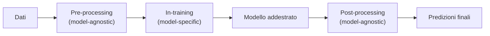

import Callout from '../../../components/Callout.astro';

## Introduzione alla Fairness nel Machine Learning

Il **Machine Learning (ML)** consente la costruzione di modelli capaci di apprendere dai dati e prendere decisioni automatiche. Tuttavia, i dati di training e le scelte di modellazione possono **riflettere e amplificare disuguaglianze**, pregiudizi sociali o errori tecnici, portando a decisioni discriminatorie o inappropriate.

L'obiettivo della **fairness** è garantire che:

- le decisioni generate dai sistemi ML **non siano ingiuste o discriminatorie** verso gruppi protetti o sottorappresentati;
- i modelli **non amplifichino disuguaglianze esistenti**.

La **misurazione** della fairness è complessa e soggettiva, specialmente in relazione ad **attributi sensibili** (razza, sesso, religione).

### La Metafora dello Specchio: Dati e Società

Un concetto fondamentale per comprendere la fairness è la **"Metafora dello Specchio"**, che descrive la relazione tra realtà, dati e modelli.

- **I dati come riflesso:** i dati di training non sono verità assolute o neutre, ma agiscono come uno **specchio della società** che li ha generati. Se il mondo reale contiene disuguaglianze storiche, stereotipi o pregiudizi (es. discriminazioni di genere o razziali), i dati rifletteranno fedelmente queste "brutture".
- **Il ruolo del modello:** quando un modello apprende da questi dati, non sta "sbagliando", ma sta semplicemente guardando nello specchio. Non si può incolpare il riflesso (l'output del modello) se l'oggetto riflesso (la società/i dati) è imperfetto.
- **Lo specchio deformante (amplificazione):** spesso il ML agisce come uno specchio deformante. Per massimizzare l'efficienza matematica, il modello tende ad **amplificare** i bias presenti: se un gruppo è leggermente sottorappresentato o svantaggiato nei dati, l'algoritmo potrebbe esasperare questa disparità per ottimizzare la metrica di errore globale.

<Callout type="insight">

**Conclusione data-centric:** per risolvere il problema non basta "pulire lo specchio" (modificare l'algoritmo), ma bisogna agire sull'**immagine riflessa**, intervenendo attivamente sulla **qualità e rappresentatività dei dati**.

</Callout>

## Bias nei Dati

Il **bias nei dati** è un'incoerenza rispetto al fenomeno che i dati dovrebbero rappresentare. Può manifestarsi in diverse forme.

### Bias preesistente (Societal Bias)

Origina nella **società** e si riflette nei dati di input.

- È **difficile da rilevare e mitigare**: richiede un quadro normativo e di credenze.
- La **rimozione delle colonne sensibili non è sufficiente**, poiché altre feature possono fungere da **proxy** (es. reddito, tipo di lavoro, CAP).
- La conoscenza dell'attributo sensibile è anzi **utile per valutare** la fairness.

### Bias tecnico

Emerge dal **funzionamento dei sistemi tecnici**, amplificando i bias preesistenti. Esempi:

- metodi di **imputazione** errati (es. nella gestione dei valori nulli, rimpiazzare i valori mancanti con il valore medio può portare ad assunzioni errate);
- **trasformazioni dei dati** che ne alterano il significato;
- **embedding pre-addestrati** che non rappresentano bene nomi rari.

### Bias emergente

Si manifesta nel **contesto d'uso** del sistema, spesso attraverso **cicli di feedback**.

<Callout type="example">

**"I ricchi diventano più ricchi" nel ranking web:** i documenti più rilevanti compaiono per primi e per questo vengono visitati più spesso; ricevono quindi maggiore rilevanza da parte degli utenti e diventeranno ancora più rilevanti.

</Callout>

### Altre tipologie di bias

| Tipo di bias | Descrizione |
| --- | --- |
| *Selection Bias* | Scelta di sorgenti dati convenienti ma non rappresentative |
| *Self-selection Bias* | Dati da sorgenti "volontarie" (es. sondaggi online) |
| *Omitted Variable Bias* | Mancanza di feature necessarie |
| *Sampling Bias (Distribution Shift)* | La distribuzione dei dati di training non riflette quella di produzione |
| *Prejudice/Stereotype Bias* | Riflette pregiudizi sociali |
| *Experimenter Bias* | Interpretazione che conferma le proprie ipotesi |
| *Labeling Bias* | Bias introdotto da chi etichetta i dati |

## Criteri Statistici di Non Discriminazione

Esistono diversi **criteri formali** (di misurazione) per definire la non discriminazione in ML, particolarmente rilevanti per sistemi di **classificazione binaria** o **score-based**. Notazione: $A$ è l'attributo sensibile (gruppi $a$, $b$), $Y$ il target reale, $\hat{Y}$ l'output del modello di decisione binaria, $R$ lo score predittivo.

Le tre categorie principali sono descritte di seguito.

### 1. Independence (Parità Demografica)

La probabilità di un certo esito deve essere **la stessa per tutti i gruppi**.

**Descrizione:** il tasso di predizioni positive ($Y = 1$) non deve dipendere dall'appartenenza a un gruppo sensibile $A$.

**Formalizzazione:**

$$
P(Y = 1 \mid A = a) = P(Y = 1 \mid A = b)
$$

Qui $Y = 1$ indica la **predizione** positiva del modello (in notazione più rigorosa, $\hat{Y} = 1$).

- *Interpretazione:* gli output del modello dovrebbero essere equamente distribuiti tra i gruppi.
- *Limiti:* questa metrica può **mascherare discriminazioni** a livello di tassi di falsi positivi/negativi e **non tiene conto delle differenze di base rate**.

<Callout type="example">

La probabilità di essere assunti deve essere simile per uomini e donne con lo stesso profilo.

</Callout>

In diversi contesti normativi, un modello è considerato sufficientemente equo quando il **rapporto tra i tassi** dei due gruppi è $\geq 0.8$ (**regola del 20%**, nota anche come *four-fifths rule* o regola dell'80%):

$$
\frac{P(\hat{Y} = 1 \mid A = b)}{P(\hat{Y} = 1 \mid A = a)} \geq 0.8
$$

### 2. Separation (Equalized Odds)

Richiede che l'indipendenza valga **all'interno di ogni strato definito dalla variabile target**, ovvero che i tassi di falsi positivi e falsi negativi siano uguali tra i gruppi.

**Descrizione:** i **tassi di errore** devono essere uguali tra i gruppi all'interno di ogni strato definito dal target $Y$.

**Forme equivalenti per classificatori binari:**

- **Tasso di veri positivi uguale:**

$$
P(\hat{Y} = 1 \mid Y = 1, A = a) = P(\hat{Y} = 1 \mid Y = 1, A = b)
$$

- **Tasso di veri negativi uguale** (equivalentemente, tasso di **falsi positivi** uguale, poiché $\text{TNR} = 1 - \text{FPR}$):

$$
P(\hat{Y} = 1 \mid Y = 0, A = a) = P(\hat{Y} = 1 \mid Y = 0, A = b)
$$

dove $\hat{Y}$ è l'output del modello di decisione binaria.

- *Interpretazione:* garantisce che, tra coloro che hanno lo **stesso esito reale**, i rischi di falsi positivi e negativi siano bilanciati tra i gruppi. In altre parole, la definizione richiede **parità dei tassi di errore**.
- *Limiti:* se i **base rate** differiscono tra i gruppi, l'equilibrio dei tassi di errore può richiedere **compromessi sulle prestazioni** complessive.

<Callout type="warning">

**Preoccupazione etica:** nella pratica, tassi di errore più alti ricadono spesso su gruppi storicamente marginalizzati o svantaggiati, aumentando le disuguaglianze esistenti e generando ulteriori danni.

</Callout>

### 3. Sufficiency (Predictive Parity)

Dato lo score del modello, il vero outcome è **indipendente dall'appartenenza al gruppo**: l'**affidabilità delle predizioni** deve essere indipendente dai gruppi.

**Descrizione:** dato lo score predittivo $R$ (punteggio continuo, es. logit), l'esito reale $Y$ è indipendente dall'appartenenza al gruppo $A$.

**Formalizzazione:**

$$
P(Y = 1 \mid R = r, A = a) = P(Y = 1 \mid R = r, A = b) \quad \text{per ogni } r
$$

- *Interpretazione:* a parità di *score*, i gruppi dovrebbero avere la stessa probabilità di successo.

Il **Positive Predictive Value (PPV)** è la probabilità che una predizione pari a 1 sia corretta, dato che il modello ha predetto 1:

$$
\text{PPV} = P(Y = 1 \mid \hat{Y} = 1)
$$

### Confronto tra i criteri

| Criterio | Nome comune | Condizione | Cosa garantisce | Limite |
| --- | --- | --- | --- | --- |
| **Independence** | Parità demografica | $\hat{Y} \perp A$ | Stesso tasso di esiti positivi tra gruppi | Ignora base rate; può mascherare differenze in FP/FN |
| **Separation** | Equalized odds | $\hat{Y} \perp A \mid Y$ | Stessi TPR e FPR tra gruppi (parità dei tassi di errore) | Con base rate diversi richiede compromessi sulle prestazioni |
| **Sufficiency** | Predictive parity | $Y \perp A \mid R$ | Stessa affidabilità delle predizioni a parità di score | — |

## Strategie per Mitigare i Bias

Per raggiungere la fairness si possono applicare approcci in **tre fasi** del ciclo di vita del ML.

### Pre-processing (prima dell'addestramento)

Mira a **modificare lo spazio delle feature** per ridurre la correlazione con l'attributo sensibile, prima che i dati vengano utilizzati dal modello.

- È un approccio **model-agnostic**: le correzioni possono essere usate con qualsiasi modello.
- **Non garantisce sempre** che le predizioni siano eque, poiché non controlla le decisioni di modellazione o le predizioni finali.
- Esempi: **bilanciamento** delle rappresentazioni di feature sensibili, **riformulazione del dataset** per ridurre le correlazioni con attributi sensibili.

### In-training (durante l'addestramento)

Consiste nell'inserire **vincoli di fairness** direttamente nell'**ottimizzazione** del modello.

- Può offrire **garanzie più forti** di fairness, poiché l'equità è integrata nell'obiettivo di training.
- È un approccio **model-specific**: richiede modifiche all'algoritmo di apprendimento, ed è potenzialmente complesso da implementare.
- Implicazioni: **bilanciamento** degli obiettivi di accuratezza e fairness nella **loss function**, oppure imposizione di **constraint** su metriche di fairness durante l'ottimizzazione.

### Post-processing (dopo l'addestramento)

L'obiettivo è **modificare un classificatore già addestrato** per renderlo non correlato con l'attributo sensibile.

- È un approccio **model-agnostic** e può essere applicato a qualsiasi modello **senza retraining**.
- È **meno flessibile** e spesso comporta **compromessi maggiori** sulle prestazioni rispetto a pre-processing e in-training.
- Tecniche comuni: **calibrazione delle soglie**, **ribilanciamento delle decisioni** per gruppi, altri aggiustamenti delle predizioni finali.

| Fase | Tipo | Vantaggi | Svantaggi |
| --- | --- | --- | --- |
| Pre-processing | Model-agnostic | Usabile con qualsiasi modello | Non garantisce predizioni eque |
| In-training | Model-specific | Garanzie di fairness più forti | Richiede modifiche all'algoritmo, complesso |
| Post-processing | Model-agnostic | Nessun retraining necessario | Meno flessibile, compromessi maggiori sulle prestazioni |

## Rischi e Considerazioni Etiche della Fairness

L'utilizzo di modelli non equi comporta **rischi significativi**: perdita di reputazione, danni economici e amplificazione di disuguaglianze strutturali.

- L'**individuazione dei bias non è sufficiente**: è cruciale valutare se le disparità osservate siano **giustificate e dannose**, e definire strategie per mitigarle.
- La "misurazione" delle disparità è spesso influenzata da **definizioni sociali**, rendendo la fairness non solo una questione tecnica ma anche **etica e normativa**.

La **discriminazione** riguarda categorie socialmente rilevanti che storicamente hanno servito come base per trattamenti ingiustificati e sistematicamente avversi. Secondo la **legge statunitense** alcune categorie sono considerate **protette**: quando si trattano dati relativi a queste categorie bisogna fare attenzione, perché possono generare pregiudizi. Queste caratteristiche sono state in passato fonti di discriminazione:

- Razza
- Sesso (incluso l'orientamento sessuale)
- Religione
- Stato di disabilità
- Luogo di nascita

<Callout type="example">

**Case Study: Amazon Same-Day Delivery (2016)**

- *Il problema:* Amazon offriva consegne in giornata in molte città USA, ma **escludeva alcuni quartieri a maggioranza afroamericana** (es. a Boston e Atlanta).
- *La causa:* l'algoritmo non usava la razza come input (quindi era "cieco"), ma si basava sulla **densità delle transazioni** e sulla **presenza di membri Prime**. Poiché storicamente i quartieri bianchi erano più ricchi e avevano più membri Prime, l'algoritmo ha escluso indirettamente i quartieri neri.
- *Lezione:* esempio classico di **Bias Preesistente** o **Proxy Bias** (usare il CAP/indirizzo come proxy della razza).

</Callout>

È fondamentale prestare attenzione al **contesto sociale e normativo**, poiché la fairness è strettamente legata a principi etici e legali, non solo a metriche matematiche.

---

## Riepilogo

| Concetto | Descrizione |
| --- | --- |
| **Fairness** | Garantire che i modelli ML non discriminino gruppi protetti e non amplifichino disuguaglianze |
| **Metafora dello specchio** | I dati riflettono la società; il modello può amplificarne i bias (specchio deformante) → approccio data-centric |
| **Bias preesistente** | Origina nella società; rimuovere colonne sensibili non basta per via dei proxy |
| **Bias tecnico** | Introdotto dal sistema (imputazione, trasformazioni, embedding) |
| **Bias emergente** | Nasce dal contesto d'uso tramite cicli di feedback |
| **Independence** | $P(\hat{Y}=1 \mid A=a) = P(\hat{Y}=1 \mid A=b)$; soglia normativa: rapporto $\geq 0.8$ |
| **Separation** | $P(\hat{Y}=1 \mid Y=y, A=a) = P(\hat{Y}=1 \mid Y=y, A=b)$ per $y \in \lbrace 0,1 \rbrace$: parità dei tassi di errore |
| **Sufficiency** | $P(Y=1 \mid R=r, A=a) = P(Y=1 \mid R=r, A=b)$ per ogni $r$ |
| **PPV** | $P(Y=1 \mid \hat{Y}=1)$: probabilità che una predizione positiva sia corretta |
| **Pre-processing** | Modifica le feature prima del training; model-agnostic |
| **In-training** | Vincoli di fairness nella loss/ottimizzazione; model-specific |
| **Post-processing** | Aggiusta soglie/decisioni del modello addestrato; model-agnostic, senza retraining |
| **Proxy bias** | Feature apparentemente neutre (CAP, reddito) che codificano l'attributo sensibile (es. caso Amazon) |
