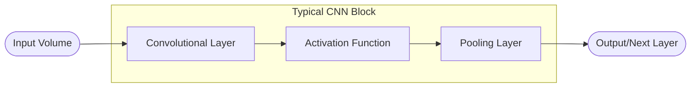

import Callout from '../../../components/Callout.astro';

## Introduction

**FROM MLP TO CNN: THE SHARED FOUNDATION**

**Convolutional Neural Networks (CNNs)** are built upon the same fundamental principles as **Multi-Layer Perceptrons (MLPs)**.

Both architectures consist of **neurons with learnable weights and biases**, where each neuron processes its input through a **dot product** followed by a **non-linear activation function**.

In both cases, the network’s parameters are **organized into layers**, and the entire model represents a **single differentiable function** — enabling training through **backpropagation**.

Thus, CNNs can be seen as a structured extension of MLPs, designed to exploit specific properties of spatial data such as images.

**WHAT IF THE INPUT ARE IMAGES**

When dealing with **images**, the data are naturally organized in a **2D grid structure**, which can lead to several challenges:

- **Parameter Explosion**: if we simply **unroll an image into a 1D vector** (as an MLP requires), the dimensionality becomes extremely large.
    

<Callout type="example">
A small $32 \times 32$ pixel color image ($32 \times 32  \times 3 = 3{,}072$ input features) connected to a $512$-neuron hidden layer would need over $1.5$ million weights for that single layer! This is computationally expensive and prone to overfitting.
</Callout>

    
    However, image data contain strong **local correlations** — nearby pixels tend to have similar values. This redundancy can be exploited to **reduce the number of parameters** without losing important information.
    
- **Loss of Spatial Information**: Flattening an image into a 1D vector in an MLP **destroys the spatial relationships** between pixels. The model “forgets” that pixels are arranged in a structured grid, which is crucial for understanding images.
    

<Callout type="example">
For example, let’s suppose we want to recognize a face — we should be able to detect it **regardless of its position** within the image.
</Callout>

    
- **Inability to Learn Hierarchies**: These networks struggle to recognize that features are built hierarchically (e.g., pixels form edges, edges combine into shapes, and shapes form objects).
    
    In deep learning architectures, we still want to preserve this **hierarchical composition of features**: the first layers extract low-level patterns, and subsequent layers gradually learn more abstract representations closer to the target labels.
    

**THE SOLUTION: A NEW APPROACH**

**Convolutional Neural Networks (CNNs)** are specifically designed for **image inputs**. Their main purpose is to **automatically and adaptively learn spatial hierarchies of features**. 

They achieve this by detecting **simple patterns** in the early layers and progressively **building upon them** to recognize more complex structures in deeper layers.

**Inspiration from Biology: The Visual Cortex**

The design of CNNs is inspired by how the **visual cortex** in the human brain processes visual information. In the biological vision system, processing occurs in **stages**:

- **Neurons in early stages** detect **simple features** like edges, lines, and colors.
- **Later stages** combine these simple patterns to recognize **more complex elements** like textures, shapes, and eventually entire objects.

Crucially, each neuron in the visual cortex responds only to stimuli within a **small, localized region** of the visual field — a concept mirrored by the **local receptive fields** in CNNs.

Another important aspect of human vision is **motion**: our brains can recognize and track objects based on how they **move** through space, further refining perception and recognition.

**BUILDING BLOCKS**

CNNs derive their efficiency and power from a combination of specialized building blocks:

- **Convolutional Layers**
- **Activation Functions**
- **Pooling Layers**

These foundational blocks will be detailed in the subsequent sections.

## Architecture

A typical **Convolutional Neural Network (CNN)** is composed of a **sequence of layers** stacked one on top of the other.

Each layer transforms an **input 3D volume** into an **output 3D volume**, using a **differentiable function**. Some layers have **learnable parameters** (e.g., convolutional layers), while others do not (e.g., pooling layers).

<Callout type="example">
So let's suppose that our input is an image $32 \times 32 \times 3$ (width × height × channels). The goal is to apply a sequence of operations that **preserve the spatial structure** of the image while **increasing the depth** — that is, the number of channels.

In an **MLP**, we increase the **number of neurons** per layer; instead in a **CNN**, we increase the **number of feature maps (channels)** per layer.
</Callout>

Each convolutional layer produces multiple 2D outputs, called **feature maps** or **activation maps**, which highlight **where specific patterns** (such as edges or textures) are detected in the input.

Then, **pooling layers** reduce the spatial dimensions (width and height) of these maps using **non-learnable operations** (e.g., max or average pooling), making the representation **more compact** and **translation-invariant** while preserving the most important information.

As the network goes deeper, the feature maps become **smaller but richer in depth**, capturing **increasingly abstract features**.

Finally, the 3D feature volume is **flattened into a vector** and passed to one or more **fully connected (MLP) layers**, which perform the **final classification**.

### Convolutional Layers

The Convolutional Layer is the fundamental building block of Convolutional Neural Networks. Unlike neurons in a fully connected layer, neurons in a convolutional layer are arranged in three dimensions: 

- **width**
- **height**
- **depth** (Channels)

**LOCAL CONNECTIVITY**

At its core, each neuron in a **Convolutional Neural Network (CNN)** still performs a **weighted sum** of its inputs plus a bias, just like in an MLP:

$$
\sum_i w_ix_i+b
$$

However, unlike neurons in an **MLP** — which are **fully connected** to all inputs (meaning each neuron “sees” the entire image) — neurons in a **convolutional layer** are connected only to a **small, localized region** of the input volume, known as their **receptive fields**. 

This **local connectivity** allows the network to learn **simple patterns** such as edges or textures in early layers and progressively more complex features in deeper ones.

**PARAMETER SHARING AND FEATURE MAP**

To efficiently detect the same feature across different parts of an image, CNNs use **parameter sharing** — meaning that the same set of weights and bias, called a **filter** or **kernel**, is applied across all spatial positions of the input. This ensures that:

1. The same feature can be detected anywhere in the image.
2. The number of learnable parameters stays small.

As this filter slides over the input (the **convolution operation**), it computes weighted sums of the pixels plus the bias at each location, producing a **2D** **feature map** or **activation map** that shows **where and how strongly** the pattern represented by that filter appears in the image.

A separate feature map is generated for each filter, and the **final output volume** of the layer is obtained by **stacking all the feature maps together**.

<Callout type="example">
Suppose we have an image of size $5 \times 5 \times 3$ and **6 learnable filters**, each trained during the network’s learning process.

1. Each filter is **slid across the image** (convolution). If we move it **one pixel at a time** (stride = 1), we get **one output value per position**.
2. At each position, the filter computes:
    
    $$
    \text{output} = \sum (\text{local pixels} \times \text{filter weights}) + \text{bias}
    $$
    
3. The result of each filter is a **2D feature map**, showing **where that feature was detected** in the image.

Since we have **6 filters**, this process produces **6 distinct feature maps**, one per filter.
</Callout>

**DEEPER LAYERS AND RECEPTIVE FIELD EXPANSION**

When another convolution is applied on top of a feature map, each neuron now “sees” a **larger portion of the original image**, since each input value already summarizes a region of pixels.

As the network goes deeper, the **receptive field grows**, meaning a single neuron can eventually “see” the **entire image**.

This explains why **early layers** capture **local features** (edges, corners), while **deeper layers** learn **global and abstract patterns**.

**WHAT IS CONVOLUTION?**

**Note** that this diagram **simplifies the process for a single channel**. In practice, a filter’s **depth must match the input volume’s depth** (e.g., a $3 \times 3 \times 3$ filter for a $32 \times 32 \times 3$ RGB image). The convolution involves **element-wise multiplications across all channels**, and the results are **summed together**, along with a **single bias term**, to produce **one pixel** in the output feature map.

**HYPERPARAMETERS**

Each convolutional layer is defined by the following hyperparameters:

- **Number of Filters** $C_{out}$: Determines the depth of the output volume — that is, how many **feature maps** the layer produces.
- **Kernel Size** ($K \times K$): Specifies the **spatial dimensions** of each filter. Kernels are usually square and always extend across the **entire depth** $C_{in}$ of the input volume.
- **Stride** $S$: The number of pixels the convolutional filter shifts across the input at each step.
    

<Callout type="warning">
If the stride is greater than one, the output (feature map) becomes **smaller** because the kernel covers fewer positions. Even with a stride of one, the output can shrink if no padding is used, since the kernel cannot fully cover the image edges. Padding adds extra pixels around the image to preserve its size. 

In the **early layers** of a CNN, we typically avoid shrinking too much to keep fine spatial details for local feature extraction, while in **deeper layers**, reducing the spatial dimensions becomes useful to obtain compact, high-level representations that summarize the learned features.
</Callout>

    

Additionally, the presence and amount of **Spatial Padding** $P$ applied to the input volume can be considered another hyperparameter. Padding is often used to **preserve spatial dimensions** or to ensure an **integer output size.**

<Callout type="warning">
While **zero-padding** (adding a black border) is simple and widely used, it can sometimes introduce **artificial edges** at the boundaries, leading to **false activations** near the image borders and potentially biasing classification.

To mitigate this, it’s often preferable to use **padding strategies** that preserve the image’s natural continuity, such as **mirror** or **replicate padding**, instead of inserting artificial black frames.
</Callout>

**NUMBER OF LEARNABLE PARAMETERS**

Given an input volume of size $H \times W \times C_{in}$, the number of learnable parameters for a convolutional layer with $C_{out}$ filters and a kernel size of $K \times K$ is:

$$
\text{Number of learnable parameters} = (K \times K \times C_{in}) \times C_{out} + C_{out}
$$

**Explanation**

- There are $C_{out}$ distinct filters (kernels) in the layer.
- Each filter has spatial dimensions $K \times K$ and extends through the full depth of the input volume ($C_{in}$). So, each filter has $K \times K \times C_{in}$ weights.
- Additionally, each of the $C_{out}$ filters has its own additive learnable bias term.

### Activation Functions

The output of a **convolutional layer** is an **activation map**, obtained through a **linear operation**. However, the composition multiple linear function still produces only a **linear function** — meaning that, without introducing **non-linearities**, a deep neural network, no matter how many layers it has, would behave like a **single-layer linear model** (e.g., logistic regression), and thus would be unable to capture complex patterns in data.

To overcome this, CNNs introduce **nonlinear activation functions** after each convolutional layer. The most common ones include:

Each activation function is applied **element-wise** to the activation map, making the model capable of learning complex, nonlinear patterns. Because these activation maps can themselves be interpreted as images, they can also be **visualized or overlaid on the original input** to show which regions the network focuses on. By upsampling maps from different layers, we can see how the CNN’s attention evolves across stages.

**WHY RELU IS PREFERRED**

The ReLU activation function has gained significant popularity for several reasons:

- **Accelerated Convergence:** ReLU was empirically found to greatly accelerate the convergence of Stochastic Gradient Descent compared to Sigmoid and Tanh functions.
- **Computational Efficiency:** ReLU can be implemented by a simple thresholding operation $f(x) = \max(0, x)$, whereas Sigmoid and Tanh involve more complex exponential calculations.

### Pooling Layers

Pooling layers **spatially downsample the input volume**, reducing its **width and height** while preserving the most important information. Pooling is typically applied **independently to each depth slice** (channel) of the input.

The main **hyperparameters** of pooling layers are:

- **Pool Size** ($K$): The spatial dimensions of the pooling window (e.g., $2 \times 2$).
- **Stride** ($S$): The number of pixels the pooling window moves across the input at each step.
    
    When $S = K$, the pooling windows are **non-overlapping**.
    

The pooling window **slides across the image**, and at each position, a predefined operation, such as taking the **maximum** or the **average** of the covered values, is applied. 

**POOLING FUNCTIONS**

The **type of pooling function** is an additional hyperparameter. While several aggregation methods are possible, the most commonly used in practice are:

- **Max Pooling**:  Returns the **maximum value** within the pooling window. This is by far the most common choice because it effectively captures the **strongest activations.**
- **Average Pooling**: Returns the **average value** within the pooling window, providing a smoother representation but often less discriminative than max pooling.

<Callout type="warning">
Although **min pooling** can technically be used, it is rarely meaningful in practice. Since activations typically indicate the **presence of a feature**, taking the minimum would mostly select **near-zero values**, effectively discarding useful information.
</Callout>

**THE PROS**

Pooling layers are widely used because they provide several key advantages:

- **Gain robustness to the exact location of the features**
    
    Pooling helps the network **become more robust to small spatial variations** in feature positions. By taking the **maximum value within a window (max pooling)**, the model captures the strongest activation—i.e., the point where the kernel best matches the feature—while ignoring small shifts or distortions. 
    
- **Reduce computational (memory) cost**
    
    Because pooling **downsamples** the activation maps, so subsequent layers operate on smaller inputs. 
    
- **Help preventing overfitting**
    
    Since the **max operation** can select different pixels as the strongest activations across samples, the network doesn’t rely on specific spatial positions. This introduces a form of randomness or variability—similar to changing the input topology—which makes it harder for the model to **memorize exact locations** and instead encourages it to **learn more general, position-independent features**.
    
- **Increase the receptive field of the following layers**
    
    Each pooling layer reduces spatial resolution, meaning neurons in deeper layers correspond to **larger portions of the input image**. This enables the network to capture **higher-level and more abstract features**, such as object parts or textures, instead of just edges or corners.
    

<Callout type="warning">
The most common configuration is a **pool size** of $K = 2$ (a $2 \times 2$ window) with a **stride** of $S = 2$, meaning that 75% of activations are discarded at each pooling step
</Callout>

**THE CONS**

While beneficial for some tasks, the aggressive downsampling of pooling layers presents drawbacks:

- **Loss of Spatial Resolution**: 
Pooling reduces the spatial dimensions of the feature maps, which can be problematic for tasks requiring **precise localization**, such as **semantic segmentation**, where each pixel must be assigned a specific class label.
    
    In such cases, reducing the image size destroys the one-to-one correspondence between **input** and **output** pixels. Therefore, modern architectures often use **alternative downsampling methods** or add **upsampling layers** later in the network to restore the original resolution when pixel-level predictions are needed.
    
    
    

## Batch Normalization

Training deep neural networks is challenging because they consist of many layers, where the input received by each layer depends on the parameters of all the layers that come before it.

As the network learns, the parameters in these earlier layers continuously change. Even small changes can be amplified as they propagate through the network, which alters the distribution of each layer’s inputs. This phenomenon is known as **Internal Covariate Shift**.

This forces the network to constantly adapt to shifting input distributions, making the training process slower and more unstable.

**THE SOLUTION: BATCH NORMALIZATION**

Batch Normalization is a technique designed to stabilize and speed up the training of deep neural networks. It works by **standardizing the inputs** to each layer across every mini-batch, reducing internal covariate shift and helping the network learn with greater stability.

**DURING TRAINING**

For a mini-batch $B$ containing $m$ activations $x$, the process involves four key steps:

1. **Calculate mini-batch mean:**
    
     $$
     \mu_B = \frac{1}{m} \sum_{i=1}^{m} x_i
     $$ 
    
    This represents the average activation across the batch.
    
2. **Calculate mini-batch variance:**
    
     $$
     \sigma^2_B = \frac{1}{m} \sum_{i=1}^{m} (x_i - \mu_B)^2
     $$ 
    
    This measures how much the activations deviate from the mean.
    
3. **Normalize:**
    
     $$
     \hat{x}_i = \frac{x_i - \mu_B}{\sqrt{\sigma^2_B + \epsilon}}
     $$ 
    
    Each activation is standardized to have approximately zero mean and variance (standard deviation) one. The small constant $\epsilon$ prevents division by zero.
    
4. **Scale and shift:**
    
     $$
     y_i = \gamma \hat{x}_i + \beta
     $$ 
    
    Here, $\gamma$ and $\beta$ are **learnable parameters,** without them, all normalized outputs would be constrained to have mean 0 and variance 1, which might limit the network’s representational capacity. 
    
    They allow the network to learn the optimal scale $\gamma$ and shift $\beta$ for the normalized activations. In essence, the network can undo the normalization if it’s not beneficial.
    

**DURING INFERENCE**

During inference typically we process one input at a time rather than a mini-batch. In this case we need a deterministic way to normalize, so we use **population statistics** — the **mean** and **variance** estimated over the entire training process.

These values are obtained by using a **moving average** of the mini-batch means and variances observed during training.

The normalization equation becomes:

 $$
 \hat{x} = \frac{x - \mu_{\text{population}}}{\sqrt{\sigma^2_{\text{population}} + \epsilon}}
 $$ 

 $$
 y = \gamma \hat{x} + \beta
 $$ 

**BENEFITS**

- **Faster Training:** Allows for higher learning rates, which speeds up convergence.
- **Reduces Internal Covariate Shift:** Stabilizes the distribution of layer inputs.
- **Regularization Effect:** The noise from mini-batch statistics has a slight regularizing effect, sometimes reducing the need for dropout.
- **Less Sensitive to Initialization:** Makes the network less dependent on the initial weights.

## Key Takeaways

| Feature | Description | Key Benefits |
|---------|-------------|--------------|
| **Convolutional Layer** | Learns local patterns via sliding filters and parameter sharing. | Parameter efficiency, spatial hierarchy, translation invariance. |
| **Activation Function (ReLU)** | Introduces non-linearity element-wise (e.g., $\max(0, x)$). | Faster convergence, computational efficiency, avoids linearity trap. |
| **Pooling Layer** | Spatially downsamples feature maps (Max or Average). | Robustness to shifts, reduced computation, increased receptive field. |
| **Batch Normalization** | Normalizes layer inputs per mini-batch during training. | Stabilizes training, faster convergence, slight regularization. |
