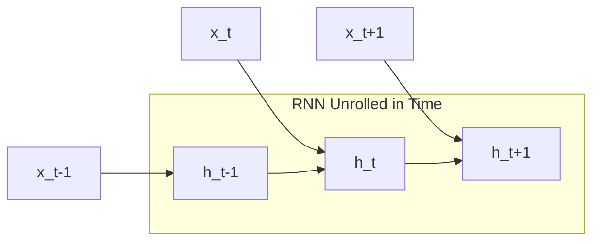

import Callout from '../../../components/Callout.astro';

## Introduction to Time Series

A **time series** is a **set of observations** $\{x_t\}_{t \in \tau}$  collected over time, that spans from a starting time $t$ to an ending time $\tau$, where $\tau$ is the total number of observations. 

The key characteristic of a time series is that **the observations are ordered**, meaning the order in which the data points are collected is meaningful and often important for analysis.

Based on the nature of $\tau$, we can distinguish between:

- **Continuous time series:** Observations are continuous in time, meaning the data can be **sampled always.**
- **Discrete time series:** A **discrete sampling rate** is defined (e.g., one item every second or minute), and values are sampled at **regular intervals.**
    
    If the **time delta** between data points is **fixed**, the series is **regularly sampled**, with a **sampling frequency** $f_s$ (usually measured in hertz, Hz). The sampling frequency indicates how many observations are collected per unit of time.
    

➡️ **We will consider discrete and regularly sampled time series!**

**FEATURES OF TIME SERIES**

Traditional analysis approaches decompose a time series into specific elements:

- **Trend:** describes the long-term direction of the series, showing whether values tend to *increase*, *decrease*, or remain *constant* over time.
- **Seasonality:** regular fluctuation around the trend that occur over fixed periods (e.g., daily, monthly, yearly).
- **Cycle:** periodic fluctuation around the trend.
- **Outliers:** values that appear out-of-distribution with respect to the rest of the data.

A time series is **stationary** if its **statistical properties** — such as mean and variance — **do not change over time**. Conversely, if the **trend is non-constant**, the time series is considered **non-stationary.**

**STL DECOMPOSITION**

The **STL decomposition** splits data into **Seasonality** and **Trend** components using the **Loess (Local regression)** smoothing function**:**

- The **trend** captures the long-term movement of the series.
- The **seasonal component** captures repeating patterns or cycles at a fixed period.

The remaining variation that cannot be attributed to trend or seasonality is called the **residual** or **noise**, representing irregular fluctuations.

## Forecasting

The object is: having observed a time series over a period $\tau$, we want to **estimate a future value** $\hat{x}_{\tau+h} \quad \text{with } h>0$ where the value $h$ is called the **forecast horizon**.

Ideally, if we knew the **Data Generating Process (DGP)** behind the series, we could predict future values perfectly. In practice, we try to **learn an approximate model** from the observed data.

**FORECASTING PROBLEM**

Most forecasting models consider a **limited window of observations** $\{x_t, \dots, x_{t-q}\}$ where $q$ is the number of past values taken into account.

The model is generally expressed as:

$$
x_t = f(x_{t-1}, \dots, x_{t-q}; \phi) + g(\xi_{t-1}, \dots, \xi_{t-q}; \theta)
$$

- $f(\cdot; \phi)$ represents the **deterministic part** of the model, which depends on past data.
- $g(\cdot; \theta)$ represents the **stochastic part**, capturing the influence of random noise or unpredictable components.
- $\xi_{t-1}, \dots, \xi_{t-q}$ are **random disturbances** with mean 0 and finite variance.
- $\phi$ and $\theta$ are the **model parameters** to be estimated.

This formulation shows that forecasting can be **stochastic**: by sampling the disturbance variables (often assumed to follow a Gaussian distribution), the model can generate **multiple possible future outcomes** for the same forecast horizon, rather than a single deterministic prediction.

**FUNDAMENTAL APPROACHES**

Forecasting models can generally be divided into two main types:

- **Autoregressive (AR) Model**
    
    Assumes that the **current value of the series** depends from its **own past values**.  Formally an **autoregressive model of order $p$**, denoted as $AR(p)$, is defined as:
    
    $$
    x_t = \sum_{i=1}^{p} \phi_i x_{t-i} + \xi_t
    $$
    
    Here:
    
    - Each $x_t$ is modeled as a linear combination of its $p$ previous observations plus a **random disturbance** $\xi_t$ (white noise), where the coefficients $\phi_i$ are the **learnable parameters**.
    

<Callout type="warning">
These past values may represent either the raw observations or intermediate representations summarizing past information. 
</Callout>

    
- **Moving Average (MA) Model**
    
    Assumes that the current value depends not on past observations but on **past random fluctuations** (errors). A **moving average model of order $q$**, denoted as $MA(q)$, is defined as:
    
    $$
    x_t = \mu + \xi_t + \sum_{i=1}^{q} \theta_i \xi_{t-i}
    $$
    
    where 
    
    - $\mu$ is the **empirical average** of the series $\{x_t\}_{t\in\tau}$
    - $\theta_i$ are the **learnable parameters**.
    - $\xi_{t-i}$ represent past random fluctuations.
    - $\xi_t$ are the **random variations** (error terms or shocks) to be estimated while learning $\theta$.
    - $x_t$ is generated as a function of the **last random variations** plus the **average** of the current series.
    
    In this formulation, the model captures how recent **deviations from the mean** affect the current value. The term “moving average” comes from the fact that these deviations are computed over a **sliding window**, effectively modeling the **residual component** of the time series — i.e., the fluctuations around the trend or average level.
    

## Data pre-processing

Before modeling, time series data must be **cleaned, formatted, and transformed** to make it suitable for analysis and learning.

**BASIC**

Pre-processing begins with **data preparation**, which includes:

- **Extracting and formatting time information** (e.g., timestamps, dates)
- **Refining values** by handling missing data, normalizing ranges, or removing outliers

At a higher level, transformations can be applied to represent the data in **different domains**:

- **Linear transforms**, such as the **Fourier Transform** convert the series from the **time domain** to the **frequency domain**.
    
    In this representation, the x-axis corresponds to **frequency** rather than time, and the y-axis indicates the **amplitude** of each frequency component — forming the **spectrum** of the time series.
    

- **Non-linear transforms**, such as the **Hilbert–Huang Transform (HHT)**

**CYCLICAL FEATURES**

Time-related variables like **hours**, **days**, or **months** are **cyclical** — they repeat after a fixed period. To make them suitable for numerical processing (since neural networks cannot interpret raw date strings), they must be **encoded numerically** while preserving their periodicity.

A common and effective approach is to use **sine and cosine transformations**, which map cyclical variables onto the **unit circle**:

$$
\text{Sin(hour)} = \sin\left(\frac{\text{hour} \cdot 2\pi}{24}\right)\quad \text{and} \quad\text{Cos(hour)} = \cos\left(\frac{\text{hour} \cdot 2\pi}{24}\right)
$$

The same approach applies to other cyclical variables, such as **months of the year**. Neural networks also benefit from this encoding since their inputs become **centered around zero** with a **fixed variance.**

## Recurrent Neural Networks

**Recurrent Neural Networks (RNNs)** are specialized architectures designed to process **sequential data**. Unlike traditional feedforward networks, which handle fixed-size inputs independently and have **no memory** of previous inputs, RNNs maintain an internal **state (or "memory")** that captures information from earlier time steps. Because of these **sequential dependencies**, the current output depends not only on the current input but also on **previous inputs**.

This core feature allows RNNs to understand **context and temporal dependencies**, making them particularly suited for tasks involving **variable-length sequences**.

- **One-to-one:** the classic feedforward neural network architecture, with one input and one output.
- **One-to-many:** used when the input has fixed size but the output (e.g., a sequence of words) has variable length.
- **Many-to-one:** used in tasks like sentiment analysis, where the input is a sequence of words and the output is a single prediction (e.g., sentiment score).
- **Many-to-many:** used in sequence-to-sequence tasks like machine translation, where both input and output are variable-length sequences.

**VANILLA RNN**

The simplest Recurrent Neural Network, often called a "Vanilla RNN", operates using three sets of **shared parameters:**

- $U$ the **input weight matrix**, which maps inputs $x^{(t)}$ to the hidden state
- $W$ the **recurrent weight matrix,** which parametrizes hidden state transition
- $V$ the **output weight matrix**, which maps the *current* hidden state $h^{(t)}$ to the final output $o^{(t)}$.

The behavior of the cell at each time step $t$ is defined by two simple equations:

$$
\begin{cases}h^{(t)} = \phi(W h^{(t-1)} + U x^{(t)}) \\o^{(t)} = V h^{(t)}\end{cases}
$$

Where:

1. **Hidden State Update  →**  $h^{(t)} = \phi(W h^{(t-1)} + U x^{(t)})$
    - The current input $x^{(t)}$ (a $d$-dimensional vector) is projected by $U$(a $k \times d$ matrix) into the $k$-dimensional hidden space.
    - Simultaneously, the *previous* hidden state $h^{(t-1)}$ (a $k$-dimensional vector) is multiplied by the recurrent matrix $W$ (a $k \times k$ matrix). This "feedback loop" is the core of the RNN, carrying information from the past.
    - These two linear projections are summed, and an **activation function** $\phi$ (like `tanh`) is applied to introduce non-linearity. The result is the new hidden state, $h^{(t)}$.
2. **Output Calculation  →**   $o^{(t)} = V h^{(t)}$

The hidden state $h^{(t)}$ acts as the network’s **memory**, providing a **lossy summary** of the entire input sequence $(x^{(1)}, x^{(2)}, \dots, x^{(t)})$ up to time $t$.

Since an arbitrarily long history is compressed into a single fixed-size vector, this summary inevitably loses some information. At any time step, the only knowledge of the past comes from $h^{(t-1)}$, making the model effectively **autoregressive of order 1** in its hidden space.

<Callout type="warning">
"Autoregressive of order 1" means that the **current state** of a system is predicted using *only* its **immediately preceding state**.
</Callout>

**TRAINING A RNN**

A **recurrent computational graph** cannot be trained directly with standard backpropagation**.** The solution is to **"unfold"** the network in time into a **sequential computational graph** with
a repetitive structure.

The recurrent dynamics can be expressed as:

$$
h^{(t)} = f(h^{(t-1)}, x^{(t)}; \theta)
$$

During training, the weight matrices $U$, $W$, and $V$ are **shared across all time steps**, meaning the same parameters are reused to process every input. This **parameter sharing** allows the RNN to handle **variable-length sequences** without increasing its parameter count.

**BACKPROPAGATION THROUGH TIME(BPTT)**

The ability to **unfold a recurrent graph into a Directed Acyclic Graph (DAG)** allows us to train RNNs using standard backpropagation. Since the gradient flows **backward through time** rather than just through layers, this process is called **Backpropagation Through Time (BPTT)**.

**Example:** Processing sequences of length $\tau = 3$ with an output at the end of the sequence.

Given a **differentiable loss** $L(y, o)$, the derivatives of the objective $L$ with respect to the weights $V, W, U$ are:

- $\frac{\partial L}{\partial V} = \frac{\partial L}{\partial o} \frac{\partial o}{\partial V}$
- $\frac{\partial L}{\partial W} = \frac{\partial L}{\partial o} \frac{\partial o}{\partial h^{(3)}} \sum_{k=0}^{3} \frac{\partial h^{(3)}}{\partial h^{(k)}} \frac{\partial h^{(k)}}{\partial W}$
- $\frac{\partial L}{\partial U} = \frac{\partial L}{\partial o} \frac{\partial o}{\partial h^{(3)}} \sum_{k=0}^{3} \frac{\partial h^{(3)}}{\partial h^{(k)}} \frac{\partial h^{(k)}}{\partial U}$

<Callout type="warning">
**Note**: 

- $\partial L / \partial V$ depends only on the **current state**,
- while $\partial L / \partial W$ and $\partial L / \partial U$ depend on **all previous sequence states**.
</Callout>

Looking closer, we see that terms $\frac{\partial h^{(t)}}{\partial h^{(k)}}$ must be themselves computed through the chain rule, which results in a long product of Jacobian matrices. For example we can obtain:

$$
\frac{\partial h^{(3)}}{\partial h^{(1)}} = \frac{\partial h^{(3)}}{\partial h^{(2)}} \frac{\partial h^{(2)}}{\partial h^{(1)}}
$$

Recalling that:

$$
h^{(t)} = \phi(W h^{(t-1)} + U x^{(t)})
$$

and temporarily ignoring the nonlinearity 	$\phi$ we can approximate:

$$
\frac{\partial h^{(t)}}{\partial h^{(t-1)}} \approx W \quad \Rightarrow \quad \frac{\partial h^{(t)}}{\partial h^{(k)}} \approx W^{(t-k)}
$$

This repeated multiplication of the *same matrix* $W$ can lead to two numerical instabilities:

1. **Vanishing Gradient Problem** 
    
    When the **2-norm** of $W$ is **smaller than 1**, the product $W^{(t-k)}$ shrinks exponentially as the time gap $(t-k)$ increases. During backpropagation through time, gradients are multiplied by $W$ at each timestep and by the derivative of the activation function. 
    
    When both of these factors are small, it **strongly pushes the total gradient toward zero**. This makes it difficult for the network to learn long-term dependencies, as it's effectively “forgetting” past information.
    

<Callout type="warning">
This problem is made much worse by "squashing" activation functions, as their derivatives are bounded:

- The **sigmoid** function's derivative has a maximum value of **$1/4$**.
- The **tanh** function's derivative has a maximum value of **$1$**.
</Callout>

    
2. **Exploding Gradient Problem**
    
    Conversely, when the 2-**norm** of $W$ is **greater than 1**, repeated multiplication causes gradients to grow exponentially over time. This leads to unstable updates and numerical overflow, where the influence of distant steps dominates and training diverges. In this case, the model gives too much importance to the distant past and cannot properly focus on the present.
    

Both issues can be mitigated through:

- **proper weight initialization,**
- **accurate choice of activation functions**
- **gradient clipping.**

**Note**: these problems can also happen in deep feedforward networks; however, they are more common in recurrent architectures because these models are usually very deep (actually as
deep as the length of the input sequence).

**ADVANCED RECURRENT ARCHITECTURES**

To overcome the problems of **vanishing** and **exploding gradients** that affect vanilla RNNs, the simple recurrent cell is replaced with a more sophisticated one that includes **learnable gating mechanisms**, which regulate the flow of information through time.

There are two main types of gated recurrent architectures:

- **Gated Recurrent Unit (GRU)**
    
    The GRU uses two gates to selectively update the hidden state at each time step allowing them to remember important information while discarding irrelevant details:
    
    - **Update Gate**: This gate decides how much information from previous hidden state should be retained for the next time step.
    - **Reset Gate**: This gate determines how much of the past hidden state should be forgotten.
- **Long Short-Term Memory (LSTM)**
    
    LSTMs have **three gates** that provide finer control over memory:
    
    - **Input Gate $i$:** Controls how much of the new "candidate state" is *added* to the memory.
    - **Forget Gate $f$:** Determines how much memory from the previous time step must be overwritten.
    - **Output Gate $o$:** Controls how much of the cell state $C_t$ is exposed to the next hidden state.

<Callout type="warning">
A gate in an RNN functions like a **controllable switch**, regulating the flow of information toward the memory cell. It's implemented as a vector whose values range from **0 (gate completely closed)**, which blocks information, to **1 (gate completely open)**, which allows information to pass through fully.
</Callout>

**LONG SHORT-TERM MEMORY (LSTM) NETWORKS**

$$
\begin{cases}i = \sigma\!\left(x^{(t)} U_i + h^{(t-1)} W_i\right) \\[6pt]f = \sigma\!\left(x^{(t)} U_f + h^{(t-1)} W_f\right) \\[6pt]o = \sigma\!\left(x^{(t)} U_o + h^{(t-1)} W_o\right) \\[6pt]\tilde{C}= \tanh\!\left(x^{(t)} U_C + h^{(t-1)} W_C\right) \\[6pt]C^{(t)} = C^{(t-1)} \odot f + \tilde{C} \odot i \\[6pt]h^{(t)} = \tanh\!\left(C^{(t)}\right) \odot o \end{cases}
$$

Here $\odot$ denotes **element-wise multiplication**

**Let’s go deeper:**

- **Gates**
    
$$
\begin{cases}i = \sigma\!\left(x^{(t)} U_i + h^{(t-1)} W_i\right) \\[6pt]f = \sigma\!\left(x^{(t)} U_f + h^{(t-1)} W_f\right) \\[6pt]o = \sigma\!\left(x^{(t)} U_o + h^{(t-1)} W_o\right) \\
\dots\end{cases}
$$
    
    Each gate is computed similarly to a standard RNN cell: 
    
    - The current input $x^{(t)}$ is multiplied by a weight matrix $U$
    - Summed to the previous hidden state $h^{(t-1)}$ multiplied by a weight matrix $W$,
    - Then is passed through a **sigmoid function** ($\sigma$) to produce values between **0** ("off") and **1** ("on").
    
    They all have the dimention of the hidden state and as we said they all act as **differentiable switches**, controlling how information flows into, through, and out of the cell state, thanks to the sigmoid activation function.
    
- **Candidate State**
    
    $$
    \begin{cases} \tilde{C}= \tanh\!\left(x^{(t)} U_C + h^{(t-1)} W_C\right) \end{cases}
    $$
    
    This equation computes what could intuitively be described as a **candidate state**. Indeed, again the equation is pretty much the same as that we saw for vanilla RNN architecture. Nonetheless,
    the amount of influence of $\tilde{C}$ on the LSTM memory cell is controlled by the input gate $i$.
    
- **Memory Cell’s update and hidden state**
    
    $$
    \begin{cases}C^{(t)} = C^{(t-1)} \odot f + \tilde{C} \odot i \\[6pt]h^{(t)} = \tanh\!\left(C^{(t)}\right) \odot o \end{cases}
    $$
    
    First equation computes the **update for memory cell** $C$. Here:
    
    - The **forget gate** $f$ controls how much of the previous memory $C^{(t-1)}$ must be kept.
    - **Input gate $i$** supervises the amount of newly computed state $\tilde{C}$ that has to flow into the memory.
    
    Eventually, the **last equation** computes the output **hidden state $h^{(t)}$** from the current memory. Here:
    
    - **Output gate $o$** regulates the amount of information to be exposed to successive layers.
    
    Two things are passed to the next cell: $h^{(t)}$ and $C^{(t)}$. Both are needed — $h^{(t)}$ is used for computing I, F, O, and $\tilde{C}$, while $C^{(t)}$ is needed for computing $C^{(t+1)}$.
    

Thus, each LSTM cell passes forward **two internal states:**

- The **cell state** $C$ represents the long-term memory of the network, and can hold past information without being overwritten quickly.
- The **hidden state** $h$, which also acts as the output, represents the short-term memory; it changes frequently, reflecting the most recent processing, thus containing the information needed for the prediction of the current time step.

## Key Takeaways

| Concept | Description | Main Advantage |
|---------|-------------|----------------|
| **Autoregressive (AR)** | Predicts $x_t$ based on its own past values $x_{t-p}$. | Simple, effective for linear dependencies. |
| **Moving Average (MA)** | Predicts $x_t$ based on past random fluctuations $\xi_{t-q}$. | Captures shocks and residual fluctuations. |
| **Vanilla RNN** | Maintains a hidden state $h^{(t)}$ to store sequence context. | Handles variable-length inputs via parameter sharing. |
| **GRU** | Simplified gated RNN with Update and Reset gates. | Faster training than LSTM, mitigates vanishing gradients. |
| **LSTM** | Advanced gated RNN with Input, Forget, and Output gates. | Best for long-term dependencies; separates cell state from hidden state. |
